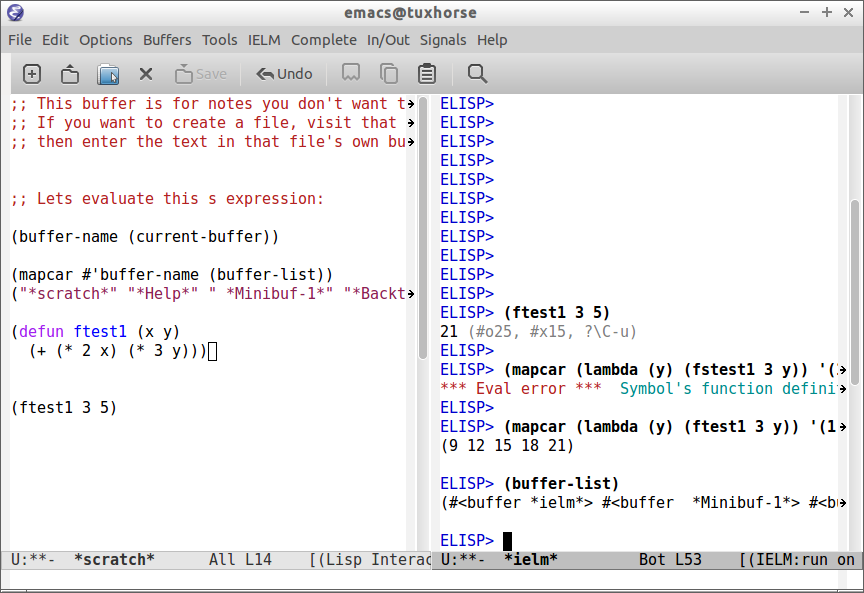
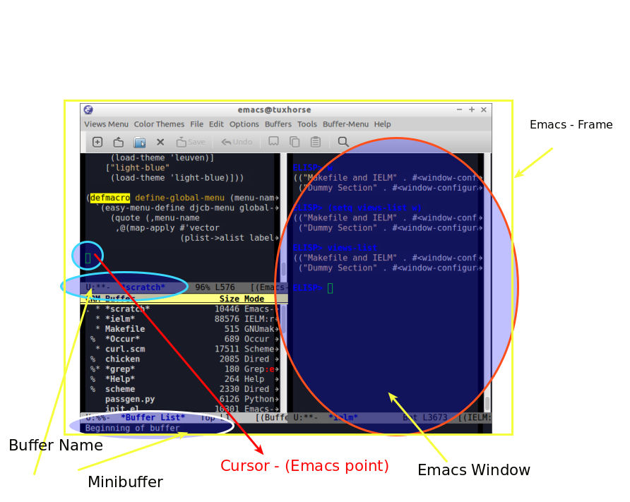
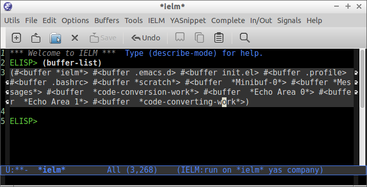
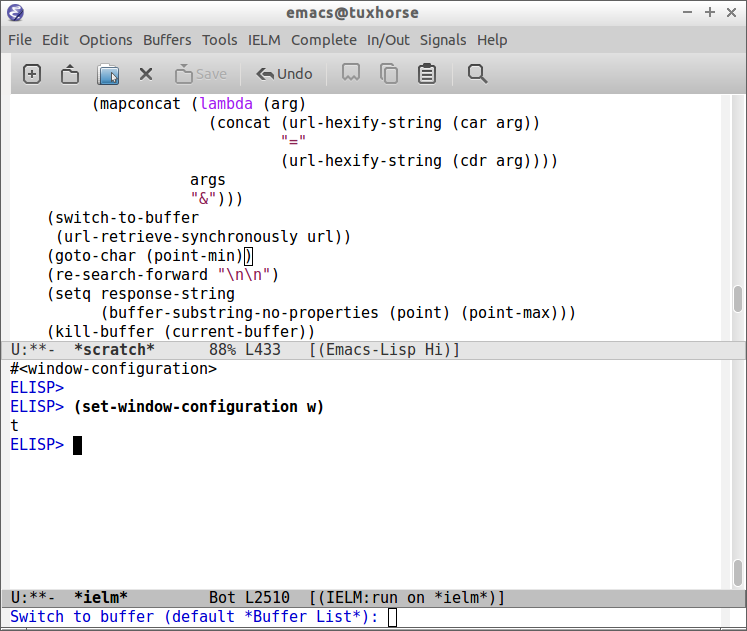

- [Emacs - Programming and Customization](#emacs---programming-and-customization)
  - [Command Line Options](#command-line-options)
  - [Default Key Bindings and Useful Commands](#default-key-bindings-and-useful-commands)
    - [Key Notation](#key-notation)
    - [Key Bindings by Task](#key-bindings-by-task)
    - [Selected Key Bindings for Programming](#selected-key-bindings-for-programming)
    - [Keybindings for Lisp programming](#keybindings-for-lisp-programming)
    - [Ubiquitous Emacs Key Bindings](#ubiquitous-emacs-key-bindings)
- [ELISP](#elisp)
  - [Using the Scratch Buffer and Interpreter](#using-the-scratch-buffer-and-interpreter)
  - [Basic Operations](#basic-operations)
  - [Type Predicates and Literals](#type-predicates-and-literals)
  - [Defining Variables](#defining-variables)
  - [Defining Functions](#defining-functions)
  - [List Operations](#list-operations)
  - [Association Lists and Property Lists](#association-lists-and-property-lists)
  - [Strings](#strings)
  - [Symbols](#symbols)
  - [Types Conversion](#types-conversion)
  - [Eval](#eval)
  - [Control Structures](#control-structures)
  - [Functional Programming](#functional-programming)
  - [Structures](#structures)
- [Macros and Metaprogramming](#macros-and-metaprogramming)
  - [Quasiquote](#quasiquote)
  - [Macros](#macros)
- [Emacs API](#emacs-api)
  - [Emacs Terminology](#emacs-terminology)
  - [Emacs API](#emacs-api)
  - [Bufffers](#bufffers)
  - [Files and Directories and OS Interface](#files-and-directories-and-os-interface)
  - [Window Functions](#window-functions)
  - [Special Variables](#special-variables)
  - [Emacs Modes](#emacs-modes)
  - [Network](#network)
  - [Discoverability / Get Documentation](#discoverability-/-get-documentation)
    - [Describe](#describe)
- [Customization](#customization)
  - [Install Packages](#install-packages)
  - [Hide / Show Emacs Widgets](#hide-/-show-emacs-widgets)
  - [Themes](#themes)
  - [Misc](#misc)
  - [Key Bindings](#key-bindings)
  - [Quiet Startup](#quiet-startup)
  - [Set Default Web Browser](#set-default-web-browser)
- [Solutions](#solutions)
  - [Quick edit and reload Emac Configuration File.](#quick-edit-and-reload-emac-configuration-file.)
  - [Refresh/ Reload File](#refresh/-reload-file)
  - [Creating Quick Access Menu](#creating-quick-access-menu)
  - [Extract Function Documentation](#extract-function-documentation)
  - [Edit File as Root](#edit-file-as-root)
  - [Open Current Buffer Directory](#open-current-buffer-directory)
  - [Open Current Buffer Directory in File Manager](#open-current-buffer-directory-in-file-manager)
  - [Open a terminal Emulator in the directory of Current Buffer](#open-a-terminal-emulator-in-the-directory-of-current-buffer)
  - [Eval String in Clipboard](#eval-string-in-clipboard)
  - [Save and Reload Current Session](#save-and-reload-current-session)
  - [Create a menu with all color themes available](#create-a-menu-with-all-color-themes-available)
  - [Better Menu Syntax](#better-menu-syntax)
  - [Save and Restore Current Window Configuration](#save-and-restore-current-window-configuration)
  - [Http and Post Request](#http-and-post-request)
- [Org-Mode](#org-mode)
- [Eshell](#eshell)
- [Developement Environments for Emacs](#developement-environments-for-emacs)
  - [Python](#python)
  - [Javascript](#javascript)
  - [C / C++](#c-/-c++)
  - [Ocaml](#ocaml)
  - [Haskell](#haskell)
  - [Lisp Dialects](#lisp-dialects)
    - [All Lisp Dialects](#all-lisp-dialects)
    - [Common Lisp](#common-lisp)
    - [Scheme](#scheme)
    - [Clojure](#clojure)
- [Resources](#resources)
  - [Emacs Tutorials](#emacs-tutorials)
    - [Motivation](#motivation)
    - [Introduction to Elisp](#introduction-to-elisp)
    - [Tips and Tricks](#tips-and-tricks)
    - [Packages](#packages)
    - [Cases](#cases)
    - [Non Categorized](#non-categorized)
  - [Documentation](#documentation)
    - [Manual and References](#manual-and-references)
    - [Wikis](#wikis)
    - [Issues](#issues)
  - [Selected Dot Emacs](#selected-dot-emacs)
  - [Emacs Starter Kits](#emacs-starter-kits)
  - [Books](#books)
  - [Community](#community)
  - [Blogs](#blogs)
  - [Videos and Screencasts](#videos-and-screencasts)
  - [Technical Notes](#technical-notes)
  - [Selected Codes](#selected-codes)


# Emacs - Programming and Customization<a id="sec-1" name="sec-1"></a>


**Repository Link**

-   [Github Link](https://github.com/caiorss/Emacs-Elisp-Programming)
-   Short Link: <http://tinyurl.com/emacsinabox> - Mneumonic: **Emacs In A Box**
-   [HTML Version - github.io](http://caiorss.github.io/Emacs-Elisp-Programming)

Emacs doesn't need presetation. It is a scriptable and fully programmable text editor that can be customized in Elisp,
an Emacs own lisp dialect that is based on [MacLisp](https://en.wikipedia.org/wiki/Maclisp), one of oldest lisp dialects, older than Common Lisp and Scheme, it was written in  1976
by the legendary [Richard Stallman](https://en.wikipedia.org/wiki/Richard_Stallman). Despite many incopatibilities with Common Lisp it has many constructs similar to it. An excellent book about Common Lisp
that is also useful for Elisp and Scheme is available at [On Lisp - by Paul Graham](http://unintelligible.org/onlisp/onlisp.html).

Note:

-   It is a work in progress.
-   You can see this document inside Emacs
    since it was converted to org-mode, see [README.org](README.md).

**Configuration File**

The user configuration file, which is executed when Emacs starts, is stored in the directory
`~/.emacs.d/init.el` or `~/.emacs`. The first one is better because it
is in the same directory of all emacs configuration files.

The Emacs scratch buffer can be used to test new features and try
Emacs codes along with IELM - Emacs Lisp interactive shell.

## Command Line Options<a id="sec-1-1" name="sec-1-1"></a>

Start emacs ignoring the <file:///home/tux/.emacs.d/init.el> or <file:///home/tux/.emacs> configuration file.

```sh
$ emacs --no-init-file

or

$ emacs -q
```

Start Emacs with a custom configuration file:

```sh
$ emacs -q -l customstart.el
```

Debug Emacs configuration file: ~/.emacs.d/init.el or ~/.emacs

```sh
$ emacs  --debug-init
```

To keep multiple configurations files see: [Emacs Bootstrap](https://github.com/caiorss/Emacs-Bootstrap)
Show Emacs version

```sh
$ emacs --version
```

## Default Key Bindings and Useful Commands<a id="sec-1-2" name="sec-1-2"></a>

The popular Ctrl-v (paste), Ctrl-c (copy), Ctrl-z (undo) can be
enabled by typing: M-x cua-mode or by inserting =(cua-mode) in emacs
configuration file, emacs also supports the Vim keybindings by
installing the evil package `(M-x package-install evil)`.

See also:

-   [GNU Emacs Key Bindings  Reference Card](https://www.gnu.org/software/emacs/refcards/pdf/refcard.pdf)

### Key Notation<a id="sec-1-2-1" name="sec-1-2-1"></a>

<table border="2" cellspacing="0" cellpadding="6" rules="groups" frame="hsides">


<colgroup>
<col  class="left" />

<col  class="left" />

<col  class="left" />
</colgroup>
<thead>
<tr>
<th scope="col" class="left">Key</th>
<th scope="col" class="left">Name</th>
<th scope="col" class="left">Modern Keyboard Equivalence</th>
</tr>
</thead>

<tbody>
<tr>
<td class="left">M</td>
<td class="left">Meta</td>
<td class="left">Alt</td>
</tr>


<tr>
<td class="left">C</td>
<td class="left">Control</td>
<td class="left">Ctrl</td>
</tr>


<tr>
<td class="left">S</td>
<td class="left">Shift</td>
<td class="left">Shift</td>
</tr>


<tr>
<td class="left">SPC</td>
<td class="left">Space</td>
<td class="left">Space</td>
</tr>
</tbody>
</table>

### Key Bindings by Task<a id="sec-1-2-2" name="sec-1-2-2"></a>

1.  File

    <table border="2" cellspacing="0" cellpadding="6" rules="groups" frame="hsides">
    
    
    <colgroup>
    <col  class="left" />
    
    <col  class="left" />
    </colgroup>
    <thead>
    <tr>
    <th scope="col" class="left">&#xa0;</th>
    <th scope="col" class="left">&#xa0;</th>
    </tr>
    </thead>
    
    <tbody>
    <tr>
    <td class="left">C-x C-s</td>
    <td class="left">Save Current Buffer</td>
    </tr>
    
    
    <tr>
    <td class="left">C-x C-w</td>
    <td class="left">Save Buffer as different file</td>
    </tr>
    
    
    <tr>
    <td class="left">C-x s</td>
    <td class="left">Save all buffers interactively</td>
    </tr>
    
    
    <tr>
    <td class="left">C-u C-x s</td>
    <td class="left">Save all buffers</td>
    </tr>
    
    
    <tr>
    <td class="left">C-x C-f</td>
    <td class="left">Open File</td>
    </tr>
    
    
    <tr>
    <td class="left">C-x C-C</td>
    <td class="left">Close Emacs</td>
    </tr>
    </tbody>
    </table>

2.  Buffers

    <table border="2" cellspacing="0" cellpadding="6" rules="groups" frame="hsides">
    
    
    <colgroup>
    <col  class="left" />
    
    <col  class="left" />
    </colgroup>
    <thead>
    <tr>
    <th scope="col" class="left">&#xa0;</th>
    <th scope="col" class="left">&#xa0;</th>
    </tr>
    </thead>
    
    <tbody>
    <tr>
    <td class="left">C-x b</td>
    <td class="left">Select Another Buffer</td>
    </tr>
    
    
    <tr>
    <td class="left">C-x C-b</td>
    <td class="left">List all buffers</td>
    </tr>
    
    
    <tr>
    <td class="left">C-x k</td>
    <td class="left">Kill a buffer</td>
    </tr>
    
    
    <tr>
    <td class="left">C-x <right arrow></td>
    <td class="left">Move to next buffer</td>
    </tr>
    
    
    <tr>
    <td class="left">C-x <left arrow></td>
    <td class="left">Move to previous buffer</td>
    </tr>
    </tbody>
    </table>

3.  Navigation

    <table border="2" cellspacing="0" cellpadding="6" rules="groups" frame="hsides">
    
    
    <colgroup>
    <col  class="left" />
    
    <col  class="left" />
    </colgroup>
    <thead>
    <tr>
    <th scope="col" class="left">&#xa0;</th>
    <th scope="col" class="left">&#xa0;</th>
    </tr>
    </thead>
    
    <tbody>
    <tr>
    <td class="left">C-a</td>
    <td class="left">Go to start of the line</td>
    </tr>
    
    
    <tr>
    <td class="left">C-e</td>
    <td class="left">Go to end of the line.</td>
    </tr>
    
    
    <tr>
    <td class="left">C-k</td>
    <td class="left">Cut/Delete from cursor current position to the end of the line.</td>
    </tr>
    
    
    <tr>
    <td class="left">M-<</td>
    <td class="left">Move to top of buffer</td>
    </tr>
    
    
    <tr>
    <td class="left">M-></td>
    <td class="left">Move to Bottom of buffer</td>
    </tr>
    
    
    <tr>
    <td class="left">M-f</td>
    <td class="left">Move forward one word</td>
    </tr>
    
    
    <tr>
    <td class="left">M-b</td>
    <td class="left">Move backward one word</td>
    </tr>
    
    
    <tr>
    <td class="left">M-[left key]</td>
    <td class="left">Move backward one word</td>
    </tr>
    
    
    <tr>
    <td class="left">M-[right key]</td>
    <td class="left">Move forward one word</td>
    </tr>
    
    
    <tr>
    <td class="left">Mg-g <line-num></td>
    <td class="left">Go to line number</td>
    </tr>
    
    
    <tr>
    <td class="left">Mg-c <cursor-pos></td>
    <td class="left">Go to character position</td>
    </tr>
    </tbody>
    </table>

4.  Bookmarks

    <table border="2" cellspacing="0" cellpadding="6" rules="groups" frame="hsides">
    
    
    <colgroup>
    <col  class="left" />
    
    <col  class="left" />
    </colgroup>
    <thead>
    <tr>
    <th scope="col" class="left">&#xa0;</th>
    <th scope="col" class="left">&#xa0;</th>
    </tr>
    </thead>
    
    <tbody>
    <tr>
    <td class="left">C-x r m</td>
    <td class="left">Add current buffer to bookmarks.</td>
    </tr>
    
    
    <tr>
    <td class="left">C-x r b</td>
    <td class="left">Open a buffer from bookmarks.</td>
    </tr>
    
    
    <tr>
    <td class="left">C-x r l</td>
    <td class="left">List bookmarks.</td>
    </tr>
    </tbody>
    </table>

5.  Search

    <table border="2" cellspacing="0" cellpadding="6" rules="groups" frame="hsides">
    
    
    <colgroup>
    <col  class="left" />
    
    <col  class="left" />
    </colgroup>
    <thead>
    <tr>
    <th scope="col" class="left">&#xa0;</th>
    <th scope="col" class="left">&#xa0;</th>
    </tr>
    </thead>
    
    <tbody>
    <tr>
    <td class="left">C-s</td>
    <td class="left">Forward Search</td>
    </tr>
    
    
    <tr>
    <td class="left">C-r</td>
    <td class="left">Backward Search</td>
    </tr>
    
    
    <tr>
    <td class="left">M-%</td>
    <td class="left">Replace</td>
    </tr>
    
    
    <tr>
    <td class="left">C-s</td>
    <td class="left">Jump to next occurrence</td>
    </tr>
    
    
    <tr>
    <td class="left">C-r</td>
    <td class="left">Jump to previour occurrence</td>
    </tr>
    
    
    <tr>
    <td class="left">C-g</td>
    <td class="left">Exit search</td>
    </tr>
    
    
    <tr>
    <td class="left">A-s .</td>
    <td class="left">Find Symbol under cursor</td>
    </tr>
    
    
    <tr>
    <td class="left">A-s w</td>
    <td class="left">Find Symbol under cursor, match symbols with underscore, dot, hyphen ..</td>
    </tr>
    
    
    <tr>
    <td class="left">A-s o</td>
    <td class="left">List all matching lines</td>
    </tr>
    </tbody>
    </table>

6.  Highlight

    <table border="2" cellspacing="0" cellpadding="6" rules="groups" frame="hsides">
    
    
    <colgroup>
    <col  class="left" />
    
    <col  class="left" />
    </colgroup>
    <thead>
    <tr>
    <th scope="col" class="left">&#xa0;</th>
    <th scope="col" class="left">&#xa0;</th>
    </tr>
    </thead>
    
    <tbody>
    <tr>
    <td class="left">M-s-h-.</td>
    <td class="left">Highlight symbol under cursor</td>
    </tr>
    
    
    <tr>
    <td class="left">M-s-h-p</td>
    <td class="left">Highlight phrase</td>
    </tr>
    
    
    <tr>
    <td class="left">M-s-h-r</td>
    <td class="left">Highlight regex</td>
    </tr>
    
    
    <tr>
    <td class="left">M-s-h-l</td>
    <td class="left">Highlight lines matching a regex</td>
    </tr>
    
    
    <tr>
    <td class="left">M-s-h-u</td>
    <td class="left">Unhighlight regex</td>
    </tr>
    </tbody>
    </table>

7.  Select, Copy, Cut and Paste

    <table border="2" cellspacing="0" cellpadding="6" rules="groups" frame="hsides">
    
    
    <colgroup>
    <col  class="left" />
    
    <col  class="left" />
    </colgroup>
    <thead>
    <tr>
    <th scope="col" class="left">&#xa0;</th>
    <th scope="col" class="left">&#xa0;</th>
    </tr>
    </thead>
    
    <tbody>
    <tr>
    <td class="left">C - \_</td>
    <td class="left">Undo</td>
    </tr>
    
    
    <tr>
    <td class="left">C - x u</td>
    <td class="left">Redo</td>
    </tr>
    
    
    <tr>
    <td class="left">C - Space</td>
    <td class="left">Begin Selection</td>
    </tr>
    
    
    <tr>
    <td class="left">C - G</td>
    <td class="left">Cancel Selection</td>
    </tr>
    
    
    <tr>
    <td class="left">C-x h</td>
    <td class="left">Select the whole buffer</td>
    </tr>
    
    
    <tr>
    <td class="left">M-w</td>
    <td class="left">Copy</td>
    </tr>
    
    
    <tr>
    <td class="left">C-y</td>
    <td class="left">Paste  (Yank)</td>
    </tr>
    
    
    <tr>
    <td class="left">C-w</td>
    <td class="left">Cut    (Wipe out), Delete and copy to clipboard (Kill Ring)</td>
    </tr>
    
    
    <tr>
    <td class="left">&#xa0;</td>
    <td class="left">&#xa0;</td>
    </tr>
    </tbody>
    </table>

8.  Word Case / Comment and Uncomment

    <table border="2" cellspacing="0" cellpadding="6" rules="groups" frame="hsides">
    
    
    <colgroup>
    <col  class="left" />
    
    <col  class="left" />
    </colgroup>
    <thead>
    <tr>
    <th scope="col" class="left">&#xa0;</th>
    <th scope="col" class="left">&#xa0;</th>
    </tr>
    </thead>
    
    <tbody>
    <tr>
    <td class="left">M-u</td>
    <td class="left">Make word uppercase</td>
    </tr>
    
    
    <tr>
    <td class="left">M-l</td>
    <td class="left">Make word lowercase</td>
    </tr>
    
    
    <tr>
    <td class="left">M-c</td>
    <td class="left">Make word title (Capitalize only first letter)</td>
    </tr>
    
    
    <tr>
    <td class="left">&#xa0;</td>
    <td class="left">&#xa0;</td>
    </tr>
    
    
    <tr>
    <td class="left">M-;</td>
    <td class="left">Comment/ Uncomment Selected Code</td>
    </tr>
    </tbody>
    </table>

9.  Windows

    <table border="2" cellspacing="0" cellpadding="6" rules="groups" frame="hsides">
    
    
    <colgroup>
    <col  class="left" />
    
    <col  class="left" />
    </colgroup>
    <thead>
    <tr>
    <th scope="col" class="left">&#xa0;</th>
    <th scope="col" class="left">&#xa0;</th>
    </tr>
    </thead>
    
    <tbody>
    <tr>
    <td class="left">C-x k</td>
    <td class="left">Close</td>
    </tr>
    
    
    <tr>
    <td class="left">C-x b</td>
    <td class="left">Next Window</td>
    </tr>
    
    
    <tr>
    <td class="left">C-x C-b</td>
    <td class="left">Choose buffer Window</td>
    </tr>
    
    
    <tr>
    <td class="left">C-x 0</td>
    <td class="left">Delete Current Window</td>
    </tr>
    
    
    <tr>
    <td class="left">C-x 1</td>
    <td class="left">Unsplit</td>
    </tr>
    
    
    <tr>
    <td class="left">C-x 2</td>
    <td class="left">Split Horizontally</td>
    </tr>
    
    
    <tr>
    <td class="left">C-x 3</td>
    <td class="left">Split Vertically</td>
    </tr>
    
    
    <tr>
    <td class="left">C-x o</td>
    <td class="left">Switch Window</td>
    </tr>
    
    
    <tr>
    <td class="left">C-x 2 5</td>
    <td class="left">Launch a new frame (separated window)</td>
    </tr>
    </tbody>
    </table>

10. Commands

    <table border="2" cellspacing="0" cellpadding="6" rules="groups" frame="hsides">
    
    
    <colgroup>
    <col  class="left" />
    
    <col  class="left" />
    </colgroup>
    <thead>
    <tr>
    <th scope="col" class="left">&#xa0;</th>
    <th scope="col" class="left">&#xa0;</th>
    </tr>
    </thead>
    
    <tbody>
    <tr>
    <td class="left">M - x</td>
    <td class="left">Enter a command</td>
    </tr>
    
    
    <tr>
    <td class="left">C - g</td>
    <td class="left">Cancel command input</td>
    </tr>
    
    
    <tr>
    <td class="left">M - x  eval-expression</td>
    <td class="left">Eval a lisp expression in current buffer</td>
    </tr>
    
    
    <tr>
    <td class="left">M -x  ielm</td>
    <td class="left">Enter Emacs Interactive elisp shell</td>
    </tr>
    
    
    <tr>
    <td class="left">M -x  eshell</td>
    <td class="left">Enter Emacs Shell Written in Elisp</td>
    </tr>
    
    
    <tr>
    <td class="left">M -x  shell</td>
    <td class="left">Run a shell</td>
    </tr>
    
    
    <tr>
    <td class="left">M -!  shell</td>
    <td class="left">Run a single shell command like: ls, pwd, make &#x2026;</td>
    </tr>
    
    
    <tr>
    <td class="left">M-x eval-region  shell</td>
    <td class="left">Evaluate selected region as elisp code</td>
    </tr>
    
    
    <tr>
    <td class="left">M-x eval-buffer  shell</td>
    <td class="left">Evaluate current buffer as elips code</td>
    </tr>
    
    
    <tr>
    <td class="left">M-x goto-char</td>
    <td class="left">Got a character position</td>
    </tr>
    </tbody>
    </table>

11. Information

    <table border="2" cellspacing="0" cellpadding="6" rules="groups" frame="hsides">
    
    
    <colgroup>
    <col  class="left" />
    
    <col  class="left" />
    </colgroup>
    <thead>
    <tr>
    <th scope="col" class="left">&#xa0;</th>
    <th scope="col" class="left">&#xa0;</th>
    </tr>
    </thead>
    
    <tbody>
    <tr>
    <td class="left">C-h a</td>
    <td class="left">Command Apropos</td>
    </tr>
    
    
    <tr>
    <td class="left">C-h i</td>
    <td class="left">Info documentation reader</td>
    </tr>
    
    
    <tr>
    <td class="left">C-h f</td>
    <td class="left">Describe function</td>
    </tr>
    
    
    <tr>
    <td class="left">C-h v</td>
    <td class="left">Describe variable</td>
    </tr>
    
    
    <tr>
    <td class="left">C-h m</td>
    <td class="left">Describe mode</td>
    </tr>
    
    
    <tr>
    <td class="left">C-h s</td>
    <td class="left">Describe syntax</td>
    </tr>
    
    
    <tr>
    <td class="left">C-h b</td>
    <td class="left">Describe key bindings for current buffer</td>
    </tr>
    
    
    <tr>
    <td class="left">C-h k</td>
    <td class="left">Describe a particular key binding.</td>
    </tr>
    </tbody>
    </table>

### Selected Key Bindings for Programming<a id="sec-1-2-3" name="sec-1-2-3"></a>

**FILE EDITING**

<table border="2" cellspacing="0" cellpadding="6" rules="groups" frame="hsides">


<colgroup>
<col  class="left" />

<col  class="left" />
</colgroup>
<thead>
<tr>
<th scope="col" class="left">&#xa0;</th>
<th scope="col" class="left">&#xa0;</th>
</tr>
</thead>

<tbody>
<tr>
<td class="left">C-x C-f</td>
<td class="left">Open a new file or a existing file.</td>
</tr>


<tr>
<td class="left">C-x C-s</td>
<td class="left">Save current buffer</td>
</tr>


<tr>
<td class="left">C-x b</td>
<td class="left">Swithc Buffer</td>
</tr>


<tr>
<td class="left">M-;</td>
<td class="left">Comment/ Uncomment Selected Code</td>
</tr>


<tr>
<td class="left">M-/</td>
<td class="left">Autocomplete word (Equivalent to VIM Ctrl + p)</td>
</tr>


<tr>
<td class="left">C-g</td>
<td class="left">Cancel any Emacs command</td>
</tr>


<tr>
<td class="left">M-x list-command-history</td>
<td class="left">List the most recent commands (M-x <command>)</td>
</tr>


<tr>
<td class="left">&#xa0;</td>
<td class="left">&#xa0;</td>
</tr>
</tbody>
</table>

**NAVIGATION**

<table border="2" cellspacing="0" cellpadding="6" rules="groups" frame="hsides">


<colgroup>
<col  class="left" />

<col  class="left" />
</colgroup>
<thead>
<tr>
<th scope="col" class="left">&#xa0;</th>
<th scope="col" class="left">&#xa0;</th>
</tr>
</thead>

<tbody>
<tr>
<td class="left">C-a</td>
<td class="left">Move the cursor to the beggining of line</td>
</tr>


<tr>
<td class="left">C-e</td>
<td class="left">Move the cursor to the end of line</td>
</tr>


<tr>
<td class="left">M-<</td>
<td class="left">Move the cursor to the beggining of buffer</td>
</tr>


<tr>
<td class="left">M-></td>
<td class="left">Move to the cursor tor end of buffer</td>
</tr>


<tr>
<td class="left">M-x goto-char</td>
<td class="left">Got a character position</td>
</tr>


<tr>
<td class="left">Mg-g <line-num></td>
<td class="left">Go to line number</td>
</tr>


<tr>
<td class="left">Mg-c <cursor-pos></td>
<td class="left">Go to character position</td>
</tr>


<tr>
<td class="left">M-m</td>
<td class="left">Jump to first non whitespace in current line.</td>
</tr>
</tbody>

<tbody>
<tr>
<td class="left">C-x r m</td>
<td class="left">Make bookmark</td>
</tr>


<tr>
<td class="left">C-x r b</td>
<td class="left">Jump to bookmarks</td>
</tr>
</tbody>
</table>

**TEXT EDITING**

<table border="2" cellspacing="0" cellpadding="6" rules="groups" frame="hsides">


<colgroup>
<col  class="left" />

<col  class="left" />
</colgroup>
<thead>
<tr>
<th scope="col" class="left">&#xa0;</th>
<th scope="col" class="left">&#xa0;</th>
</tr>
</thead>

<tbody>
<tr>
<td class="left">C-y</td>
<td class="left">Copy selected text by cursor (Copy region)</td>
</tr>


<tr>
<td class="left">C-y</td>
<td class="left">Paste when no text is selected. (Yank)</td>
</tr>


<tr>
<td class="left">C-k</td>
<td class="left">Delete current line from cursor position.</td>
</tr>


<tr>
<td class="left">C-w</td>
<td class="left">Cut (Wipe Out)</td>
</tr>


<tr>
<td class="left">M-del</td>
<td class="left">Delete previous word</td>
</tr>


<tr>
<td class="left">M-d</td>
<td class="left">Delete next word</td>
</tr>


<tr>
<td class="left">C-x C-o</td>
<td class="left">Delete all empty line around the cursor.</td>
</tr>


<tr>
<td class="left">M-q</td>
<td class="left">Justify / Re-align current paragraph</td>
</tr>


<tr>
<td class="left">&#xa0;</td>
<td class="left">&#xa0;</td>
</tr>


<tr>
<td class="left">C-x C - (minus)</td>
<td class="left">Decrease font size</td>
</tr>


<tr>
<td class="left">C-x C + (plus)</td>
<td class="left">Increase font size</td>
</tr>


<tr>
<td class="left">&#xa0;</td>
<td class="left">&#xa0;</td>
</tr>


<tr>
<td class="left">M-x replace-string</td>
<td class="left">Batch replace string in selected region or  buffer.</td>
</tr>


<tr>
<td class="left">M-x replace-regexp</td>
<td class="left">Batch replace regex pattern in selected text or buffer.</td>
</tr>
</tbody>
</table>

### Keybindings for Lisp programming<a id="sec-1-2-4" name="sec-1-2-4"></a>

Useful lisp key bindings to edit and navigate Lisp code.

**Lisp Evaluation  (Emacs Lisp)**

<table border="2" cellspacing="0" cellpadding="6" rules="groups" frame="hsides">


<colgroup>
<col  class="left" />

<col  class="left" />
</colgroup>
<thead>
<tr>
<th scope="col" class="left">&#xa0;</th>
<th scope="col" class="left">&#xa0;</th>
</tr>
</thead>

<tbody>
<tr>
<td class="left">&#xa0;</td>
<td class="left">&#xa0;</td>
</tr>


<tr>
<td class="left">C-x C-e</td>
<td class="left">Evaluate last s-expression under cursor</td>
</tr>


<tr>
<td class="left">C-j</td>
<td class="left">Evaluate last s-expression under cursor and print.</td>
</tr>


<tr>
<td class="left">C-u M-:</td>
<td class="left">Evaluate S-expression in minibuffer and insert result in minibuffer</td>
</tr>


<tr>
<td class="left">M-:</td>
<td class="left">Execute S-expression in minibuffer.</td>
</tr>


<tr>
<td class="left">M-x eval-defun</td>
<td class="left">Evaluates the outermost S-expression, regardless of cursor position within the s-exp.</td>
</tr>


<tr>
<td class="left">M-x eval-buffer</td>
<td class="left">Eval the whole buffer</td>
</tr>


<tr>
<td class="left">M-x eval-region</td>
<td class="left">Eval the selected text</td>
</tr>
</tbody>
</table>

**IELM - Emacs Lisp Interpreter**

<table border="2" cellspacing="0" cellpadding="6" rules="groups" frame="hsides">


<colgroup>
<col  class="left" />

<col  class="left" />
</colgroup>
<thead>
<tr>
<th scope="col" class="left">&#xa0;</th>
<th scope="col" class="left">&#xa0;</th>
</tr>
</thead>

<tbody>
<tr>
<td class="left">M-x ielm</td>
<td class="left">Run Emacs Lisp Interpreter</td>
</tr>


<tr>
<td class="left">C-c C-b</td>
<td class="left">(IELM only) Change the current buffer of IELM. It is useful control buffers from IELM shell.</td>
</tr>


<tr>
<td class="left">C-[up]</td>
<td class="left">(All Shells) Get the next input in the history</td>
</tr>


<tr>
<td class="left">C-[down]</td>
<td class="left">(All Shells) Get the previous input in the history</td>
</tr>


<tr>
<td class="left">M-p</td>
<td class="left">(All Shells) Get the previous input in the history</td>
</tr>


<tr>
<td class="left">M-n</td>
<td class="left">(All Shells) Get the next input in the history</td>
</tr>


<tr>
<td class="left">C-c C-l</td>
<td class="left">Display the shell history in another window</td>
</tr>
</tbody>
</table>

**Delimiter Wrapping**

<table border="2" cellspacing="0" cellpadding="6" rules="groups" frame="hsides">


<colgroup>
<col  class="left" />

<col  class="left" />
</colgroup>
<thead>
<tr>
<th scope="col" class="left">&#xa0;</th>
<th scope="col" class="left">&#xa0;</th>
</tr>
</thead>

<tbody>
<tr>
<td class="left">M-(</td>
<td class="left">Wrap selection in parentheses</td>
</tr>


<tr>
<td class="left">M-[</td>
<td class="left">Wrap selection in square brackets</td>
</tr>


<tr>
<td class="left">M-{</td>
<td class="left">Wrap selection in curly brackets</td>
</tr>


<tr>
<td class="left">&#xa0;</td>
<td class="left">&#xa0;</td>
</tr>
</tbody>
</table>

**S-expression Navigation**

<table border="2" cellspacing="0" cellpadding="6" rules="groups" frame="hsides">


<colgroup>
<col  class="left" />

<col  class="left" />
</colgroup>
<thead>
<tr>
<th scope="col" class="left">&#xa0;</th>
<th scope="col" class="left">&#xa0;</th>
</tr>
</thead>

<tbody>
<tr>
<td class="left">C-M-n</td>
<td class="left">Move forward over a parenthetical group</td>
</tr>


<tr>
<td class="left">C-M-p</td>
<td class="left">Move backward over a parenthetical group</td>
</tr>


<tr>
<td class="left">C-M-f</td>
<td class="left">Move forward over a balanced expression</td>
</tr>


<tr>
<td class="left">C-M-b</td>
<td class="left">Move backward over a balanced expression</td>
</tr>


<tr>
<td class="left">C-M-k</td>
<td class="left">Delete s-expression under cursor</td>
</tr>


<tr>
<td class="left">&#xa0;</td>
<td class="left">&#xa0;</td>
</tr>


<tr>
<td class="left">C-M-a</td>
<td class="left">Move to the beggining of current function</td>
</tr>


<tr>
<td class="left">C-M-e</td>
<td class="left">Move to the end f current function</td>
</tr>
</tbody>
</table>

### Ubiquitous Emacs Key Bindings<a id="sec-1-2-5" name="sec-1-2-5"></a>

Some Emacs Key bindings (Emacs-style key bindings) are ubiquitous in
Unix apps like Bash, Sh and all shells that uses the GNU readline
library.

<table border="2" cellspacing="0" cellpadding="6" rules="groups" frame="hsides">


<colgroup>
<col  class="left" />

<col  class="left" />

<col  class="left" />
</colgroup>
<thead>
<tr>
<th scope="col" class="left">Key</th>
<th scope="col" class="left">Emacs</th>
<th scope="col" class="left">Bash Shell</th>
</tr>
</thead>

<tbody>
<tr>
<td class="left">C-a</td>
<td class="left">Move the cursor to the beggining of line</td>
<td class="left">same</td>
</tr>


<tr>
<td class="left">C-e</td>
<td class="left">Move the cursor to the end of line</td>
<td class="left">same</td>
</tr>


<tr>
<td class="left">&#xa0;</td>
<td class="left">&#xa0;</td>
<td class="left">&#xa0;</td>
</tr>


<tr>
<td class="left">C-n</td>
<td class="left">Move the cursor to the next line  (downward)</td>
<td class="left">Show next command in the history.</td>
</tr>


<tr>
<td class="left">C-p</td>
<td class="left">Move the cursor to the previous line (upward)</td>
<td class="left">Show the previou command in the history.</td>
</tr>


<tr>
<td class="left">C-j</td>
<td class="left">New line character (same as Return)</td>
<td class="left">same</td>
</tr>


<tr>
<td class="left">&#xa0;</td>
<td class="left">&#xa0;</td>
<td class="left">&#xa0;</td>
</tr>


<tr>
<td class="left">A-b</td>
<td class="left">Move the cursor backward one word</td>
<td class="left">same</td>
</tr>


<tr>
<td class="left">A-f</td>
<td class="left">Move the cursor forward one word</td>
<td class="left">same</td>
</tr>


<tr>
<td class="left">&#xa0;</td>
<td class="left">&#xa0;</td>
<td class="left">&#xa0;</td>
</tr>


<tr>
<td class="left">A-t</td>
<td class="left">Swap current word with previous</td>
<td class="left">same</td>
</tr>


<tr>
<td class="left">&#xa0;</td>
<td class="left">&#xa0;</td>
<td class="left">&#xa0;</td>
</tr>


<tr>
<td class="left">A-d</td>
<td class="left">Delete the next word</td>
<td class="left">same</td>
</tr>


<tr>
<td class="left">&#xa0;</td>
<td class="left">&#xa0;</td>
<td class="left">&#xa0;</td>
</tr>


<tr>
<td class="left">C-k</td>
<td class="left">Delete the remaining of line from current cursor position</td>
<td class="left">same</td>
</tr>


<tr>
<td class="left">C-y</td>
<td class="left">Paste the deleted line with (C-k) or copied line (Yank)</td>
<td class="left">same</td>
</tr>


<tr>
<td class="left">A-w</td>
<td class="left">Copy the slected text</td>
<td class="left">&#xa0;</td>
</tr>


<tr>
<td class="left">&#xa0;</td>
<td class="left">&#xa0;</td>
<td class="left">&#xa0;</td>
</tr>


<tr>
<td class="left">&#xa0;</td>
<td class="left">&#xa0;</td>
<td class="left">&#xa0;</td>
</tr>


<tr>
<td class="left">C-r</td>
<td class="left">Search forward for a string</td>
<td class="left">Search for previous command</td>
</tr>


<tr>
<td class="left">C-s</td>
<td class="left">Search backward for a string</td>
<td class="left">No implemented.</td>
</tr>


<tr>
<td class="left">&#xa0;</td>
<td class="left">&#xa0;</td>
<td class="left">&#xa0;</td>
</tr>


<tr>
<td class="left">&#xa0;</td>
<td class="left">&#xa0;</td>
<td class="left">&#xa0;</td>
</tr>


<tr>
<td class="left">c-l</td>
<td class="left">Redraws the screen with the cursor in the middle.</td>
<td class="left">Clear the screen.</td>
</tr>


<tr>
<td class="left">&#xa0;</td>
<td class="left">&#xa0;</td>
<td class="left">&#xa0;</td>
</tr>


<tr>
<td class="left">C-\_</td>
<td class="left">Undo</td>
<td class="left">same</td>
</tr>


<tr>
<td class="left">&#xa0;</td>
<td class="left">&#xa0;</td>
<td class="left">&#xa0;</td>
</tr>
</tbody>
</table>

See also:

-   [Bash Emacs Editing Mode Cheat Sheet](http://www.catonmat.net/blog/bash-emacs-editing-mode-cheat-sheet/)
-   [Confusing behavior of emacs-style keybindings in bash](http://unix.stackexchange.com/questions/150578/confusing-behavior-of-emacs-style-keybindings-in-bash)

# ELISP<a id="sec-2" name="sec-2"></a>

This section will use the Emacs interactive elisp shell IELM that can
be accessed by typing **M-x ielm**. You can also use the scratch buffer
to test Emacs features and elisp codes.

## Using the Scratch Buffer and Interpreter<a id="sec-2-1" name="sec-2-1"></a>

The scratch buffer is useful to evaluate Emacs lisp commands, test new
features and test new Emacs configurations and dot emacs without need
to reload Emacs.


C-x C-e at the end of s-expression displays the result of evaluation
in the minibuffer.


C-j  at the end of s-expression prints the result in the scratch
buffer.


The scratch buffer can be used with the interpreter IELM, to open the
interpreter type: C-x-3, put the cursor on the other window and type
M-x ielm. By this way it is possible to evaluate expressions in the
scratch buffer and test it in the shell.



The command **M-x eval-expression** which is bound to the key bind **M-:** can
be used to evaluate Elisp commands in any buffer and test buffer local
variables.

Example:


## Basic Operations<a id="sec-2-2" name="sec-2-2"></a>

**Arithmetic**

```lisp
ELISP> (+ 20 30)
50
ELISP> (- 100 80)
20
ELISP> (+ 1 2 3 4 5 6)
21
ELISP> (* 1 2 3 4 5 6)
720
ELISP> (/ 1 100)
0

ELISP> (> 10 1) ;; ?? 10 > 1
t
ELISP> (< 2 8) ;; ?? 2 < 8
t
ELISP> (< 8 2) ;; ?? 8 < 2
nil

ELISP> (= 2 2)
t
ELISP> (= 2 4)
nil

ELISP> (/= 2 2)
nil
ELISP> (exp -1)
0.36787944117144233
ELISP> (log 10)
2.302585092994046
ELISP> (sin pi)
1.2246467991473532e-16
ELISP> (cos pi)
-1.0
ELISP> (tan (/ pi 2))
1.633123935319537e+16
ELISP>
```

Comparison

```lisp
;;;; Compare Numbers
;;;;;;;;;;;;;;;;;;;;;;;;;;

ELISP> (= 2 (+ 1 1))
t

;;; Compare Symbols and Numbers
;;;;;;;;;;;;;;;;;;;;;;;;;;;;;

ELISP> (eq 1 1)
t
ELISP> (eq 1 2)
nil
ELISP>

ELISP> (eq 'x 'x)
t
ELISP>

;;; Compare Elements of a List
;;;;;;;;;;;;;;;;;;;;;;;;;;;;;;

ELISP> (equal (list 1 2 3 4) (list 1 2 3 4))
t

;;; Compare Strings
;;;;;;;;;;;;;;;;;;;;;;;;;;;;;

ELISP> (string= "hello" "hello")
t
```

Lists

```lisp
ELISP>
ELISP> '(10 20 30 40)
(10 20 30 40)

ELISP> '(10 203 40 "hello" () ("empty" 65))
(10 203 40 "hello" nil
    ("empty" 65))

ELISP>
```

## Type Predicates and Literals<a id="sec-2-3" name="sec-2-3"></a>

Basic Types

<table border="2" cellspacing="0" cellpadding="6" rules="groups" frame="hsides">


<colgroup>
<col  class="left" />

<col  class="left" />

<col  class="left" />

<col  class="left" />
</colgroup>
<thead>
<tr>
<th scope="col" class="left">Type</th>
<th scope="col" class="left">Predicate</th>
<th scope="col" class="left">Literal</th>
<th scope="col" class="left">Description</th>
</tr>
</thead>

<tbody>
<tr>
<td class="left">Nil</td>
<td class="left">null</td>
<td class="left">nil '()</td>
<td class="left">Test if argument is nil</td>
</tr>


<tr>
<td class="left">Number</td>
<td class="left">numberp</td>
<td class="left">100, 200e3</td>
<td class="left">Test if it is number.</td>
</tr>


<tr>
<td class="left">String</td>
<td class="left">stringp</td>
<td class="left">"hello"</td>
<td class="left">Test if it is string</td>
</tr>


<tr>
<td class="left">Symbol</td>
<td class="left">symbolp</td>
<td class="left">'sym :keyworkd</td>
<td class="left">Test if it is a symbol.</td>
</tr>


<tr>
<td class="left">&#xa0;</td>
<td class="left">&#xa0;</td>
<td class="left">&#xa0;</td>
<td class="left">&#xa0;</td>
</tr>


<tr>
<td class="left">Atom</td>
<td class="left">atom</td>
<td class="left">'x "h" :key 200</td>
<td class="left">Everything that is not a list or pair is an atom.</td>
</tr>


<tr>
<td class="left">List</td>
<td class="left">listp</td>
<td class="left">'(1 2 x y)</td>
<td class="left">Test if it is a list</td>
</tr>


<tr>
<td class="left">Pair</td>
<td class="left">consp</td>
<td class="left">'( a . 200)</td>
<td class="left">Test if it is a pair (cons cell)</td>
</tr>


<tr>
<td class="left">Vector</td>
<td class="left">vectorp</td>
<td class="left">[1 200 'sym]</td>
<td class="left">Test if it is a vector</td>
</tr>
</tbody>
</table>

Emacs Objects

<table border="2" cellspacing="0" cellpadding="6" rules="groups" frame="hsides">


<colgroup>
<col  class="left" />

<col  class="left" />
</colgroup>
<thead>
<tr>
<th scope="col" class="left">Object</th>
<th scope="col" class="left">Predicate</th>
</tr>
</thead>

<tbody>
<tr>
<td class="left">Buffer</td>
<td class="left">bufferp</td>
</tr>


<tr>
<td class="left">Window</td>
<td class="left">windowp</td>
</tr>


<tr>
<td class="left">Frame</td>
<td class="left">framep</td>
</tr>


<tr>
<td class="left">Process</td>
<td class="left">processp</td>
</tr>
</tbody>
</table>

## Defining Variables<a id="sec-2-4" name="sec-2-4"></a>

```lisp
;;; Constants
;;;;;;;;;;;;;;;;;;;;;;;;;;;;;;;;;;;

ELISP> (defconst zsh-shell "/usr/bin/zsh")
zsh-shell

ELISP> zsh-shell
"/usr/bin/zsh"
ELISP>

;;; Define a variable
;;;;;;;;;;;;;;;;;;;;;;;;;;;;;;;;;;;

;;;; Set is not used very much
;;
ELISP> (set 'avar "hello world")
"hello world"

ELISP> avar
"hello world"
ELISP>

;;;;; The most used command for assignment is setq
;;
ELISP> (setq x 10)
10

ELISP> (setq avar "hello world")
"hello world"

ELISP> x
10

ELISP> avar
"hello world"
ELISP>

ELISP> (setq my-list '(10 20 30 40))
(10 20 30 40)

ELISP> my-list
(10 20 30 40)

;;; Multiple Assignment
;;
ELISP> (setq a 10 b 20 c "Emacs")
"Emacs"
ELISP> a
10
ELISP> b
20
ELISP> c
"Emacs"
ELISP>

;; Dynamic Scoping  (Local Variables)
;;;;;;;;;;;;;;;;;;;;;;;;;;;;;;;;;;;;;
;;
ELISP> (let ((x 1) (y 10)) (+ (* 4 x) (* 5 y)) )
54
ELISP> x
10
ELISP> y
    ** Eval error **  Symbol's value as variable is void: y
ELISP>
```

## Defining Functions<a id="sec-2-5" name="sec-2-5"></a>

1.  Define Simple Function

    Syntax:
    
    ```
    (defun <function name> (<parameters>) (<body>))
    ```
    
    ```lisp
    ELISP> (defun afunction (a b c) (+ a b c))
    afunction
    
    ELISP> (afunction 10 20 30)
    60
    
    ELISP> (defun myfun () (message "Hello Emacs"))
    myfun
    ELISP> (myfun)
    "Hello Emacs"
    ELISP>
    
    
    ELISP>
    ELISP> (defun signum (n)
         (cond ((> n 0) 1 )
               ((< n 0) -1)
               (0)))
    signum
    ELISP> (signum 10)
    1
    ELISP> (signum 0)
    0
    ELISP> (signum -23)
    -1
    ELISP>
    
    
    ELISP> (defun factorial (n)
         (if (= n 0)
             1
             (* n (factorial (- n 1)))))
    factorial
    
    ELISP> (factorial 5)
    120
    ELISP
    ```

2.  Anonymous Functions / Lambda Functions

    Syntax:
    
    ```
    (lambda (<parameters>) (<body>))
    ```
    
    ```lisp
    ELISP> (lambda (x) (+ x 3))
    (lambda
      (x)
      (+ x 3))
    
    ;;; Applying Lambda Functions
    ;;
    
    ELISP> ((lambda (x) (+ x 3)) 4)
    7
    ELISP> (funcall (lambda (x) (+ x 3)) 4)
    7
    ELISP>
    
    ;;; Storing Lambda Function in Variable
    ;;
    ;;
    
    ELISP> (defvar add3 (lambda (x) (+ x 3)))
    add3
    
    
    ELISP> add3
    (lambda
      (x)
      (+ x 3))
    
    ELISP> (funcall add3 10)
    13
    
    ELISP> (add3 10)
        ** Eval error **  Symbol's function definition is void: add3
    
    ELISP> (funcall #'add3 10)
        ** Eval error **  Symbol's function definition is void: add3
    ELISP>
    
    ;;; Passing Lambda Function to functions
    ;;
    ELISP> (mapcar (lambda (x) (+ x 3))  '(1 2 3 4 5))
    (4 5 6 7 8)
    ```

3.  Passing Functions as Arguments

    Functions must be passed with
    
    ```
        (caller-function #'<function-1> #'<function-1> arg1 arg2 ...)
    ```
    
    Inside the caller function the argument functions must be called using funcall:
    
    ```lisp
        (funcall function-1 arg1 arg2 ...)
    ```
    
    Example:
    
    ```lisp
    ELISP> (mapcar log '(1 10 100 1000))
        ** Eval error **  Symbol's value as variable is void: log
    
    
    ELISP> (mapcar #'log10 '(1 10 100 1000))
    (0.0 1.0 2.0 3.0)
    
    (defun sum-fun (f1 f2 x)
      (+ (funcall f1 x) (funcall f2 x)))
    
    ELISP> (sum-fun #'log #'exp 3)
    21.18414921185578
    ELISP>
    
    ELISP> (+ (log 3) (exp 3))
    21.18414921185578
    ELISP>
    
    ELISP> (sum-fun (lambda (x) (* 3 x))
            (lambda (x) (* 4 x))
            5)
    35
    ELISP>
    
    ELISP> (defun 1+ (x) (+ 1 x))
    1+
    ELISP> (defun 3+ (x) (* 3 x))
    3+
    
    ELISP> (sum-fun #'1+  #'3* 4)
    17
    ELISP>
    
    ELISP> (sum-fun #'1+  (lambda (x) (* 3 x)) 4)
    17
    ELISP>
    ```

4.  Variadic Functions

    Functions with many arguments
    
    ```lisp
    (defun sum (&rest numbers)
      (apply #'+ numbers))
    
    ELISP> (sum 1 2 3 4 5 6)
    21
    
    
    ELISP> (apply #'sum '(1 2 3 5 6))
    17
    
    ELISP> (apply #'sum (list 1 2 3 5 (+ 6 5 2)))
    24
    
    ELISP> (apply #'sum '())
    0
    
    ELISP> (apply #'sum nil)
    0
    
    ELISP> (sum nil)
        ** Eval error **  Wrong type argument: number-or-marker-p, ni
    
    ;;----------------------------------
    
    (defun sum-prod (a &rest xs)
      (* a (apply #'+ xs)))
    
    
    ELISP> (sum-prod 3 1 2 3 4 5)
    45
    
    ELISP> (sum-prod 1 1 2 3 4 5)
    15
    ```

5.  Function with optional argument

    ```lisp
    (defun test-optional (a &optional b)
      (list a b))
    
    ELISP> (test-optional 10 20)
    (10 20)
    
    ELISP> (test-optional 10 )
    (10 nil)
    
    ;--------------------------------;
    
    (defun test-optional2 (a b &optional b c d e)
      (list :a a :b b :c c :d d :e e))
    
    ELISP> (test-optional2 0 1 2 3 4 5 )
    (:a 0 :b 2 :c 3 :d 4 :e 5)
    
    
    ELISP> (test-optional2 0 1 2 3 4  )
    (:a 0 :b 2 :c 3 :d 4 :e nil)
    
    ELISP> (test-optional2 0 1 2 3   )
    (:a 0 :b 2 :c 3 :d nil :e nil)
    
    ELISP> (test-optional2 0 1 2    )
    (:a 0 :b 2 :c nil :d nil :e nil)
    
    ELISP> (test-optional2 0 1  )
    (:a 0 :b nil :c nil :d nil :e nil)
    
    ELISP> (test-optional2 0 1)
    (:a 0 :b nil :c nil :d nil :e nil)
    
    ;--------------------------------;
    
    (defun test-optional-default-b (a &optional b)
      (if b
          (list a b)
          (list a "b is null")))
    
    ELISP> (test-optional-default-b 1 2)
    (1 2)
    
    ELISP> (test-optional-default-b 1)
    (1 "b is null")
    
    ELISP> (test-optional-default-b 1 nil)
    (1 "b is null")
    ```

6.  Functions with Property List argument

    ```lisp
    (defun make-shell-interface (&rest params)
      "
      Create a shell interface.
    
      Possible parameters:
    
        :name      Name of shell
        :type      ['sh, 'bash, ...]
        :path      Path to program
        :buffer    Name of buffer
    
      "
      (let
           ((name   (plist-get params :name ))
            (type   (plist-get params :type))
            (path   (plist-get params :path))
            (buffer (plist-get params :buffer)))
        (list
         (cons 'name buffer)
         (cons 'type type)
         (cons 'path path)
         (cons 'buffer buffer))))
    
    
    ELISP> (make-shell-interface :name "pylaucher" :path "/usr/bin/python" :type 'sh :buffer "pyshell")
    ((name . "pyshell")
     (type . sh)
     (path . "/usr/bin/python")
     (buffer . "pyshell"))
    
    ELISP> (make-shell-interface :name "pylaucher" :path "/usr/bin/python" :type 'sh)
    ((name)
     (type . sh)
     (path . "/usr/bin/python")
     (buffer))
    
    ELISP> (make-shell-interface :name "pylaucher" :path "/usr/bin/python" :type 'bash)
    ((name)
     (type . bash)
     (path . "/usr/bin/python")
     (buffer))
    
    ELISP> (make-shell-interface :name "pylaucher" :path "/usr/bin/python")
    ((name)
     (type)
     (path . "/usr/bin/python")
     (buffer))
    
    ELISP> (make-shell-interface :name "pylaucher" )
    ((name)
     (type)
     (path)
     (buffer))
    
    ELISP> (make-shell-interface  )
    ((name)
     (type)
     (path)
     (buffer))
    
    ELISP> (make-shell-interface :buffer "pyshell"  :path "/usr/bin/python" :type 'sh :name "pylaucher")
    ((name . "pyshell")
     (type . sh)
     (path . "/usr/bin/python")
     (buffer . "pyshell"))
    ```

7.  Closures

    Emacs lisp dialect doesn't have closure by default, so the code below won't work like in Scheme and Common Lisp:
    
    See also:
    
    -   [Emacs Wiki - LexicalBinding](http://www.emacswiki.org/emacs/LexicalBinding)
    -   [Emacs Wiki - DynamicBinding Vs LexicalBinding](http://emacswiki.org/emacs/DynamicBindingVsLexicalBinding)
    -   [Emacs Lisp Readable Closures](http://nullprogram.com/blog/2013/12/30/)
    -   [Emacs Lisp: Closures Exposed ](http://jamesporter.me/2013/06/14/emacs-lisp-closures-exposed.html)
    -   [lexical scoping and dynamic scoping in Emacs Lisp](http://technical-dresese.blogspot.com.br/2011/04/brief-demonstration-of-emacs-new.html)
    
    ```lisp
    (defun make-adder (x)
      (lambda (y) (+ x y)))
    
    
    ELISP>
    ELISP> (make-adder 3)
    (lambda
      (y)
      (+ x y))
    
    ELISP> ((make-adder 3) 4)
        ** Eval error **  Invalid function: (make-adder 3)
    ELISP> (funcall (make-adder 3) 4)
        ** Eval error **  Symbol's value as variable is void: x
    ELISP> (map (make-adder 3) '(1 2 3 4 5))
        ** Eval error **  Symbol's value as variable is void: x
    ELISP>
    ```
    
    Now the code with closure enabled:
    
    ```lisp
    (setq lexical-binding t)
    
    (defun make-adder (x)
      (lambda (y) (+ x y)))
    
    ELISP> (make-adder 3)
    (closure
     ((x . 3)
      t)
     (y)
     (+ x y))
    
    ELISP> ((make-adder 3) 4)
        ** Eval error **  Invalid function: (make-adder 3)
    ELISP>
    
    ELISP> (funcall (make-adder 3) 4)
    7
    ELISP>
    
    ELISP> (mapcar (make-adder 3) '(1 2 3 4 5))
    (4 5 6 7 8)
    
    
    ;;;; Sometimes is better to create macro rather than a higher order function
    
    
    (defmacro make-sum-fun (f1 f2)
      `(lambda (x) (+ (,f1 x) (,f2 x))))
    
    ELISP>
    ELISP> (funcall (make-sum-fun sin cos) 3)
    -0.8488724885405782
    ELISP>
    ELISP> (make-sum-fun sin cos)
    (closure
     (t)
     (x)
     (+
      (sin x)
      (cos x)))
    
    ELISP> (map (make-sum-fun sin cos) '(1 2 3 4 5))
    (1.3817732906760363 0.4931505902785393 -0.8488724885405782 -1.4104461161715403 -0.6752620891999122)
    ```
    
    To enable closures put the expression below the ~/.emacs.d/init.el file.
    
    ```lisp
    (setq lexical-binding t)
    ```

## List Operations<a id="sec-2-6" name="sec-2-6"></a>

See also:

-   <http://www.fincher.org/tips/Languages/Emacs.shtml>
-   <http://www.emacswiki.org/emacs?search=%22ListModification%22>

```lisp
;; Defining a List
;;
;; An emacs list can contain elements of almost any type.
;;
ELISP> '( "a" 2323 "b" 21.2323 "hello" "emacs"   nil () (34 134) '(+ 2 3 5))
("a" 2323 "b" 21.2323 "hello" "emacs" nil nil
 (34 134)
 '(+ 2 3 5))

ELISP> (quote  (1 3 3 4 5))
(1 3 3 4 5)

;;;;; Empty List
;;
ELISP> nil
nil
ELISP> '()
nil
ELISP>

;; Length of a list
ELISP> (length '(1 2 3 4 5 6))
6
ELISP>


;; nth element of a list
;;
ELISP> (nth 0 '(0 1 2 3 4 5))
0
ELISP> (nth 2 '(0 1 2 3 4 5))
2
ELISP> (nth 5 '(0 1 2 3 4 5))
5
ELISP> (nth 10 '(0 1 2 3 4 5))
nil
ELISP>


;; Membership test
;; member returns null if the element is not member of the list
;;
ELISP> (member 2 '(0 1 2 3 4 5))
(2 3 4 5)

ELISP> (member 10 '(0 1 2 3 4 5))
nil
ELISP>

;; Position of list element (prior to emacs 24.4)
;;
ELISP> (position 7 '(5 6 7 8))
2

ELISP> (position 17 '(5 6 7 8))
nil
ELISP>

;; Position of list element (emacs 24.4 or later)
;;
ELISP> (cl-position 7 '(5 6 7 8))
2

ELISP> (cl-position 17 '(5 6 7 8))
nil
ELISP>

;; cdr
;;
;; Removes first element of the list, returns the list tail.
;;
ELISP> (cdr '(1 2 3 4 5))
(2 3 4 5)

;; car
;;
;; Returns the first list element
;;
ELISP> (car '(1 2 3 4 5))
1
ELISP>


;; cons
;;
;; List constructor
;;
ELISP> (cons 10 '(1 2 3 4))
(10 1 2 3 4)

ELISP> (cons 1 (cons 2 (cons 3 (cons 4 (cons 5 '())))))
(1 2 3 4 5)

;; Last element of a list
;;
;;
ELISP> (car (last '(1 2 3 4 5)))
5
ELISP>


;; Reverse a list
;;
ELISP> (reverse '(1 2 3 4 5))
(5 4 3 2 1)


;; Append lists
;;
;; Note: nil also means an empty list
;;
ELISP> (append '(1 2) '( "a" "b" "c" "d"))
(1 2 "a" "b" "c" "d")

ELISP> (append '(1 2) nil '( "a" "b" "c" "d") nil)
(1 2 "a" "b" "c" "d")


;; Filter list elements given a predicate function
;;
;;
ELISP> (remove-if-not (lambda (x) (> x 2))     '(1 2 3 4 5 6 7 8 9 10))
(3 4 5 6 7 8 9 10)

;; Test if list is empty
;;
ELISP> (null '(1 2 3 4 5))
nil
ELISP> (null '())
t
ELISP> (null nil)
t
ELISP>

;; Drop the firsts n elements of a list
;;
;;
ELISP> (nthcdr 2 '(1 2 3 4))
(3 4)

ELISP> (nthcdr 3 '(1 2 3 4))
(4)

ELISP> (nthcdr 13 '(1 2 3 4))
nil
ELISP>

;; Delete an element of a list
;;
;;
ELISP> (delq 1 '(1 2 3 4))
(2 3 4)


ELISP> (delq 10 '(1 2 3 4))
(1 2 3 4)

;; It doesn't work to delete sublists
;;
ELISP> (delq (5) '(1 2 (5) 3 4))
    ** Eval error **  Invalid function: 5
ELISP> (delq '(5) '(1 2 (5) 3 4))
(1 2
   (5)
   3 4)

ELISP> (delete '(5) '(1 2 (5) 3 4))
(1 2 3 4)

;;;;;;;;;;;;;;;;;;;;;;;;;;;;;;;;;;;;;

;; Convert Vector to List
;;
;;
ELISP> (coerce [1 2 3] 'list)
(1 2 3)

;; Convert List to Vector
;;
ELISP> (coerce '(1 2 3) 'vector)
[1 2 3]

ELISP> (number-sequence 0 10 2)
(0 2 4 6 8 10)

ELISP> (number-sequence 9 4 -1)
(9 8 7 6 5 4)


;; Modify list variables.
;;
ELISP> alist
(a b c d e)

ELISP> (push 'f alist)
(f a b c d e)

ELISP> alist
(f a b c d e)

ELISP> (pop alist)
f

ELISP> alist
(a b c d e)

ELISP> (pop alist)
a
ELISP> alist
(b c d e)

ELISP>
```

## Association Lists and Property Lists<a id="sec-2-7" name="sec-2-7"></a>

1.  Association List / Alist

    Reference: [Emacs Manual / Association Lists](http://www.delorie.com/gnu/docs/elisp-manual-21/elisp_89.html)
    
    ```lisp
    ELISP> (setq dict
    '((pine . cones)
     (oak . acorns)
     (maple . seeds)))
    ((pine . cones)
     (oak . acorns)
     (maple . seeds))
    
    ELISP> dict
    ((pine . cones)
     (oak . acorns)
     (maple . seeds))
    
    ;; Get a cell associated with a key
    ;;
    ;;;;;;;;;;;;;;;;;;;;;;;;;;;;;;;;;;;;;;;;
    ELISP>
    ELISP> (assoc 'oak dict)
    (oak . acorns)
    
    ELISP> (assoc 'wrong dict)
    nil
    
    ;; Get a Key
    ;;
    ;;;;;;;;;;;;;;;;;;;;;;;;;;;;;;;;;;;;;;;;;;
    
    ELISP> (car (assoc 'oak dict))
    oak
    ELISP> (cdr (assoc 'oak dict))
    acorns
    ELISP>
    
    
    ELISP> (car (assoc 'oak dict))
    oak
    ELISP>
    
    ;; Get all keys
    ;;
    ;;;;;;;;;;;;;;;;;;;;;;;;;;;;;;;;;;;;;;;;;;;;;
    
    ELISP> (mapcar #'car dict)
    (pine oak maple)
    
    ;; Get all values
    ;;
    ;;;;;;;;;;;;;;;;;;;;;;;;;;;;;;;;;;;;;;;;;;;;;
    
    ELISP> (mapcar #'cdr dict)
    (cones acorns seeds)
    ```
    
    Example: Filter multiple keys
    
    ```lisp
    ELISP> (defvar language-list
      '(
       ("io" . ((:command . "io")
                 (:description . "Run IO Language script")))
        ("lua" . ((:command . "lua")
                  (:description . "Run Lua script")))
        ("groovy" . ((:command . "groovy")
                     (:description . "Run Groovy")))
        ("scala" . ((:command . "scala")
                    (:cmdopt . "-Dfile.encoding=UTF-8")
                    (:description . "Run Scala file with scala command")))
    
        ("haml" . ((:command . "haml")
                   (:exec    . "%c %o %s")
                   (:description . "Convert HAML to HTML")))
        ("sass" . ((:command . "sass")
                   (:exec    . "%c %o --no-cac")))
     ))
    language-list
    
    
    ELISP> (assoc  "scala"  language-list )
    ("scala"
     (:command . "scala")
     (:cmdopt . "-Dfile.encoding=UTF-8")
     (:description . "Run Scala file with scala command"))
    
    ELISP> (assoc  "lua"  language-list )
    ("lua"
     (:command . "lua")
     (:description . "Run Lua script"))
    
    ELISP> (assoc  "wrong"  language-list )
    nil
    
    ELISP> (assoc ':command (assoc  "scala"  language-list ))
    (:command . "scala")
    
    ELISP> (cdr (assoc ':command (assoc  "scala"  language-list )))
    "scala"
    ELISP>
    
    ELISP> (assoc ':description (assoc  "scala"  language-list ))
    (:description . "Run Scala file with scala command")
    
    ELISP> (cdr (assoc ':description (assoc  "scala"  language-list )))
    "Run Scala file with scala command"
    ELISP>
    
    ELISP> (mapcar 'car language-list)
    ("io" "lua" "groovy" "scala" "haml" "sass")
    
    ELISP> (mapcar 'cdr language-list)
    (((:command . "io")
      (:description . "Run IO Language script"))
     ((:command . "lua")
      (:description . "Run Lua script"))
     ((:command . "groovy")
      (:description . "Run Groovy"))
     ((:command . "scala")
      (:cmdopt . "-Dfile.encoding=UTF-8")
      (:description . "Run Scala file with scala command"))
     ((:command . "haml")
      (:exec . "%c %o %s")
      (:description . "Convert HAML to HTML"))
     ((:command . "sass")
      (:exec . "%c %o --no-cac")))
    
    ELISP>
    
    ELISP> (mapcar (lambda (x) (
                                 list
                                 (car x)
                                 (cdr x)
                                 ))
                                language-list)
    (("io"
      ((:command . "io")
       (:description . "Run IO Language script")))
     ("lua"
      ((:command . "lua")
       (:description . "Run Lua script")))
     ("groovy"
      ((:command . "groovy")
       (:description . "Run Groovy")))
     ("scala"
      ((:command . "scala")
       (:cmdopt . "-Dfile.encoding=UTF-8")
       (:description . "Run Scala file with scala command")))
     ("haml"
      ((:command . "haml")
       (:exec . "%c %o %s")
       (:description . "Convert HAML to HTML")))
     ("sass"
      ((:command . "sass")
       (:exec . "%c %o --no-cac"))))
    
    ELISP>
    
    ELISP> (mapcar (lambda (x) (
         list
         (car x)
         (assoc ':command       (cdr x))
         (assoc ':cmdopt        (cdr x))
         (assoc ':description   (cdr x))
         ))
        language-list)
    
    (("io"
      (:command . "io")
      nil
      (:description . "Run IO Language script"))
     ("lua"
      (:command . "lua")
      nil
      (:description . "Run Lua script"))
     ("groovy"
      (:command . "groovy")
      nil
      (:description . "Run Groovy"))
     ("scala"
      (:command . "scala")
      (:cmdopt . "-Dfile.encoding=UTF-8")
      (:description . "Run Scala file with scala command"))
     ("haml"
      (:command . "haml")
      nil
      (:description . "Convert HAML to HTML"))
     ("sass"
      (:command . "sass")
      nil nil))
    
    ELISP>
    
    
    ELISP> (mapcar (lambda (x) (
             list
             (car x)
             (cdr (assoc ':command   (cdr x)))
             (cdr (assoc ':cmdopt       (cdr x)))
             (cdr (assoc ':description   (cdr x)))
             ))
    
            language-list)
    (("io" "io" nil "Run IO Language script")
     ("lua" "lua" nil "Run Lua script")
     ("groovy" "groovy" nil "Run Groovy")
     ("scala" "scala" "-Dfile.encoding=UTF-8" "Run Scala file with scala command")
     ("haml" "haml" nil "Convert HAML to HTML")
     ("sass" "sass" nil nil))
    
    ELISP>
    
    ELISP> (defun get-value (alist key) (cdr (assoc key alist)))
    get-value
    ELISP> (get-value language-list "scala")
    ((:command . "scala")
     (:cmdopt . "-Dfile.encoding=UTF-8")
     (:description . "Run Scala file with scala command"))
    
    ELISP> (get-value language-list "lua")
    ((:command . "lua")
     (:description . "Run Lua script"))
    
    ELISP>
    ELISP> (get-value language-list "0")
    nil
    ELISP>
    
    
    ELISP> (defun get-key-value (alist key field)
                    (cdr (assoc  field  (cdr (assoc key alist))  )))
    get-key-value
    ELISP>
    ELISP> (get-key-value language-list "scala" ':description)
    "Run Scala file with scala command"
    ELISP>
    
    ELISP> (get-key-value language-list "scala" ':command)
    "scala"
    ELISP>
    ```

2.  Property Lists

    ```lisp
        ELISP> (defvar plst (list :buffer (current-buffer) :line 10 :pos 2000))
        plst
    
        ELISP>
        ELISP> (plist-get plst :line)
        10
    
        ELISP> (plist-get plst :pos)
        2000
    
        ELISP> (plist-get plst :buffer)
        #<buffer *ielm*>
        ELISP>
    
        ELISP>
        ELISP> (plist-get plst :buffdfds)
        nil
        ELISP>
    
        ELISP> (plist-member plst :buffer)
        (:buffer #<buffer *ielm*> :line 10 :pos 2000)
    
        ELISP> (plist-member plst :bufferasd)
        nil
        ELISP>
    
        ELISP> (plist-put plst :winconf (current-window-configuration))
        (:buffer #<buffer *ielm*> :line 10 :pos 2000 :winconf #<window-configuration>)
    
        ELISP> plst
        (:buffer #<buffer *ielm*> :line 10 :pos 2000 :winconf #<window-configuration>)
    
        ELISP>
    ```

3.  Converting Alists to Plists and vice-versa

    ```lisp
    ;; Alist to plist
    (defun plist->alist (plist)
      (if (null plist)
          '()
          (cons
           (list (car plist) (cadr plist))
           (plist->alist (cddr plist)))))
    
    ELISP> (plist->alist (list :x 10 :y 20 :name "point"))
    ((:x 10)
     (:y 20)
     (:name "point"))
    
    ;;; Convert association list to plist
    (defun alist->plist (assocl)
      (if (null assocl)
          '()
        (let
        ((hd (car assocl))
         (tl (cdr assocl)))
          (cons (car hd)
            (cons (cadr hd)
              (alist->plist tl))))))
    
    ;; Separates a property list into two lists of keys and values.
    ;;
    (defun plist->kv (plist)
      (let ((alist (plist->alist plist)))
        (cons
         (mapcar #'car alist)
         (mapcar #'cdr alist))))
    
    ELISP> (setq al (plist->alist (list :x 10 :y 20 :name "point")))
    ((:x 10)
     (:y 20)
     (:name "point"))
    
    ELISP> (alist->plist al)
    (:x 10 :y 20 :name "point")
    
    ELISP>
    
    (setq keylist
        '("M-i"  'previous-line
          "M-j"  'backward-char
          "M-k"  'next-line
          "M-l"  'forward-char))
    
    
    ELISP> (setq kv (plist->kv keylist))
    (("M-i" "M-j" "M-k" "M-l")
     ('previous-line)
     ('backward-char)
     ('next-line)
     ('forward-char))
    
    ELISP> (car kv)
    ("M-i" "M-j" "M-k" "M-l")
    
    ELISP> (cdr kv)
    (('previous-line)
     ('backward-char)
     ('next-line)
     ('forward-char))
    
    ELISP>
    ```

## Strings<a id="sec-2-8" name="sec-2-8"></a>

```lisp
;; Split String

ELISP> (split-string "  two words ")
("two" "words")

ELISP>

ELISP> (split-string "o\no\no" "\n" t)
("o" "o" "o")

ELISP> (split-string "Soup is good food" "o*" t)
("S" "u" "p" " " "i" "s" " " "g" "d" " " "f" "d")

ELISP>

;; Format String

ELISP> (format-time-string "%Y/%m/%d %H:%M:%S" (current-time))
"2015/06/26 06:10:04"
ELISP>
ELISP>


;; Concatenate Strings

ELISP> (concat "The " "quick brown " "fox.")
"The quick brown fox."
ELISP>

ELISP> (mapconcat 'identity '("aaa" "bbb" "ccc") ",")
"aaa,bbb,ccc"
ELISP> (split-string "aaa,bbb,ccc" ",")
ELISP> (split-string "aaa,bbb,ccc" ",")
("aaa" "bbb" "ccc")

;; String Width

ELISP> (string-width "hello world")
11
ELISP>
ELISP> (substring "Freedom Land" 0 5)
"Freed"
ELISP>
ELISP> (string-match "ce" "central park")
0
ELISP> (string-match "gt" "central park")
nil
ELISP>


;;;;; Misc

ELISP> (make-string 5 ?x)
"xxxxx"
ELISP> (make-string 5 ?a)
"aaaaa"
ELISP> (make-string 5 ?r)
"rrrrr"
ELISP> (make-string 15 ?r)
"rrrrrrrrrrrrrrr"
ELISP>
```

**Elisp Symbol / String Conversion**

```lisp
; Convert a symbol to string
;;
ELISP> (symbol-name 'wombat)
"wombat"


; Convert a String to Symbol

ELISP> (intern "wombat")
wombat
```

**Read S-expression from String**

```lisp
ELISP> (read-from-string
            "(
               (POINT1  (X  10.2323)  (Y   20.2323))
               (POINT2  (x  0.2)          (Y 923.23))
               (POINT3  (x -10.5)       (Y 78,23))
             )")
(((POINT1
   (X 10.2323)
   (Y 20.2323))
  (POINT2
   (x 0.2)
   (Y 923.23))
  (POINT3
   (x -10.5)
   (Y 78
      (\, 23))))
 . 174)

ELISP>
```

## Symbols<a id="sec-2-9" name="sec-2-9"></a>

```lisp
;;; Convert a string to symbol

ELISP> (intern "a-symbol")
a-synmbol
ELISP> (symbolp (intern "a-symbol"))
t
ELISP>

;;; Convert a symbol to a string

ELISP> (symbol-name 'symbol)
"symbol"
ELISP>

;;;;;;;;;;;;;;;;;;;;;;;;;;;;;;;;;;;;;;;;;;;;;;

ELISP> (setq sym '(1 2 3 4 5))
(1 2 3 4 5)

ELISP> sym
(1 2 3 4 5)

;;; Test if variable is defined
ELISP> (boundp 'sym)
t
ELISP>

;;; Test if variable sym is a symbol
ELISP> (symbolp sym)
nil

;;; Test if the symbol sym is a symbol
ELISP> (symbolp 'sym)
t
ELISP>

;; Get symbol as string
;;
ELISP> (symbol-name 'sym)
"sym"

;; Get value from a symbol
;;
ELISP> (symbol-value 'sym)
(1 2 3 4 5)

ELISP> (symbol-function 'sym)
nil

ELISP> (symbol-plist 'sym)
nil

;;-------------------------;;

ELISP> (defun func (x y) (+ (* 3 x) (* 4 y)))
func

ELISP> (func 10 2)
38
ELISP>

;;; Check if function is defined
;;
ELISP> (fboundp 'func)
t
ELISP> (fboundp 'sym)
nil
ELISP>


ELISP> (symbol-name 'func)
"func"

ELISP> (symbol-value 'func)
    ** Eval error **  Symbol's value as variable is void: func
ELISP> (symbol-function 'func)
(lambda
  (x y)
  (+
   (* 3 x)
   (* 4 y)))


ELISP> (symbol-plist 'func)
nil
ELISP>

;;; Function Source Code

ELISP> (symbol-function #'func)
(lambda
  (x y)
  (+
   (* 3 x)
   (* 4 y)))


;; Test if function is an elisp primitive

ELISP> (subrp (symbol-function 'goto-char))
t
ELISP>
```

## Types Conversion<a id="sec-2-10" name="sec-2-10"></a>

**Query Types**

```lisp
ELISP> (type-of 1000)
integer

ELISP> (type-of 1000.3434)
float
ELISP>

ELISP> (type-of "lisp")
string

ELISP> (type-of '(1 2 3 4 5))
cons
ELISP> (type-of (list 'cos 'sin 1 2 3 4 5))
cons
ELISP>

ELISP> (type-of [1 2 3 4])
vector

ELISP> (type-of 'elisp-mode-map)
symbol
ELISP>

ELISP> (type-of #'cos)
symbol
ELISP>
```

**Test Types**

```lisp
;; Test if it is a number
;;-----------------------------------

ELISP> (numberp 1000)
t
ELISP> (numberp 10e4)
t
ELISP> (numberp '(1 2 3 4))
nil
ELISP> (numberp "hello world")
nil
ELISP>


;; Test if it is a string
;;-----------------------------------

ELISP> (stringp "Emacs")
t
ELISP> (stringp '(1 2 3 4))
nil
ELISP>

;; Test if ti is a symbol
;;------------------------------------
ELISP> (symbolp 'emacs)
t
ELISP> (symbolp #'emacs)
t
ELISP> (symbolp "something")
nil
ELISP> (symbolp 10000)
nil
ELISP>


;; Test if it is a list
;;-----------------------------------

ELISP> (listp '(1 2 3 4))
t
ELISP> (listp [1 2 3 4])
nil
ELISP> (listp "hello world")
nil
ELISP>


;; Test if it is a vector
;;-----------------------------------

ELISP> (vectorp ["Lisp" "Emacs" "Scheme" "Clojure"])
t
ELISP>
ELISP> (vectorp '(1 2 3))
nil
ELISP> (vectorp "lisp")
nil
ELISP>
```

**Number <-> String**

```lisp
ELISP>
ELISP> (number-to-string 1000)
"1000"

ELISP> (string-to-number "200")
200
ELISP>
ELISP>
```

**Symbol <-> String**

```lisp
ELISP> (symbol-name 'my-symbol)
"my-symbol"

ELISP> (symbol-name :my-symbol)
":my-symbol"
ELISP>
```

String to Symbol

```lisp
ELISP> (intern "some-symbol")
some-symbol
```

**S-expression <-> string**

-   read : Parse a s-expression.

```lisp
    ELISP>
    ELISP> (setq raw "(:x 10 :y 20 :z 30 :w \"hello world\")")
    "(:x 10 :y 20 :z 30 :w \"hello world\")"
    ELISP>
    ELISP> (read raw)
    (:x 10 :y 20 :z 30 :w "hello world")

    ELISP> (plist-get (read raw) :x)
    10
    ELISP> (plist-get (read raw) :w)
    "hello world"
    ELISP>
```

-   prin1-to-string  : Serialize a s-expression

```lisp
    ELISP> (setq sexp '(:x 10 :y 20 :z 30 :w "hello world"))
    (:x 10 :y 20 :z 30 :w "hello world")

    ELISP> sexp
    (:x 10 :y 20 :z 30 :w "hello world")

    ELISP> (prin1-to-string sexp)
    "(:x 10 :y 20 :z 30 :w \"hello world\")"
    ELISP>
```

## Eval<a id="sec-2-11" name="sec-2-11"></a>

**Eval Sexp or S-expressions**

```lisp
ELISP> (eval '(+ 1 2 3 4 5))
15
ELISP>


ELISP> '(defun func1(x)(* 10 x))
(defun func1
    (x)
  (* 10 x))

ELISP>

ELISP> '((+ 1 3) (* 4 5) (- 8 9))
((+ 1 3)
 (* 4 5)
 (- 8 9))

ELISP> (eval '(defun func1(x)(* 10 x)))
func1
ELISP> (func1 5)
50
ELISP>


ELISP> (mapcar 'eval '((+ 1 3) (* 4 5) (- 8 9)))
(4 20 -1)
```

**Eval Strings**

```lisp
ELISP> (defun eval-string (str) (eval (read str)))
eval-string

ELISP> (eval-string "(+ 1 2 3 4 5 6)")
21
ELISP>

ELISP> (eval-string "(defun func2(x)(* 10 x)))")
func2
ELISP> (func2 6)
60
ELISP>
```

**S-expression/ Sexp to String**

```lisp
ELISP> (setq sexp1 '(+ 1 (* 2 3)))
(+ 1
   (* 2 3))

ELISP> (eval sexp1)
7

ELISP> (format "%S" sexp1)
"(+ 1 (* 2 3))"
ELISP>
```

**Enter Emacs Lisp mode**

```
M-x emacs-lisp-mode
```

Or

```
emacs-lisp-mode
```

**Eval Commands in Elisp mode**

References:
-   [[<http://www.gnu.org/software/emacs/manual/html_node/emacs/Lisp-Eval.html>]
-   [Evaluating Emacs Lisp Expressions]]

Evaluate the defun containing or after point, and print the value in the echo area (eval-defun).

```
M-x eval-defun

or

(eval-defun)
```

Evaluate all the Emacs Lisp expressions in the region.
\\#+END<sub>SRC</sub>
M-x eval-region

or

(eval-region)
\\#+END<sub>SRC</sub>

Evaluate all the Emacs Lisp expressions in the current buffer/ window.
\\#+END<sub>SRC</sub>
M-x eval-buffer

or

(eval-buffer)
\\#+END<sub>SRC</sub>

Open a prompt, request user input in current buffer and evalutes.
\\#+END<sub>SRC</sub>
M-x eval-expression
\\#+END<sub>SRC</sub>

Eval/ Load a File
\\#+END<sub>SRC</sub>
M-x load-file

or

(load-file "/path/my<sub>lisp</sub><sub>commands</sub>.el")
\\#+END<sub>SRC</sub>

## Control Structures     :loop:control:iteration:<a id="sec-2-12" name="sec-2-12"></a>

See also:

-   [The Common Lisp Cookbook - The Loop Macro](http://cl-cookbook.sourceforge.net/loop.html)
-   [LOOP for Black Belts](http://www.gigamonkeys.com/book/loop-for-black-belts.html)
-   [Tutorial for the Common Lisp Loop Macro](http://www.ai.sri.com/pkarp/loop.html)

1.  Conditional Statement

    **If Else Statement**
    
    ```lisp
    ;;
    ;; Any value different from nil or '() is true, otherwise false.
    ;;
    
    ;; True
    ;;
    ELISP> (if t 5 6)
    5
    
    ELISP> (if 10 5 6)
    5
    
    ELISP> (if 0 5 6)
    5
    
    ;; False
    ELISP> (if nil 5 6)
    6
    
    ELISP> (if '() 5 6)
    6
    
    
    ;; Inverting Predicate
    ;;
    ELISP> (if (not t) 5 6)
    6
    
    ELISP> (if (not nil) 5 6)
    5
    
    
    ELISP> (if (< 5 10)  (message "less than 10") (message "greater or equal to 10") )
    "less than 10"
    
    ELISP> (if (< 30 10)  (message "less than 10") (message "greater or equal to 10") )
    "greater or equal to 10"
    ELISP>
    
    ;;; If else with multiple statements
    
    ELISP> (setq x 10)
    10
    
    ELISP> (if (> x 5)
           ;; Then Statement
           (progn
    
             (message "Positive Number")
             (print "Greater than five")
             (split-window-vertically)
             78 ;;  Return Value
            )
         ;; Else Statement
         (progn
           (print "Less than five")
           (split-window-horizontally)
           12 ;;  Return Value
         ))
    
    "Greater than five"
    
    78
    ELISP>
    ```
    
    **When**
    
    ```lisp
    ELISP> (when t 3)
    3
    
    ELISP> (when nil 3)
    nil
    
    
    ELISP> (setq x 5)
    5
    
    ELISP> (when (> x 3)
             (message "Less than 3"))
    "Less than 3"
    ELISP>
    
    ELISP> (setq x 1)
    1
    
    ELISP> (when (> x 3)
             (message "Less than 3"))
    nil
    ELISP>
    
    
    ;;;;; When with Multiple Statements
    
    ELISP> (setq x 10)
    10
    
    ELISP> (when (> x 7)
         (progn
           (message "Greater than 7 OK.")
           (message "Print message 2")
           (split-window-horizontally)
          ))
    
     #<window 8 on *ielm*>
    ELISP>
    ```

2.  Cond     - Case Switch

    ```lisp
    ELISP> (setq a 3)       ;; a = 3
    3
    ELISP>
    
    ELISP> (cond
            ((evenp a) a)       ;; if   (a % 2 == 0)    ==> a
            ((> a 7) (/ a 2))   ;; elif (a > 7)         ==> a/2
            ((< a 5) (- a 1))   ;; elif (a < 5)         ==> a-1
            (t 7)               ;; else                 ==> 7
            )
    2
    ELISP>
    ```

3.  CL-Case  - Case Swithc

    ```lisp
    (defun test-cl-case (operation x y)
      (cl-case operation
        (:mul (* x y))
        (:add (+ x y))
        (:sub (- x y))
        (:div (/ x y))
        (otherwise nil)))
    
    ELISP> (test-cl-case :mul 2 10)
    20
    
    ELISP> (test-cl-case :sub 10 2)
    8
    
    ELISP> (test-cl-case :add 10 2)
    12
    ELISP> (test-cl-case :div 10 2)
    5
    
    ELISP> (test-cl-case 'dummy 20 10)
    nil
    ```

4.  Loops

    **Dolist**
    
    ```lisp
    ELISP> (dolist (h '(a b c)) (print h))
    
    a
    
    b
    
    c
    
    nil
    
    ELISP> (dolist (x '(1 2 3)) (print (* 2 x)))
    
    2
    
    4
    
    6
    
    nil
    ELISP>
    
    ELISP> (dolist (x '(1 2 3))
             (dolist (y '(a b))
                (print (list x y))))
    (1 a)
    
    (1 b)
    
    (2 a)
    
    (2 b)
    
    (3 a)
    
    (3 b)
    
    nil
    ELISP>
    ```
    
    **Dotimes**
    
    ```lisp
    ELISP> (dotimes (i 3) (print i))
    
    0
    
    1
    
    2
    
    nil
    ELISP
    
    ELISP> (dotimes (i 3) (print (* 2 i)))
    
    0
    
    2
    
    4
    
    nil
    ELISP>
    ```
    
    **Loop**
    
    It is better to use map and filter instead of loops. See the section: Functional Programming (See section )
    
    ```lisp
    ELISP> (setq a 4)
    4
    
    ELISP> (loop
            (setq a (+ a 1))
            (when (> a 7) (return a)))
    8
    
    ELISP> a
    8
    ELISP>
    
    ELISP> (loop
       (setq a (- a 1))
       (when (< a 3) (return)))
    nil
    ELISP> a
    2
    ELISP>
    ```
    
    **Loop Collecting / Summing / For**
    
    ```lisp
    ELISP> (loop for i from 1 to 10 collecting i)
    (1 2 3 4 5 6 7 8 9 10)
    
    ELISP> (loop for i from 1 to 10 collecting (* 3 i))
    (3 6 9 12 15 18 21 24 27 30)
    
    ELISP> (loop for x from 1 to 10 summing (expt x 2))
    385
    
    ELISP> (loop for x from 1 to 10 collecting (* 2 x))
    (2 4 6 8 10 12 14 16 18 20)
    
    ELISP> (loop for x from 1 to 10 summing (* 2 x))
    110
    ELISP>
    
    ELISP> (apply #'+ '(2 4 6 8 10 12 14 16 18 20))
    110
    
    ELISP> (loop for i below 10 collecting i)
    (0 1 2 3 4 5 6 7 8 9)
    
    ELISP>  (loop for x in '(1 2 3)
          do (print x) )
    
    1
    
    2
    
    3
    
    nil
    
    (loop
           for x in '(a b c)
           for y in '(1 2 3 4 5 6)
           collect (list x y))
    ((a 1)
     (b 2)
     (c 3))
    
    ELISP> (loop for (a b) in '((x 1) (y 2) (z 3))
          collect (list b a))
    ((1 x)
     (2 y)
     (3 z))
    
    ELISP> (loop for i upto 20
          if (oddp i)
            collect i into odds
          else
            collect i into evens
          finally (return (values evens odds)))
    ((0 2 4 6 8 10 12 14 16 18 20)
     (1 3 5 7 9 11 13 15 17 19))
    ```
    
    **Do loop**
    
    ```
    (do (variable-definition*)
        (end-test-form result-form*)
      statement*)
    ```
    
    Each variable definition introduces a variable that will be in scope
    in the body of the loop. The full form of a single variable definition
    is a list containing three elements.
    
    ```
    (var init-form step-form)
    ```
    
    ```lisp
    (do
       ;; Variables Definitions
       ((i 0 (1+ i)))
    
       ;; Test form
        ((>= i 4))
    
      ;; Statement form
      (print i))
    
    0
    
    1
    
    2
    
    3
    nil
    
    ;; Fibbonaci Computing Loop
    ;;
    (do ((n 0 (1+ n))
         (cur 0 next)
         (next 1 (+ cur next)))
        ((= 10 n) cur))
    55
    ```

## Functional Programming<a id="sec-2-13" name="sec-2-13"></a>

See also: [Dash Library Github repository](https://github.com/magnars/dash.el)
Dash is functional programming library to Emacs with many useful higher order functions.

1.  Map and Filter

    **Mapcar / Equivalent to map**
    
    ```lisp
    ELISP> (defun my-fun (x) (* x 10))
    my-fun
    ELISP>
    
    ELISP> (mapcar 'my-fun '(1 2 3 5 6))
    (10 20 30 50 60)
    
    ELISP> (mapcar 'capitalize '("hello" "world" "emacs"))
    ("Hello" "World" "Emacs")
    
    ;;  Anonymous Functions
    ;;
    ELISP> (mapcar (lambda (x) (* x x))   '(1 2 3 4 5 6))
    (1 4 9 16 25 36)
    
    
    ELISP> (setq anon (lambda (x) (* x x)))
    (lambda
      (x)
      (* x x))
    
    ELISP> (mapcar anon '(1 2 3 4 5 6))
    (1 4 9 16 25 36)
    ```
    
    **Filter**
    
    ```lisp
    ELISP> (null nil)
    t
    ELISP> (null 23)
    nil
    ELISP>
    
    ;; Equivalent to  Haskell idiom:
    ;;
    ;; > filter predicate list
    ;;
    ELISP> (remove-if-not 'null '(1 2 3 nil 5 6 nil nil ))
    (nil nil nil)
    
    ;; Equivalent to Haskell idiom:
    ;;
    ;;   > filter (\x -> not (predicate x)) list
    ;;
    ;; a more apropriate name would be reject
    ;;
    ELISP> (remove-if 'null '(1 2 3 nil 5 6 nil nil ))
    (1 2 3 5 6)
    
    
    
    ELISP> (defun range (step start stop)
      (if (> start stop)
          nil
          (cons start (range step (+ step start) stop))
    
      );; End If
    );; End range
    
    ELISP> (range 1 0 10)
    (0 1 2 3 4 5 6 7 8 9 10)
    
    ELISP> (range 2 0 20)
    (0 2 4 6 8 10 12 14 16 18 20)
    
    
    ELISP> (remove-if (lambda (x) (= (% x 2) 0)) (range 1 0 20))
    (1 3 5 7 9 11 13 15 17 19)
    
    ELISP> (remove-if-not (lambda (x) (= (% x 2) 0)) (range 1 0 20))
    (0 2 4 6 8 10 12 14 16 18 20)
    
    
    ELISP> (remove-if (lambda (x) (= (% x 3) 0)) (range 1 0 20))
    (1 2 4 5 7 8 10 11 13 14 16 17 19 20)
    
    ELISP> (remove-if-not (lambda (x) (= (% x 3) 0)) (range 1 0 20))
    (0 3 6 9 12 15 18)
    
    ELISP>
    ```

2.  Anonymous functions/ Lambda functions

    ```lisp
    ELISP> (lambda (x)(* x 10))
    (lambda
      (x)
      (* x 10))
    
    ELISP>
    
    ELISP> (funcall (lambda (x)(* x 10)) 5)
    50
    ELISP>
    
    ELISP> (setq my-lambda (lambda (x) (+ (* x 10) 5))) ;; 10 * x + 5
    (lambda
      (x)
      (+
       (* x 10)
       5))
    
    ELISP> (funcall my-lambda 10)
    105
    ELISP> (mapcar my-lambda '(1 2 3 4 5))
    (15 25 35 45 55)
    
    
    ELISP>  (setq double (function (lambda (x) (+ x x)) ))
    (lambda
      (x)
      (+ x x))
    
    ELISP> (funcall double 22)
    44
    ELISP>
    
    
    ;;
    ;; Apply a function to a list of arguments
    ;;
    ;;;;;;;;;;;
    
    ELISP> (apply #'+ '(1 2 3 4 5))
    15
    ELISP>
    
    ELISP>
    ELISP> (defun f (x y z) (+ (* 10 x) (* -4 y) (* 5 z)))
    f
    ELISP> (f 2 3 5)
    33
    
    ELISP> (apply 'f '(2 3 5))
    33
    
    
    ELISP> (mapcar (lambda (x) (apply 'f x)) '( (2 3 5) (4 5 6) (8 9 5)))
    (33 50 69)
    
    
    
    ;; Create Higher Order Functions
    ;;
    ;;;;;;;;;;;;;;;;;;;;;;;;;;;;;;;;;;;;
    ```

3.  Function Composition

    Credits: [Elisp Function Composition](http://nullprogram.com/blog/2010/11/15/)
    
    ```lisp
    ELISP> ;; ID: f0c736a9-afec-3e3f-455c-40997023e130
    (defun compose (&rest funs)
      "Return function composed of FUNS."
      (lexical-let ((lex-funs funs))
        (lambda (&rest args)
          (reduce 'funcall (butlast lex-funs)
                  :from-end t
                  :initial-value (apply (car (last lex-funs)) args)))))
                  compose
    
    ELISP> (funcall (compose 'prin1-to-string 'random* 'exp) 10)
    "4757.245739507558"
    ELISP>
    ```

4.  Interactive Functions

    Interactive functions can be called using: M-x <function>. The user can create custom emacs commands with interactive functions.
    
    ```lisp
    (defun some-interactive-function ()
       "Documentation"
      (interactive)
      ...)
    ```
    
    Execute the function
    
    `M-x some-interactive-function>`

5.  List Recursive Functions

    **Map**
    
    ```lisp
    (defun map (fun xs)
      (if (null xs)
          '()
        (cons (funcall fun (car xs))
          (map fun (cdr xs)))))
    
    ELISP> (map #'buffer-name (buffer-list))
    ("*ielm*" "*scratch*" " *Minibuf-1*" "*Backtrace*" "*eshell*" "sclj.import.scm" "*Messages*" "*GNU Emacs*" " *Minibuf-0*" " *code-conversion-work*" " *Echo Area 0*" " *Echo Area 1*" "*Shell Command Output*" "*Completions*")
    
    ELISP>
    ```
    
    **Filter**
    
    ```lisp
    (defun filter (fun xs)
      (if (null xs)
          '()
        (let ((hd (car xs))
          (tl (cdr xs)))
          (if (funcall fun hd)
          (cons hd (filter fun tl))
        (filter fun tl)))))
    
    (defun odd? (x) (zerop (% x 2)))
    
    ELISP> (filter #'odd? '(1 2 3 4 5 6))
    (2 4 6)
    ```
    
    **Take**
    
    ```lisp
    (defun take (n xs)
      (if (or (null xs) (zerop n))
          '()
        (cons (car xs)
          (take (- n 1) (cdr xs)))))
    
    
    ELISP> (take 5 '(a b c d e f g h i j))
    (a b c d e)
    
    ELISP> (take 10 '(a b c d e f g h i j))
    (a b c d e f g h i j)
    
    ELISP> (take 200 '(a b c d e f g h i j))
    (a b c d e f g h i j)
    
    ELISP> (take 0 '(a b c d e f g h i j))
    nil
    ELISP> (take 10 '())
    nil
    ELISP>
    ```
    
    **Drop**
    
    ```lisp
    (defun drop (n xs)
      (if (or (null xs) (zerop n))
          xs
          (drop (- n 1)  (cdr xs))))
    
    ELISP> (drop 3 '(a b c d e f g h i j))
    (d e f g h i j)
    
    ELISP> (drop 4 '(a b c d e f g h i j))
    (e f g h i j)
    
    ELISP> (drop 25 '(a b c d e f g h i j))
    nil
    ELISP>
    ```
    
    **Map-apply**
    
    Apply a function to a list of arguments
    
    ```lisp
    (defun map-apply (fun xss)
      (mapcar (lambda (xs) (apply fun xs)) xss))
    
    ELISP> (map-apply #'fxyz '((1 2 3) (3 4 5) (2 3 1)))
    (17 35 20)
    
    ELISP> (fxyz 1 2 3)
    17
    ELISP> (fxyz 3 4 5)
    35
    ELISP> (fxyz 2 3 1)
    20
    ELISP>
    ```
    
    **Zip**
    
    ```lisp
    (defun zip (&rest xss)
        (if (null (car xss))
        '()
          (cons
           (mapcar #'car xss)
           (apply #'zip (mapcar #'cdr xss)))))
    
    ELISP> (zip (list 1 2 3 4) '(a b c d) '(x y z w))
    ((1 a x)
     (2 b y)
     (3 c z)
     (4 d w))
    ```
    
    **Zipwith**
    
    ```lisp
    (defun zipwith (f &rest xss)
      (map-apply f (apply #'zip xss)))
    
    ELISP> (zipwith #'f '(1 2 3) '(4 5 6) '(3 6 8))
    (23 40 53)
    
    ELISP> (f 1 4 3)
    23
    
    ELISP> (f 2 5 6)
    40
    
    ELISP> (f 3 6 8)
    53
    ELISP>
    ```
    
    **Foldr**
    
    See: [Fold - Higher Order Function](https://en.wikipedia.org/wiki/Fold_%28higher-order_function%29)
    
    ```lisp
     ;;           f :: x -> acc -> acc
     ;; foldr :: (a -> b -> b) -> b -> [a] -> b
     ;; foldr :: (x -> acc -> acc) -> acc -> [x] -> acc
     ;; foldr f z []     = z
     ;; foldr f z (x:xs) = f x (foldr f z xs)
     ;;
     ;;  x = (car xss) , xs = (cdr xss)
    (defun foldr (f acc xss)
      (if (null xss)
           ;; foldr f z []     = z
          acc
           ;; foldr f z (x:xs) = f x (foldr f z xs)
        (funcall f (car xss)
             (foldr f acc (cdr xss)))))
    
    ELISP> (foldr (lambda (a b) (+ (* 10 b) a)) 0 '(1 2 3 4 5))
    54321
    ELISP>
    
    ELISP> (foldr #'+ 0 '(1 2 3 4 5))
    15
    ELISP>
    ```
    
    **Foldl**
    
    ```lisp
    ;; foldl :: (b -> a -> b) -> b -> [a] -> b
    ;; foldl f z []     = z
    ;; foldl f z (x:xs) = foldl f (f z x) xs
    (defun foldl (f acc xss)
      (if (null xss)
          acc
          (foldl f (funcall f acc (car xss)) (cdr xss))))
    
    ELISP> (foldl (lambda (a b) (+ (* 10 a) b)) 0 '(1 2 3 4 5))
    12345
    ELISP>
    ```
    
    **Map Pairs**
    
    ```lisp
    (defun map-pair (func xs)
      (mapcar (lambda (x) (cons x (funcall func x))) xs))
    
    ELISP> (map-pair #'1+ '(1 2 3 4))
    ((1 . 2)
     (2 . 3)
     (3 . 4)
     (4 . 5))
    
    ELISP> (map-pair #'log10 '(1 10 100 1000 10000))
    ((1 . 0.0)
     (10 . 1.0)
     (100 . 2.0)
     (1000 . 3.0)
     (10000 . 4.0))
    
    (defun buffer-mode (buffer-or-string)
      "Returns the major mode associated with a buffer."
      (with-current-buffer buffer-or-string
        major-mode))
    
    ELISP> (map-pair #'buffer-mode (buffer-list))
    ((#<buffer *ielm*> . inferior-emacs-lisp-mode)
     (#<buffer *scratch*> . lisp-interaction-mode)
     (#<buffer *Backtrace*> . debugger-mode)
     (#<buffer *GNU Emacs*> . fundamental-mode)
     (#<buffer  *Minibuf-1*> . minibuffer-inactive-mode)
     (#<buffer  *Minibuf-0*> . minibuffer-inactive-mode)
     (#<buffer *Messages*> . messages-buffer-mode)
    ```
    
    **Map pairs xy**
    
    ```lisp
    (defun map-xypair (func-x func-y xs)
      (mapcar
       (lambda (x)
         (cons (funcall func-x x) (funcall func-y x)))
       xs))
    
    ELISP> (map-xypair #'buffer-name #'buffer-mode (buffer-list))
    (("*ielm*" . inferior-emacs-lisp-mode)
     ("*scratch*" . lisp-interaction-mode)
     ("*Backtrace*" . debugger-mode)
     ("*GNU Emacs*" . fundamental-mode)
     (" *Minibuf-1*" . minibuffer-inactive-mode)
     (" *Minibuf-0*" . minibuffer-inactive-mode)
     ("*Messages*" . messages-buffer-mode)
     (" *code-conversion-work*" . fundamental-mode)
     (" *Echo Area 0*" . fundamental-mode)
     (" *Echo Area 1*" . fundamental-mode)
     (" *http www.httpbin.org:80*" . fundamental-mode)
     (" *http www.httpbin.org:80*-820734" . fundamental-mode)
     (" *http www.httpbin.org:80*-914099" . fundamental-mode)
     (" *http www.httpbin.org:80*-945998" . fundamental-mode)
     ("*Help*" . help-mode)
     ("*Completions*" . completion-list-mode))
    ```
    
    **Juxt**
    
    Apply a list of functions to a single argument.
    
    ```lisp
    (defmacro juxt (&rest xs_f)
      `(lambda (x)
         (list ,@(mapcar (lambda (f) `(funcall ,f x)) xs_f))))
    
         ELISP> (juxt #'buffer-name #'buffer-mode)
    
    ELISP> (juxt #'buffer-name #'buffer-mode)
    (lambda
      (x)
      (list
       ((funcall #'buffer-name x)
        (funcall #'buffer-mode x))))
    
    
    ELISP> (funcall (juxt #'buffer-file-name  #'buffer-name #'buffer-mode) (current-buffer))
    (nil "*ielm*" inferior-emacs-lisp-mode)
    
    ELISP> (mapcar (juxt #'buffer-name #'buffer-file-name #'buffer-mode) (buffer-list))
    (("*ielm*" nil inferior-emacs-lisp-mode)
     ("*scratch*" nil lisp-interaction-mode)
     ("passgen.py" "/home/tux/bin/passgen.py" python-mode)
     (".bashrc" "/home/tux/.bashrc" sh-mode)
     (" *Minibuf-1*" nil minibuffer-inactive-mode)
     ("init.el" "/home/tux/.emacs.d/init.el" emacs-lisp-mode)
     ("*Backtrace*" nil debugger-mode)
     ("*GNU Emacs*" nil fundamental-mode)
     (" *Minibuf-0*" nil minibuffer-inactive-mode)
     ("*Messages*" nil messages-buffer-mode)
     (" *code-conversion-work*" nil fundamental-mode)
     (" *Echo Area 0*" nil fundamental-mode)
     (" *Echo Area 1*" nil fundamental-mode)
     (" *http www.httpbin.org:80*" nil fundamental-mode)
     (" *http www.httpbin.org:80*-820734" nil fundamental-mode)
     (" *http www.httpbin.org:80*-914099" nil fundamental-mode)
     (" *http www.httpbin.org:80*-945998" nil fundamental-mode)
     ("*Help*" nil help-mode)
     ("*Completions*" nil completion-list-mode))
    ```
    
    **Map Juxt**
    
    Map a list of functions to a list:
    
    ```lisp
    (defmacro map-juxt (xs_f xs)
      `(mapcar (juxt ,@xs_f) ,xs))
    
    
    ELISP> (map-juxt (#'buffer-name #'buffer-file-name #'buffer-mode) (buffer-list))
    (("*ielm*" nil inferior-emacs-lisp-mode)
     ("*scratch*" nil lisp-interaction-mode)
     ("passgen.py" "/home/tux/bin/passgen.py" python-mode)
     (".bashrc" "/home/tux/.bashrc" sh-mode)
     (" *Minibuf-1*" nil minibuffer-inactive-mode)
     ("init.el" "/home/tux/.emacs.d/init.el" emacs-lisp-mode)
     ("*Backtrace*" nil debugger-mode)
     ("*GNU Emacs*" nil fundamental-mode)
     (" *Minibuf-0*" nil minibuffer-inactive-mode)
     ("*Messages*" nil messages-buffer-mode)
     ...
    ```
    
    **Lambda Function Macro**
    
    ```lisp
    (defmacro $f (f &rest params)
      `(lambda ($) (,f ,@params)))
    
    
    ELISP> ($f - 10 $)
    (lambda
      ($)
      (- 10 $))
    
    ELISP> ($f * (+ 3 $) 5)
    (lambda
      ($)
      (*
       (+ 3 $)
       5))
    
    ELISP> (funcall ($f * (+ 3 $) 5) 10)
    65
    ELISP> (mapcar  ($f * (+ 3 $) 5) '(1 2 3 4 5))
    (20 25 30 35 40)
    
    ELISP>
    ELISP> (mapcar  ($f list (1+ $) (1- $) (log10 $)) '(1 10 100 1000))
    ((2 0 0.0)
     (11 9 1.0)
     (101 99 2.0)
     (1001 999 3.0))
    ```
    
    **Partial Application**
    
    ```lisp
    (defmacro $c (f  &rest params)
     `(lambda (__x) (,f ,@params __x)))
    
    ELISP> (defun f (x y z) (+ (* 3 x) (* 2 y) (* 4 z)))
    f
    ELISP> (f 1 2 3)
    19
    ELISP> ($c f 1 2)
    (lambda
      (__x)
      (f 1 2 __x))
    
    ELISP> (mapcar ($c f 1 2) '(1 2 3 4 5))
    (11 15 19 23 27)
    
    ELISP> (mapcar ($c + 1 2) '(1 2 3 4 5))
    (4 5 6 7 8)
    
    ELISP>
    ```

## Structures<a id="sec-2-14" name="sec-2-14"></a>

```lisp
ELISP> (defstruct account id name balance)
account
ELISP> (make-account :id 3434 :name "John" :balance 1000.34)
[cl-struct-account 3434 "John" 1000.34]

ELISP> (setq user1 (make-account :id 3434 :name "John" :balance 1000.34))
[cl-struct-account 3434 "John" 1000.34]

ELISP> (account-name user1)
"John"

ELISP> (account-id user1)
3434

ELISP> (account-balance user1)
1000.34

;; Test if input is an account object
;;
;;;;;;;;;;;;;;;;;;;;;;;;;;;;;;;;;;;;
ELISP> (account-p user1)
t
ELISP>

;; Change Field
;;;;;;;;;;;;;;;;;;;;;;;;;;;;;;;;

ELISP> (defun withdraw (accc amount)
         (setf (account-balance acc) (- (account-balance acc) amount)))
withdraw

ELISP> (withdraw user1 300)
700.34
ELISP> user1
[cl-struct-account 3434 "John" 700.34]

ELISP> (withdraw user1 500)
200.34000000000003
ELISP> user1
[cl-struct-account 3434 "John" 200.34000000000003]

ELISP>

;; Build structure from a list of parameters
;;
;;;;;;;;;;;;;;;;;;;;;;;;;;;;;;;;;;;;;;;;;;;;

ELISP> (defun build-account (id name balance)
          (make-account :id id :name name  :balance balance))
build-account

ELISP> (build-account 3434 "O' Neil" 35434.23)
[cl-struct-account 3434 "O' Neil" 35434.23]

ELISP> (apply 'build-account '(3434 "O' Neil" 35434.23))
[cl-struct-account 3434 "O' Neil" 35434.23]

ELISP>

ELISP> (mapcar (lambda (params) (apply 'build-account params))
               '(
                 (34423 "O' Neil" 23.2323)
                 (1023  "John Edwards" 1002323.23)
                 (92323 "Mr. Dummy"  2323241.2323)
                 (8723  "John Oliver" 9823)
               ))
([cl-struct-account 34423 "O' Neil" 23.2323]
 [cl-struct-account 1023 "John Edwards" 1002323.23]
 [cl-struct-account 92323 "Mr. Dummy" 2323241.2323]
 [cl-struct-account 8723 "John Oliver" 9823])

ELISP>

ELISP> (defun build-accounts-from-list (list-of-params)
          (mapcar (lambda (params) (apply 'build-account params)) list-of-params))
build-accounts-from-list
ELISP>

ELISP> (setq accounts (build-accounts-from-list
              '(
                 (34423 "O' Neil" 23.2323)
                 (1023  "John Edwards" 1002323.23)
                 (92323 "Mr. Dummy"  2323241.2323)
                 (8723  "John Oliver" 9823)
               )))
([cl-struct-account 34423 "O' Neil" 23.2323]
 [cl-struct-account 1023 "John Edwards" 1002323.23]
 [cl-struct-account 92323 "Mr. Dummy" 2323241.2323]
 [cl-struct-account 8723 "John Oliver" 9823])

ELISP> accounts
([cl-struct-account 34423 "O' Neil" 23.2323]
 [cl-struct-account 1023 "John Edwards" 1002323.23]
 [cl-struct-account 92323 "Mr. Dummy" 2323241.2323]
 [cl-struct-account 8723 "John Oliver" 9823])

ELISP> (mapcar #'account-id accounts)
(34423 1023 92323 8723)

ELISP>

ELISP>
ELISP> (mapcar #'account-name accounts)
("O' Neil" "John Edwards" "Mr. Dummy" "John Oliver")

ELISP>


ELISP> (mapcar #'account-balance accounts)
(23.2323 1002323.23 2323241.2323 9823)

ELISP>
```

# Macros and Metaprogramming     :macro:metaprogramming:lisp:<a id="sec-3" name="sec-3"></a>

Macros are useful to create new lisp special forms like if and when,
create new control structures, domain specific languages, eliminate
boilerplate code, automate code  and redefine syntax.
Elisp macro constructs has the same syntax of Common Lisp.

## Quasiquote<a id="sec-3-1" name="sec-3-1"></a>

Quasiquote is useful to create s-expression templates, data structure templates and lisp macros.

```lisp
> (setq a 10)
10

> (setq b 20)
20

> (setq c 'my-symbol)
my-symbol

> (setq d "a string")
"a string"


;;;; List of Symbols
> '(a b c d)
(a b c d)

> (list 'a 'b 'c 'd )
(a b c d)

;;;; List of numbers

> '(1 2.232 3523 23)
(1 2.232 3523 23)

> (list 1 2.232 3523 23)
(1 2.232 3523 23)


;;;; List of symbol and numbers

> '(1 2.232 3523 23 a b c d)
(1 2.232 3523 23 a b c d)

> (list 1 2.232 3523 23 'a 'b 'c 'd)
(1 2.232 3523 23 a b c d)

> (list 1 2.232 3523 23 a b c d)
(1 2.232 3523 23 10 20 my-symbol "a string")

;;;; List with the variables a b c d
> (list a b c d)
(10 20 my-symbol "a string")

;;;;  List with variables and symbols
> (list 'a a 'b b 'c c 'd d)
(a 10 b 20 c my-symbol d "a string")

;;;; Asssociaiton List
> (list (cons 'a  a) (cons 'b b) (cons 'c c) (cons 'd  d))
((a . 10)
 (b . 20)
 (c . my-symbol)
 (d . "a string"))


;;;; Quasiquote

> `(the product of 3 and 4 is ,(* 3 4))
(the product of 3 and 4 is 12)

> `("the product of 3 and 4 is" ,(* 3 4))
("the product of 3 and 4 is" 12)

> `("the value of (exp 3) is " ,(exp 3) "the value of (sqrt 100) is" ,(sqrt 100))
("the value of (exp 3) is " 20.085536923187668 "the value of (sqrt 100) is" 10.0)

> `(a ,a b ,b c ,c d ,d)
(a 10 b 20 c my-symbol d "a string")

> `((a . ,a) (b . ,b) (c . ,c) (d . ,d))
((a . 10)
 (b . 20)
 (c . my-symbol)
 (d . "a string"))

> (setq xs '(sym1 sym2 sym3))
(sym1 sym2 sym3)

> xs
(sym1 sym2 sym3)

> `(xs ,xs)
(xs
 (sym1 sym2 sym3))

> `(xs ,@xs)
(xs sym1 sym2 sym3)

> `(if (< ,a ,b) ,(+ a 4) ,d)
(if
    (< 10 20)
    14 "a string")

> (eval `(if (< ,a ,b) ,(+ a 4) ,d))
14
>

> (eval `(if (> ,a ,b) ,(+ a 4) ,d))
"a string"

;;------------------

> (setq xlist '(1 2 3 4))
(1 2 3 4)

> (setq ylist '(a b c d e))
(a b c d e)

> `(xs ,xlist ys ,ylist)
(xs
 (1 2 3 4)
 ys
 (a b c d e))

> `(xs ,@xlist ys ,@ylist)
(xs 1 2 3 4 ys a b c d e)
```

## Macros<a id="sec-3-2" name="sec-3-2"></a>

**Redefine lambda syntax to λ**

```lisp
(defmacro λ (args body)
 `(lambda ,args ,body))

ELISP> (λ (x) (+ x 3))
(lambda
  (x)
  (+ x 3))
ELISP> (mapcar (λ (x) (+ x 3)) '(1 2 3 4 5 6))
(4 5 6 7 8 9)
```

**Set variable to nil**

```lisp
(defmacro nil! (var)
  `(setq ,var nil))


ELISP> (setq x 10)
10
ELISP> x
10
ELISP>

ELISP> (nil! x)
nil
ELISP> x
nil
ELISP>

ELISP> (nil! z)
nil
ELISP> z
nil
ELISP>
```

**Create Clojure def, defn and fn special forms**

-   [Special form - fn](https://clojuredocs.org/clojure.core/fn)
-   [Special form - def](https://clojuredocs.org/clojure.core/def)
-   [Special form - defn](https://clojuredocs.org/clojure.core/defn)

```lisp
(defmacro fn (args body)
 `(lambda ,args ,body))

(defmacro def (name value)
   `(setq ,name ,value))

(defmacro defn (name args body)
   `(defun ,name ,args ,body))

ELISP> (fn (x) (* x x))
(lambda
  (x)
  (* x x))

ELISP> (mapcar (fn (x) (* x x)) '(1 2 3 4 5))
(1 4 9 16 25)

ELISP> (def x 1000)
1000
ELISP> x
1000
ELISP>

ELISP> (defn f (x y z) (+ (* 3 x) (* -4 y) (* 5 z)))
f
ELISP> (f 4 5 6)
22
ELISP>
```

**Clojure - Thread-First Macro**

See also:

-   [Clojure Docs (-> x & forms)](https://clojuredocs.org/clojure.core/-%3E)
-   [The ~> Threading Macro](http://www.greghendershott.com/2013/05/the-threading-macro.html)

```lisp
(defun foldl (f acc xss)
  (if (null xss)
      acc
      (foldl f (funcall f acc (car xss)) (cdr xss))))

(defun pass-result (x sexp)
  (if (listp sexp)
      `(,(car sexp) ,x ,@(cdr sexp))
      `(,sexp ,x)))

(defmacro -> (x &rest exprs)
  (foldl #'pass-result x exprs))

;; The expression below is expanded to:
;;
(->
    5
    exp
    (/ 20)
    (+ 10 20)
    (- 3)
    log10)

ELISP> (macroexpand
    '(->
    5
    exp
    (/ 20)
    (+ 10 20)
    (- 3)
    log10))

(log10
 (-
  (+
   (/
    (exp 5)
    20)
   10 20)
  3))

Or

(log10 (- (+ (/ (exp 5) 20) 10 20) 3))

;;; How does the macro work ?

ELISP> (pass-result 5 'exp)
(exp 5)

ELISP> (pass-result (pass-result 5 'exp) '(/ 20))
(/
 (exp 5)
 20)

ELISP> (pass-result (pass-result (pass-result 5 'exp) '(/ 20)) '(+ 10 20))
(+
 (/
  (exp 5)
  20)
 10 20)

ELISP>
```

**Clojure - Thread-Last Macro**

See:  [(->> x & forms)](https://clojuredocs.org/clojure.core/-%3E%3E)

```lisp
(defun pass-result-last (x sexp)
  (if (listp sexp)
    `(,(car sexp) ,@(cdr sexp) ,x)
    `(,sexp ,x)))

(defmacro --> (x &rest exprs)
  (foldl #'pass-result-last x exprs))


(-->
    5
    (/ 20)
    (+ 10 20)
    (- 16))

;; Macro expansion
;;;(- 16 (+ 10 20 (/ 20 5)))


ELISP> (-->
    5
    (/ 20)
    (+ 10 20)
    (- 16))
-18
ELISP
```

**Thread-Substitute Macro**

```lisp
(defun replace (targ subst lst)
  (if (null lst)
      '()
    (let ((hd (car lst))
      (tl (cdr lst)))
      (if (equal targ hd)
      (cons subst (replace targ subst tl))
    (cons (if (listp hd) (replace targ subst hd) hd)
          (replace targ subst tl))))))

(defun pass-result-subst (x sexp)
  (if (listp sexp)
     (replace '$ x sexp)
    `(,sexp ,x)))

(defmacro $-> (x &rest exprs)
  (foldl #'pass-result-subst x exprs))


;;------------------------------------;;

ELISP> (replace '$ 10 '(20 + $ * ( 3 + $ + 5 * (sqrt ($ - 5)))))
(20 + 10 *
    (3 + 10 + 5 *
       (sqrt
    (10 - 5))))

ELISP> (macroexpand
  '($->
    500
    (/ $ 20 )
    (- 40 $)
    sqrt))
(sqrt
 (- 40
    (/ 500 20)))

ELISP>
  ($->
    500
    (/ $ 20 )
    (- 40 $)
    sqrt)
3.872983346207417
ELISP>
```

**Clojure Let**

```lisp
(defmacro letc (bindings &rest body)
  `(let*
       ,(plist->alist bindings)
     ,@body))

ELISP>
        (letc
         (
          a 10
          b (+ a 3)
          c (+ a b)
          )
         (list a b c))
(10 13 23)

ELISP>

ELISP> (macroexpand
        '(letc
         (
          a 10
          b (+ a 3)
          c (+ a b)
          )
         (list a b c)))
(let*
    ((a 10)
     (b
      (+ a 3))
     (c
      (+ a b)))
  (list a b c))

ELISP>
```

**Create Scheme Syntax define**

```lisp
(defmacro define (args body)
 (if (listp args)
     `(defun ,(car args) ,(cdr args) ,body)
     `(setq  ,args ,body)))
define
ELISP>
ELISP> (define x 50)
50
ELISP> x
50
ELISP>
ELISP> (define (f x y) (+ (* 3 x) (* -4 y)))
f
ELISP> (f 5 6)
-9
ELISP>
```

**Rebind Elisp functions**

Bind new names to existing elisp functions in order to create user friendly identifiers, for example, bind the symbol map to the function mapcar.

```lisp
(defmacro rebindfun (new-name old-name)
   `(setf (symbol-function ,new-name) ,old-name))

ELISP> (rebindfun 'map #'mapcar)
mapcar
ELISP>

ELISP> (map (lambda (x) (+ x 5)) '(1 2 3 4 5 6 7 8))
(6 7 8 9 10 11 12 13)

ELISP> (rebindfun 'filter #'remove-if-not)
remove-if-not
ELISP>

ELISP> (filter (lambda (x) (< x  10)) '(1 20 30 4 6 89 3 2 9 100))
(1 4 6 3 2 9)

ELISP> (filter 'evenp  '(1 2 3 4 5 6 7 8))
(2 4 6 8)

ELISP> (filter 'oddp  '(1 2 3 4 5 6 7 8))
(1 3 5 7

;;; Commmon Lisp Way

ELISP> (filter #'evenp  '(1 2 3 4 5 6 7 8))
(2 4 6 8)

ELISP> (filter #'oddp  '(1 2 3 4 5 6 7 8))
(1 3 5 7)
```

**Convert Infix Operator to prefix operator**

```lisp
(defmacro $ (a op b)
  `(,op ,a ,b))

ELISP>
ELISP> ($ 1 < 10)
t
ELISP> ($ 1 > 10)
nil
ELISP>

ELISP> (macroexpand '($ 1 > 10))
(> 1 10)

ELISP> (if ($ 4 < 10) "Less than 10" "Greater than 10")
"Less than 10"
ELISP>
ELISP> (if ($ 1444 < 10) "Less than 10" "Greater than 10")
"Greater than 10"
ELISP>
```

**Debug Injection Macro**

The function print can be replaced by message to display the debug message in the minibuffer. It is useful to debug callbacks.

```lisp
(defmacro $debug (func &rest params)
  `(let
      ((__r (,func ,@params)))
       (progn
     (print (format "%s = %s"
      (quote (,func ,@params))
       __r))
     __r)))

;;; Usage:

ELISP> ($debug + 10 ($debug * 10 30))

"(* 10 30) = 300"

"(+ 10 ($debug * 10 30)) = 310"

310
ELISP>
```

# Emacs API<a id="sec-4" name="sec-4"></a>

## Emacs Terminology<a id="sec-4-1" name="sec-4-1"></a>

<table border="2" cellspacing="0" cellpadding="6" rules="groups" frame="hsides">


<colgroup>
<col  class="left" />

<col  class="left" />
</colgroup>
<thead>
<tr>
<th scope="col" class="left">Emacs Terminology</th>
<th scope="col" class="left">Description</th>
</tr>
</thead>

<tbody>
<tr>
<td class="left">Point</td>
<td class="left">Cursor position</td>
</tr>


<tr>
<td class="left">Buffer</td>
<td class="left">Place where the user edit something. Not all buffers are bound to a file.</td>
</tr>


<tr>
<td class="left">Region</td>
<td class="left">Selected area/ text</td>
</tr>


<tr>
<td class="left">Frame</td>
<td class="left">The current window of emacs</td>
</tr>


<tr>
<td class="left">Windows</td>
<td class="left">Each frame can be split in sections that Emacs documentation calls windows</td>
</tr>


<tr>
<td class="left">Fill</td>
<td class="left">Word Wrap</td>
</tr>


<tr>
<td class="left">Yank</td>
<td class="left">Paste</td>
</tr>


<tr>
<td class="left">Kill</td>
<td class="left">Cut</td>
</tr>


<tr>
<td class="left">Kill Ring</td>
<td class="left">Clipboard</td>
</tr>


<tr>
<td class="left">Mode Line</td>
<td class="left">Status Bar</td>
</tr>


<tr>
<td class="left">Font Lock</td>
<td class="left">Syntax Coloring</td>
</tr>
</tbody>
</table>

See also:

-   [11 Concepts The Emacs Newbie Should Master](http://www.blogbyben.com/2011/04/10-concepts-emacs-newbie-should-master.html)



## Emacs API<a id="sec-4-2" name="sec-4-2"></a>

**Emacs API Objects**

-   Buffer
-   Temporary Buffer
-   Modes
-   Mode Hooks
-   Mode Map
-   Window
-   Frame
-   Point
-   Process
-   Network Process
-   [Minibuffers](http://www.chemie.fu-berlin.de/chemnet/use/info/elisp/elisp_18.html)

**Emacs API Limitations**

-   No multi-thread support. However it can handle well subprocesses.

-   No directly file access. A file cannot be read directly, it must be read to a buffer and then the buffer must be read.

-   There is no lexical scope or closures in Emacs Lisp as there is in Common Lisp and Scheme, however macros can be used as a work around to overcome this limitation.

-   No tail call elimination, so loops must be used instead of recursion.

-   No namespace support.

-   Lack of modern widgets.

Despite the limitations of Emacs, it is one the few programmable text editors available, the ideal text editor would be a Scitilla IDE with a Emacs-like interface and a clojure-like programming language or Scheme.

Here some projects that tried to create a "better Emacs", "lisp powered"  editor:

[Guile Emacs](http://emacswiki.org/emacs/GuileEmacs)

-   Emacs on top of GNU Guile (Scheme)

[JEmacs - the Java/Scheme-based Emacs Text Editor (Kawa - Scheme)](http://jemacs.sourceforge.net/)

-   Emacs implementation on top of Kawa Scheme (Scheme on JVM).

[Hemlock](http://www.cons.org/cmucl/hemlock/index.html)

-   Hemlock is an extensible Emacs-like text editor embedded in CMUCL (Common Lisp)

[Climacs](https://common-lisp.net/project/climacs/)

-   Climacs - An Emacs-like editor in Common Lisp

[Deuce](https://github.com/hraberg/deuce)

-   Deuce - An Emacs like editor implemented under Clojure, it stills a work in progress.

Emacs has more than 35 years of active development and no editor can
beat it.

See also, from Emacs Wiki:

-   [Emacs Lisp Limitations](http://www.emacswiki.org/emacs/EmacsLispLimitations)
-   [Why isn't more of CommonLisp in GNU Emacs?](http://www.emacswiki.org/emacs/CommonLisp)
-   [Why Does ElispSuck](http://www.emacswiki.org/emacs/WhyDoesElispSuck)

## Bufffers<a id="sec-4-3" name="sec-4-3"></a>

1.  Buffer Attributes

    **List all Buffers**
    
    ```lisp
    ;; List of Buffers
    
    ELISP> (buffer-list)
    (#<buffer *ielm*> #<buffer Emacs.md> #<buffer *Help*> #<buffer  *Minibuf-1*>
        #<buffer *shell*> #<buffer init.el> #<buffer *markdown-output*> #<buffer *Popup Shell*>
        #<buffer dummy.el> #<buffer  *Minibuf-0*> #<buffer  *code-conversion-work*> #<buffer
        *Echo Area 0*> #<buffer  *Echo Area 1*> #<buffer  *code-converting-work*> #<buffer pad>
        #<buffer *scratch*> #<buffer *Messages*>
        #<buffer *Flycheck error messages*> #<buffer *Completions*>)
    ```
    
    **Show Current Buffer**
    
    ```lisp
    ;; Show Current Buffer
    ;;
    ELISP> (current-buffer)
        #<buffer *ielm*>
    ELISP>
    ```
    
    **Name of all buffers**
    
    ```lisp
    ;; Name of all buffers
    ;;
    ELISP> (mapcar #'buffer-name (buffer-list))
    ("*ielm*" "Emacs.md" "*Help*" " *Minibuf-1*" "*shell*" "init.el" "*markdown-output*"
    "*Popup Shell*" "dummy.el" " *Minibuf-0*" " *code-conversion-work*" "
    *Echo Area 0*" " *Echo Area 1*" " *code-converting-work*" "pad" "*scratch*"
    "*Messages*" "*Flycheck error messages*" "*Completions*")
    ```
    
    **File names of all buffers**
    
    ```lisp
    ;;
    ;;
    ELISP> (mapcar #'buffer-file-name (buffer-list))
    (nil "/home/tux/.emacs.d/Emacs.md" nil nil nil
    "/home/tux/.emacs.d/init.el" nil nil
    "/home/tux/tmp/dummy.el"
    nil nil nil nil nil nil nil nil nil nil)
    ```
    
    **List all opened files**
    
    ```lisp
    ELISP> (defun opened-files ()
      "List all opened files in the current session"
      (interactive)
      (remove-if 'null (mapcar 'buffer-file-name  (buffer-list))))
    
    opened-files
    
    ELISP> (opened-files)
    ("/home/tux/.emacs.d/elutils.el"
    "/home/tux/.emacs.d/init.el"
    "/home/tux/PycharmProjects/ocaml/prelude/mtree.ml"
    "/home/tux/.emacs.d/ntmux.el"
    ...)
    ```
    
    **Kill Buffer**
    
    ```lisp
    ELISP> (kill-buffer "pad")
    t
    ELISP>
    
    ELISP> (get-buffer "*scratch*")
        #<buffer *scratch*>
    ```
    
    **Open a File Programmatically**
    
    ```lisp
    ELISP> (find-file "/etc/fstab")
     #<buffer fstab>
    ELISP>
    
    ;; Open a list of files programmatically
    ;;
    ELISP> (mapcar 'find-file '("/etc/hosts" "/etc/host.conf" "/etc/hosts.allow" "/etc/hosts.deny"))
    (#<buffer hosts> #<buffer host.conf> #<buffer hosts.allow> #<buffer hosts.deny>)
    ```
    
    **Find Buffer Associated With a File**
    
    ```lisp
    ELISP> (defun find-buffer-file (filename)
                (car (remove-if-not
                  (lambda (b) (equal (buffer-file-name b) filename)) (buffer-list))))
    find-buffer-file
    ELISP>
    
    ELISP> (find-buffer-file "/etc/hosts.allow")
     #<buffer hosts.allow>
    ELISP>
    
    ELISP> (find-buffer-file "/etc/file_not_opened")
    nil
    
    ELISP> (mapcar 'find-buffer-file '("/etc/hosts" "/etc/host.conf" "/etc/hosts.allow" "/etc/hosts.deny"))
    (#<buffer hosts> #<buffer host.conf> #<buffer hosts.allow> #<buffer hosts.deny>)
    ```
    
    **Close a list of files**
    
    ```lisp
    (mapcar
      (lambda (f) (kill-buffer (find-buffer-file f)))
     '("/etc/hosts" "/etc/host.conf" "/etc/hosts.allow" "/etc/hosts.deny"))
    
    ELISP> (defun close-files (filelist)
             (mapcar (lambda (f) (kill-buffer (find-buffer-file f))) filelist))
    close-files
    ELISP>
    
    ;;;; Close All Files ;;;;
    
    ELISP> (close-files (opened-files))
    (t t t t t t)
    ```
    
    **Create a New Buffer**
    
    ```lisp
    ;;
    ;;
    ;; This function returns a buffer named  buffer-or-name.
    ;; The buffer returned does not become the current
    ;; buffer—this function does not change which buffer is current.
    ;;
    
    ELISP> (get-buffer-create "foobar")
        #<buffer foobar>
    ELISP>
    
    ;;
    ;;  Divide the screen in two windows, and switch to the new buffer
    ;;  window
    ;;
    ELISP> (switch-to-buffer-other-window "foobar")
        #<buffer foobar>
    ELISP>
    
    ;; Clean Current Buffer
    ;;
    ELISP> (erase-buffer)
    nil
    ELISP>
    
    ;;  Edit another buffer and go back to the old buffer
    ;;
    ;;;;;;;;;;;;;;;;;;;;;;;;;;;;;;;;;;;;;;;;;;;;;;;;;;;;;;;;;
    
    ELISP> (defun within-buffer (name function)
             (let (curbuff (current-buffer))
             (switch-to-buffer name)
             (funcall function)
             (switch-to-buffer current-buffer)
           ))
    
    ELISP> (within-buffer "foobar" (lambda () (insert "dummy")))
        #<buffer *ielm*>
        ELISP>
        ELISP> (lambda (x)(* x 10))
        (lambda
          (x)
          (* x 10))
    
    ;;;; Translated from: http://d.hatena.ne.jp/rubikitch/20100201/elispsyntax
    ;;
    ELISP> ;; test-buffer Create a buffer named, to write a variety of content
    (with-current-buffer (get-buffer-create "test-buffer")
      ;; Empty the contents of the buffer
      (erase-buffer)
      ;; /tmp/foo.txt Make the contents inserted
      (insert-file-contents "/etc/fstab")
      ;; Insert a string
      (insert "End\n")
      ;; Write the contents of a buffer to a file
      (write-region (point-min) (point-max) "/tmp/bar.txt"))
    nil
    ELISP>
    ```

2.  Buffer Mode

    **Show Buffers Mode**
    
    ```lisp
    ELISP> (defun buffer-mode (buffer-or-string)
      "Returns the major mode associated with a buffer."
      (with-current-buffer buffer-or-string
         major-mode))
    buffer-mode
    
    ELISP> (mapcar (lambda (b)(
                               let
                                (
                                (name (buffer-name b))
                                (type   (buffer-mode (buffer-name b)))
                                )
                                (list name type)
                              ))
                             (buffer-list))
    (("*ielm*" inferior-emacs-lisp-mode)
     ("*SPEEDBAR*" speedbar-mode)
     (" *Minibuf-1*" minibuffer-inactive-mode)
     ("*scratch*" emacs-lisp-mode)
     ("test3.ml" tuareg-mode)
     ("*Help*" help-mode)
     ("*Messages*" messages-buffer-mode)
     ("sbet.ml" tuareg-mode)
     (" *Minibuf-0*" minibuffer-inactive-mode)
     ("test.el" emacs-lisp-mode)
     ...
     ...
    
      ("ocsv.ml" tuareg-mode)
     ("parser.ml" tuareg-mode)
     ("prelude.back.ml" tuareg-mode)
     ("prelude.ml" tuareg-mode)
     ("sbet.m" objc-mode)
     ("*etags tmp*" fundamental-mode)
     ("*compilation*" compilation-mode)
     ("mli" fundamental-mode)
     ("test3.mli" tuareg-mode)
     ("*Completions*" completion-list-mode))
    ```

3.  Get Buffer Contents / Selection / Line

    **Get Buffer Content as String**
    
    ```lisp
    ELISP> (defun buffer-content (name)
        (with-current-buffer name
        (buffer-substring-no-properties (point-min) (point-max)  )))
    buffer-content
    ELISP>
    
    ELISP> (buffer-content "test3.ml")
    "\n\nlet rec prodlist = function \n    | [] ... "
    ```
    
    **Get Selected text in current buffer as string**
    
    You can test the function: select a text in any buffer, enter M-x get-selection, it
    will print in another window the selected text
    
    ```lisp
    (defun get-selection ()
     "Get the text selected in current buffer as string"
     (interactive)
     (buffer-substring-no-properties (region-beginning) (region-end))
    )
    ```
    
    **Get current line in current buffer**
    
    To test it: M-x eval-expression and enter (get-current-line)
    
    ```lisp
    (defun get-current-line ()
       (interactive)
       "Get current line, where the cursor lies in the current buffer"
       (replace-regexp-in-string "[\n|\s\t]+$" "" (thing-at-point 'line t))
    )
    ```

4.  Search and Replace in the entire Buffer

    Source: [How to search and replace in the entire buffer?](http://emacs.stackexchange.com/questions/249/how-to-search-and-replace-in-the-entire-buffer)
    Usage: A-x replace-regexp-entire-buffer
    
    ```lisp
    (defun replace-regexp-entire-buffer (pattern replacement)
      "Perform regular-expression replacement throughout buffer."
      (interactive
       (let ((args (query-replace-read-args "Replace" t)))
         (setcdr (cdr args) nil)    ; remove third value returned from query---args
         args))
      (save-excursion
        (goto-char (point-min))
        (while (re-search-forward pattern nil t)
          (replace-match replacement))))
    ```

## Files and Directories and OS Interface<a id="sec-4-4" name="sec-4-4"></a>

[Files](http://www.gnu.org/software/emacs/manual/html_node/elisp/Files.html)

1.  Directory and Path

    ```lisp
    ;; Get and Set current directory
    
    ELISP> (pwd)
    "Directory /home/tux/tmp/"
    
    ELISP> (cd "/etc/")
    "/etc/"
    
    ELISP> (pwd)
    "Directory /etc/"
    ELISP>
    
    
    ELISP> (file-name-directory "/etc/hosts")
    "/etc/"
    
    ;; Expand File Name
    ;;
    ELISP> (expand-file-name "~/")
    "/home/tux/"
    ELISP> (expand-file-name ".")
    "/home/tux/tmp"
    ELISP> (expand-file-name "..")
    "/home/tux"
    ELISP>
    
    
    ;;;;; Create a Directory
    ;;;
    ELISP> (mkdir "dummy")
    nil
    ELISP> (mkdir "dummy")
        ** Eval error **  File exists: /home/tux/dummy
    ELISP>
    
    ;;; List Directory
    ;;;;
    ;;;
    ELISP> (directory-files "/home/tux/PycharmProjects/Haskell/")
    ("." ".." ".git" ".gitignore" ".idea" "LICENSE" "Make" "Makefile"
    "README.back.md" "README.html" "README.md" "Test.html" "build.sh" "clean.sh"
    "codes" "dict.sh" "haskell" "ocaml" "papers" "tags" "tmp")
    ```

2.  Date and Time

    ```lisp
    ;;;
    ;;; Print Current Time
    ;;;
    ;;;;;;;;;;;;;;;;;;;;;;;;;;;;;;;;;;;;;;;;;;;;;;;
    ;; (current-time-string)
    ;;;;;;;;;;
    "Sun Jun 21 06:10:28 2015"
    
    ;; Year-Month-Day:
    (insert (format-time-string "%Y-%m-%d"))
    
    ;; Hour:Minutes:Seconds
    (insert (format-time-string "%H-%M-%S"))
    
    
    ;; Format Current Time
    ;;
    ;;;;;;;
    ELISP> (format-time-string "%d/%m/%Y %H:%M:%S" (current-time))
    "27/06/2015 22:05:10"
    ELISP>
    ```

3.  Call External Commands or Apps

    ```lisp
    ;;; Call External Command
    ;;;;;;
    ;; It will launch Lxterminal
    ;;;;;;;;;;;;;;;;;;;;;;;;;;;;;;;;;...
    ELISP> (call-process "lxterminal")
    0
    ELISP>
    
    
    ;; Shell Command to String
    ;;;;;;;
    ELISP> (shell-command-to-string "pwd")
    "/home/tux/PycharmProjects/ocaml/prelude\n"
    ELISP
    ELISP> (shell-command-to-string "uname" )
    "Linux\n"
    ELISP> (shell-command-to-string "uname -a" )
    "Linux tuxhorse 3.19.0-18-generic #18-Ubuntu SMP Tue May 19 18:30:59 UTC 2015 i686 i686 i686 GNU/Linux\n"
    ELISP>
    ```

4.  Environment Variables

    ```lisp
    ;; Environment Variables
    ;;
    ELISP> (getenv "PATH")
    "/home/tux/.opam/4.02.1/bin:/home/tux/bin:/home/tux/.opam/4.02.1/bin
    :/usr/local/sbin:/usr/local/bin:/usr/sbin:/usr/bin:/sbin:/bin:/usr/games
    :/usr/local/games:/opt/java:/opt/java/bin:/home/tux/bin:/home/tux/usr/bin
    :/home/tux/.apps:/opt/jython:/opt/jython/bin:/opt/jython/Lib"
    
    ELISP> (getenv "HOME")
    "/home/tux"
    
    
    ;; Set Environment Variables
    ;;
    
    ELISP> (setenv "JAVA_HOME" "/usr/local/java")
    "/usr/local/java"
    
    ELISP> (setenv "LANG" "en_US.UTF8")
    "en_US.UTF8"
    
    ELISP> (getenv "LANG")
    "en_US.UTF8"
    ELISP>
    
    ;; Detect Operating System
    ;;
    ;;
    ELISP> system-type
    gnu/linux
    ELISP>
    
    ;; Test if the operating system is Linux
    ELISP> (eq system-type 'gnu/linux)
    t
    ELISP>
    ```

5.  Process Management

    ```lisp
    ;;;; List all process
    
    ELISP> (process-list)
    (#<process ocaml-toplevel> #<process ielm> #<process merlin> #<process melpa.org> #<process melpa.milkbox.net>)
    
    ;;;; Get a process, given its name.
    
    ELISP> (get-process "merlin")
     #<process merlin>
    ELISP>
    
    ;;;; Names
    
    ELISP> (mapcar 'process-name (process-list))
    ("ocaml-toplevel" "ielm" "merlin" "melpa.org" "melpa.milkbox.net")
    
    ELISP>
    
    ;;;; Commmand of a process
    
    ELISP> (process-command (get-process "ocaml-toplevel"))
    ("/home/tux/bin/opam" "config" "exec" "--" "ocaml")
    
    ELISP> (process-command (get-process "ielm"))
    ("hexl")
    
    ;;;; Process ID
    
    ELISP>
    ELISP> (process-id (get-process "ocaml-toplevel"))
    2488
    ELISP>
    ELISP> (process-id (get-process "ielm"))
    25579
    ELISP>
    
    ;;;; Buffer Process
    
    ELISP> (process-buffer (get-process "ocaml-toplevel"))
     #<buffer *ocaml-toplevel*>
    ELISP>
    
    ELISP> (buffer-name (process-buffer (get-process "ocaml-toplevel")))
    "*ocaml-toplevel*"
    ELISP>
    
    ELISP> (mapcar (lambda (p) (buffer-name (process-buffer p))) (process-list))
    ("pybff" "*ocaml-toplevel*" "*ielm*" " *merlin (default)*" "*ielm*" "*ielm*")
    
    ;;;; Display Buffer Process Window
    
    ELISP> (display-buffer (process-buffer (get-process "py")))
     #<window 21 on pybff>
    ELISP>
    
    ;;;; Start Asyncronous Process
    
    ;;  Start the process named py, with the buffer named pybff
    ;;  using the command python, /usr/bin/python (on linux)
    ;;
    ELISP> (start-process "py"   "pybff" "python")
     #<process py>
    
    ELISP> (process-list)
    (#<process py> #<process ocaml-toplevel> #<process ielm>
     #<process merlin> #<process melpa.org> #<process melpa.milkbox.net>)
    
    
    ;;;; End Asynchronous Process
    
    ;; End the process named py
    ELISP> (process-send-eof "py")
    "py"
    
    ELISP> (process-send-eof "py")
        ** Eval error **  Process py does not exist
    ELISP>
    
    ;;;; Send String to Process
    
    ELISP> (process-send-string "py" "print 'Hello world'\n")
    nil
    ELISP>
    
    ;;;; Get Multiple Fields
    
    ELISP> (mapcar
            (lambda (p)(list
                         p
                        (process-name p)
                        (process-command p)
                        (list (process-buffer p) (buffer-name (process-buffer p)))
                        (process-id p)
                        (process-status p)
            ))
            (process-list))
    ((#<process py> "py"
                ("python")
                (#<buffer pybff> "pybff")
                3374 run)
     (#<process ocaml-toplevel> "ocaml-toplevel"
                ("/home/tux/bin/opam" "config" "exec" "--" "ocaml")
                (#<buffer *ocaml-toplevel*> "*ocaml-toplevel*")
                2488 run)
     (#<process ielm> "ielm"
                ("hexl")
                (#<buffer *ielm*> "*ielm*")
                25579 run)
     (#<process merlin> "merlin"
                ("ocamlmerlin" "-protocol" "sexp")
                (#<buffer  *merlin
                           (default)
                           *> " *merlin (default)*")
                24926 run)
     (#<process melpa.org> "melpa.org" nil
                (nil "*ielm*")
                nil open)
     (#<process melpa.milkbox.net> "melpa.milkbox.net" nil
                (nil "*ielm*")
                nil open))
    ```

6.  File Name Components

    [File Name Components](http://www.gnu.org/software/emacs/manual/html_node/elisp/File-Name-Components.html)
    
    ```lisp
    ELISP> (file-name-directory "/usr/bin/env")
    "/usr/bin/"
    ELISP>
    
    ELISP> (file-name-nondirectory "/usr/bin/env")
    "env"
    ELISP>
    
    
    ELISP> (file-name-base "/home/foo/zoo1.c")
    "zoo1"
    ELISP> (file-name-base "/home/foo/zoo1.c.back")
    "zoo1.c"
    ```

7.  Read / Write file to a string

    **Read File**
    
    ```lisp
    ELISP> (defun file-contents (filename)
      (interactive "fFind file: ")
      (with-temp-buffer
        (insert-file-contents filename)
        (buffer-substring-no-properties (point-min) (point-max))))
    
    ELISP> (file-contents "/proc/filesystems")
    "nodev  sysfs\nnodev    rootfs\nnodev   ramfs\nnodev
    bdev\nnodev proc\nnodev cgroup\nnode ...
    ```
    
    **Write to File**
    
    ```lisp
    ELISP> (append-to-file "hello world" nil "/tmp/hello.txt")
    nil
    
    ELISP> (file-contents "/tmp/hello.txt")
    "hello world"
    ELISP>
    ```
    
    -   [Current Buffer](http://www.gnu.org/software/emacs/manual/html_node/elisp/Current-Buffer.html)
    -   [Creating New Buffer](http://www.gnu.org/software/emacs/manual/html_node/elisp/Creating-Buffers.html)

## Window Functions<a id="sec-4-5" name="sec-4-5"></a>

1.  Basic Window Functions

    Original Window before be changed.
    
    
    
    Split Window Horizontally
    
    ```lisp
        ELISP> (split-window-horizontally)
        #<window 6 on *ielm*>
    ```
    
    
    
    Delete Other Windows
    
    ```lisp
        ELISP> (delete-other-windows)
        nil
        ELISP>
    ```
    
    
    
    Split Window Vertically
    
    ```lisp
        ELISP> (split-window-vertically)
        #<window 10 on *ielm*>
        ELISP>
    ```
    
    
    
    Switch to Buffer on other window.
    
    ```lisp
        ELISP> (switch-to-buffer-other-window "init.el")
        #<buffer init.el>
        ELISP>
    ```
    
    
    
    Delete Current Window
    
    ```lisp
        ELISP> (split-window-vertically)
        #<window 18 on *ielm*>
    
        ELISP> (switch-to-buffer-other-window "init.el")
        #<buffer init.el>
    ```
    
    
    
    ```lisp
    ELISP> (delete-window)
    nil
    ELISP>
    ```
    
    
    
    Launch a new frame
    
    ```lisp
        ELISP> (make-frame)
        #<frame emacs@tuxhorse 0x9651518>
        ELISP>
    ```
    
    
    
    ```lisp
    ;;; List Frames:
    
    ELISP> (frame-list)
    (#<frame /home/tux/.emacs.d/init.el 0x95fe518> #<frame *ielm* 0x9651518>)
    
    ELISP>
    
    ;; Close the new frame
    ;;
    ELISP> (delete-frame)
    nil
    ELISP>
    ```

2.  Manipulate Buffer in Another Window

    Description: Split window vertically, create a new buffer not associated to a file named dummy, and switch
    to this buffer on the second window and set the current buffer to dummy.
    
    ```lisp
        ELISP> (split-window-vertically)
        #<window 22 on *ielm*>
    
        ELISP> (setq dummy-buffer (get-buffer-create "dummy"))
        #<buffer dummy>
    
        ELISP> (switch-to-buffer-other-window dummy-buffer)
        #<buffer dummy>
    
        ELISP> (set-buffer dummy-buffer)
        #<buffer dummy>
        ELISP>
    ```
    
    
    
    Description: Insert some text on the buffer dummy.
    
    ```lisp
    ELISP> (insert "Testing Emacs GUI capabilities")
    nil
    ELISP>
    ```
    
    
    
    Description: Redirect a shell command to the dummy buffer.
    
    ```lisp
    ELISP> (print (shell-command-to-string "lsusb") dummy-buffer)
    ;;
    ;; Or it could be:
    ;;
    ;;  (insert (shell-command-to-string "lsusb"))
    ```
    
    
    
    Description: Erase Dummy buffer:
    
    ```lisp
    ELISP> (erase-buffer)
    nil
    ELISP>
    ```
    
    
    
    Change Buffer Safely:
    
    ```lisp
    ELISP> (with-current-buffer dummy-buffer
             (insert (shell-command-to-string "uname -a")))
    nil
    ELISP>
    ```
    
    
    
    Other Window Operations
    
    ```lisp
    ;; List all Opened windows
    ;;
    ELISP> (window-list)
    (#<window 18 on *ielm*> #<window 22 on dummy> #<window 12 on  *Minibuf-1*>)
    
    ;; List the buffer of each window
    ;;
    ELISP> (mapcar 'window-buffer (window-list))
    (#<buffer *ielm*> #<buffer dummy> #<buffer  *Minibuf-1*>)
    
    ;; List the buffer name of each window
    ;;
    ELISP> (mapcar (lambda (w)(buffer-name (window-buffer w))) (window-list))
    ("*ielm*" "dummy")
    ```

3.  Window Configuration

    The function current-window-configuration returns the current  emacs window configuration.
    
    ```lisp
        ELISP> (current-window-configuration)
        #<window-configuration>
    ```
    
    Save the current window configuration to variable w
    
    ```lisp
        ELISP> (setq w (current-window-configuration))
        #<window-configuration>
        ELISP> w
        #<window-configuration>
        ELISP>
    ```
    
    
    
    Change the Window configuration and buffers:
    
    
    
    Restore the window configuration.
    
    ```lisp
    ;; Change the windows, buffers and then restore the the current window.
    ;;
        ELISP>
        ELISP> (set-window-configuration w)
        t
        ELISP>
    ```
    
    
    
    Not Compiled Yet.
    
    ```
    balance-windows
    delete-other-windows
    delete-window
    delete-windows-on
    display-buffer
    shrink-window-if-larger-than-buffer
    switch-to-buffer
    switch-to-buffer-other-window
    other-window
    other-window-for-scrolling
    
    ;; Open a new Emacs Window
    (make-frame)
    
    ;; Screen Resolution
    
    ELISP> (x-display-pixel-width)
    1366
    
    ELISP> (x-display-pixel-height)
    768
    ELISP>
    ELISP>
    
    ;; Resize and Set Emacs Windows position
    ;;
    ;; From: http://uce.uniovi.es/tips/Emacs/mydotemacs.html#sec-41
    ;;
    ;;;;;;;;;;;;;;;;;;;;;;;;;;;;;;;;;;;;;;;;;;;;;
    
    ELISP> (defun resize-frame ()
      "Set size"
      (interactive)
      (set-frame-width (selected-frame) 100)
      (set-frame-height (selected-frame) 28)
      (set-frame-position (selected-frame) 0 1))
    resize-frame
    ELISP>
    
    ELISP> (resize-frame)
    t
    ELISP>
    ```
    
    -   <http://ecb.sourceforge.net/docs/The-edit_002darea.html>
    -   <http://www.delorie.com/gnu/docs/elisp-manual-21/elisp_432.html>
    -   <http://www.delorie.com/gnu/docs/elisp-manual-21/elisp_441.html>
    -   <http://www.chemie.fu-berlin.de/chemnet/use/info/elisp/elisp_26.html>

## Special Variables<a id="sec-4-6" name="sec-4-6"></a>

```lisp
ELISP> emacs-major-version
24

ELISP> load-path
    ("/home/tux/.emacs.d/elpa/color-theme-cobalt-0.0.2/"
    "/home/tux/.emacs.d/elpa/color-theme-20080305.34/"
    "/home/tux/.emacs.d/elpa/company-ghc-20150613.123/"
    "/home/tux/.emacs.d/elpa/company-0.8.12/
    ...)


ELISP> window-system
x
ELISP>

;;; Stores the operating system type
;;
ELISP> system-type
gnu/linux
ELISP>

ELISP> system-configuration
"i686-pc-linux-gnu"
ELISP>

;;;;;;;; User Settings ;;;;;;;;;

ELISP> shell-file-name
"/bin/bash"
ELISP>

ELISP> user-full-name
"tux"
ELISP> user-mail-address
"tux@tuxhorse"

;; Emacs Configuration File which is loaded at Emacs startup.
;;
ELISP> user-init-file
"/home/tux/.emacs.d/init.el"
ELISP>

;; Directory where is the user configuration file, this path also works
;; for Windows
;;
ELISP> user-emacs-directory
"~/.emacs.d/"


ELISP> exec-directory
"/usr/lib/emacs/24.4/i686-linux-gnu/"
ELISP>
```

## Emacs Modes<a id="sec-4-7" name="sec-4-7"></a>

1.  Major Mode

    <table border="2" cellspacing="0" cellpadding="6" rules="groups" frame="hsides">
    
    
    <colgroup>
    <col  class="left" />
    
    <col  class="left" />
    
    <col  class="left" />
    </colgroup>
    <thead>
    <tr>
    <th scope="col" class="left">Mode</th>
    <th scope="col" class="left">Description</th>
    <th scope="col" class="left">File Extension</th>
    </tr>
    </thead>
    
    <tbody>
    <tr>
    <td class="left">text-mode</td>
    <td class="left">Any file which extension is not associated to a mode</td>
    <td class="left">&#xa0;</td>
    </tr>
    
    
    <tr>
    <td class="left">shell-script-mode</td>
    <td class="left">Shell Script</td>
    <td class="left">\*.sh</td>
    </tr>
    
    
    <tr>
    <td class="left">conf-mode</td>
    <td class="left">Configuration File</td>
    <td class="left">&#xa0;</td>
    </tr>
    
    
    <tr>
    <td class="left">yaml-mode</td>
    <td class="left">Mode for yaml files</td>
    <td class="left">&#xa0;</td>
    </tr>
    
    
    <tr>
    <td class="left">markdown-mode</td>
    <td class="left">Mode for \*.md files</td>
    <td class="left">\*.md, \*.mdown</td>
    </tr>
    </tbody>
    </table>
    
    Languages
    
    <table border="2" cellspacing="0" cellpadding="6" rules="groups" frame="hsides">
    
    
    <colgroup>
    <col  class="left" />
    
    <col  class="left" />
    
    <col  class="left" />
    </colgroup>
    <thead>
    <tr>
    <th scope="col" class="left">Mode</th>
    <th scope="col" class="left">Description</th>
    <th scope="col" class="left">File Extension</th>
    </tr>
    </thead>
    
    <tbody>
    <tr>
    <td class="left">ruby-mode</td>
    <td class="left">Mode for ruby language</td>
    <td class="left">\*.rb</td>
    </tr>
    
    
    <tr>
    <td class="left">js-mode</td>
    <td class="left">Javascript</td>
    <td class="left">\*.js</td>
    </tr>
    
    
    <tr>
    <td class="left">python-mode</td>
    <td class="left">Python</td>
    <td class="left">\*.py</td>
    </tr>
    </tbody>
    </table>
    
    Lisp Dialects
    
    <table border="2" cellspacing="0" cellpadding="6" rules="groups" frame="hsides">
    
    
    <colgroup>
    <col  class="left" />
    
    <col  class="left" />
    
    <col  class="left" />
    </colgroup>
    <thead>
    <tr>
    <th scope="col" class="left">Mode</th>
    <th scope="col" class="left">Description</th>
    <th scope="col" class="left">File Extension</th>
    </tr>
    </thead>
    
    <tbody>
    <tr>
    <td class="left">lisp-mode</td>
    <td class="left">Mode for Common Lisp</td>
    <td class="left">\*.lisp</td>
    </tr>
    
    
    <tr>
    <td class="left">emacs-lisp-mode</td>
    <td class="left">Mode for Emacs Lisp</td>
    <td class="left">\*.el</td>
    </tr>
    
    
    <tr>
    <td class="left">schem-mode</td>
    <td class="left">Mode for Scheme</td>
    <td class="left">\*.smc, \*.ss</td>
    </tr>
    
    
    <tr>
    <td class="left">clojure-mode</td>
    <td class="left">Mode for Clojure Language</td>
    <td class="left">\*.clj</td>
    </tr>
    </tbody>
    </table>

2.  Minor Modes

    Inferior Modes are modes that runs as Emacs subprocess (generally a shell).
    
    <table border="2" cellspacing="0" cellpadding="6" rules="groups" frame="hsides">
    
    
    <colgroup>
    <col  class="left" />
    
    <col  class="left" />
    
    <col  class="left" />
    </colgroup>
    <thead>
    <tr>
    <th scope="col" class="left">Mode</th>
    <th scope="col" class="left">Description</th>
    <th scope="col" class="left">Mode Hook</th>
    </tr>
    </thead>
    
    <tbody>
    <tr>
    <td class="left">inferior-emacs-lisp-mode</td>
    <td class="left">Emacs Lisp Interpreter (shell) - IELM</td>
    <td class="left">ielm-mode-hook</td>
    </tr>
    
    
    <tr>
    <td class="left">eshell-mode</td>
    <td class="left">Eshell Mode</td>
    <td class="left">eshell-mode-hook</td>
    </tr>
    
    
    <tr>
    <td class="left">lisp-interaction-mode</td>
    <td class="left">Mode of scratch buffer</td>
    <td class="left">&#xa0;</td>
    </tr>
    
    
    <tr>
    <td class="left">inferior-lisp</td>
    <td class="left">Lisp Subprocess</td>
    <td class="left">&#xa0;</td>
    </tr>
    
    
    <tr>
    <td class="left">inferior-ess-mode</td>
    <td class="left">R language subprocess</td>
    <td class="left">&#xa0;</td>
    </tr>
    </tbody>
    </table>
    
    <table border="2" cellspacing="0" cellpadding="6" rules="groups" frame="hsides">
    
    
    <colgroup>
    <col  class="left" />
    
    <col  class="left" />
    </colgroup>
    <thead>
    <tr>
    <th scope="col" class="left">&#xa0;</th>
    <th scope="col" class="left">&#xa0;</th>
    </tr>
    </thead>
    
    <tbody>
    <tr>
    <td class="left">[eldoc-mode](http://emacswiki.org/emacs/ElDoc)</td>
    <td class="left">Minor mode which shows ,in the echo area, the argument list of the function call current function</td>
    </tr>
    </tbody>
    </table>

3.  Mode Association with Files

    The variable auto-mode-alist holds all modes associated with file extension.
    
    -   List all modes associated with file extensions.
    
    ```lisp
    ELISP> auto-mode-alist
    (("Dockerfile.*\\'" . dockerfile-mode)
     ("/\\.gitmodules\\'" . gitconfig-mode)
     ("/git/config\\'" . gitconfig-mode)
     ("/\\.git/config\\'" . gitconfig-mode)
     ("/\\.gitconfig\\'" . gitconfig-mode)
     ("\\.hsc\\'" . haskell-mode)
     ("\\.l[gh]s\\'" . literate-haskell-mode)
     ("\\.[gh]s\\'" . haskell-mode)
     ("\\.cabal\\'" . haskell-cabal-mode)
     ("\\.ghci\\'" . ghci-script-mode)
     ("\\.dump-simpl\\'" . ghc-core-mode)
     ("\\.hcr\\'" . ghc-core-mode)
     ...
      ("\\.ds\\(ss\\)?l\\'" . dsssl-mode)
     ("\\.js\\'" . javascript-mode)
     ("\\.json\\'" . javascript-mode)
     ("\\.[ds]?vh?\\'" . verilog-mode)
     ("\\.by\\'" . bovine-grammar-mode)
     ("\\.wy\\'" . wisent-grammar-mode)
     ("[]>:/\\]\\..*\\(emacs\\|gnus\\|viper\\)\\'" . emacs-lisp-mode)
     ("\\`\\..*emacs\\'" . emacs-lisp-mode)
     ("[:/]_emacs\\'" . emacs-lisp-mode))
    
    
    ELISP> (dolist (m (remove-if #'listp (mapcar #'cdr auto-mode-alist))) (print m))
    
    dockerfile-mode
    
    gitconfig-mode
    
    ...
    
    ghc-core-mode
    
    ...
    
    racket-mode
    
    tuareg-mode
    
    clojure-mode
    ...
    ```
    
    -   Query all file extensions associated with a mode.
    
    ```lisp
    ELISP> (remove-if-not
            (lambda (al)
              (equal (cdr al) 'markdown-mode)) auto-mode-alist)
    (("\\.md\\'" . markdown-mode)
     ("\\.text\\'" . markdown-mode)
     ("\\.markdown\\'" . markdown-mode))
    ```
    
    Associate a file pattern with a mode:
    
    ```lisp
    (add-to-list 'auto-mode-alist '("\\.text\\'" . markdown-mode))
    (add-to-list 'auto-mode-alist '("\\.markdown\\'" . markdown-mode))
    (add-to-list 'auto-mode-alist '("\\.md\\'" . markdown-mode))
    ```
    
    **Lisp Routines to introspect modes**
    
    ```lisp
    (defun show-doc (function)
      (princ (documentation function)))
    
    (defun mode/show ()
      "  Returns all modes associated with files
    
         To query the file extesions associated with a mode
         use:
             > (mode/ftypes 'markdown-mode)
    
         for example.
      "
      (dolist (m (remove-if #'listp
        (mapcar #'cdr auto-mode-alist))) (print m)))
    
    (defun mode/ftypes (mode)
      "
      Get all file extension associated with a mode.
    
      Usage:
    
      ELISP> (get-mode-ftypes 'markdown-mode)
      ((\"\\.md\\'\" . markdown-mode)
      (\"\\.text\\'\" . markdown-mode)
      (\"\\.markdown\\'\" . markdown-mode)
    
      "
      (remove-if-not
       (lambda (al)
         (equal (cdr al) mode))
       auto-mode-alist))
    
    ELISP> (mode/ftypes 'clojure-mode)
    (("\\(?:build\\|profile\\)\\.boot\\'" . clojure-mode)
     ("\\.\\(clj\\|dtm\\|edn\\)\\'" . clojure-mode))
    
    ELISP> (mode/ftypes 'scheme-mode)
    (("\\.\\(scm\\|stk\\|ss\\|sch\\)\\'" . scheme-mode)
     ("\\.scm\\.[0-9]*\\'" . scheme-mode)
     ("\\.oak\\'" . scheme-mode))
    
    ELISP> (show-doc #'mode/ftypes)
    
      Get all file extension associated with a mode.
    
      Usage:
    
      ELISP> (get-mode-ftypes 'markdown-mode)
      (("\.md\'" . markdown-mode)
      ("\.text\'" . markdown-mode)
      ("\.markdown\'" . markdown-mode)
    ```

4.  Mode Specific Key Bindings

    The function **define-key**  associates a key bind to function that will be called in a specific mode. To see what function is associated with a key bind type: #+END<sub>SRC</sub> A-x describe-key #+END<sub>SRC</sub> and then type the key bind.
    
    ```lisp
    ;; Every time the user press F5 in a emacs lisp file *.el the minibuffer
    ;; will display the message hello world
    ;;
    ELISP> (define-key emacs-lisp-mode-map (kbd "<f5>")
                (lambda () (interactive) (message "Hello world")))
    (lambda nil
      (interactive)
      (message "Hello world"))
    
    
    (defun show-message ()
     (interactive)
     (message "Hello world"))
    
    ELISP>
    ELISP> (define-key emacs-lisp-mode-map (kbd "<f5>") #'show-message)
    show-message
    ELISP>
    
    ;;  It will insert the message "Hello world" at the current cursor position
    ;;
    (define-key emacs-lisp-mode-map (kbd "<f5>")
       (lambda () (interactive) (insert "Hello world")))
    
    
    ;; This Key bind (Ctrl + F5) will insert the absolute path of current
    ;; path of the buffer at current cursor position if the file is a Emacs
    ;; Lisp file *.el
    ;;
    (defun insert-absolute-path ()
        (interactive)
        (insert (buffer-file-name (current-buffer))))
    
    (define-key emacs-lisp-mode-map (kbd "C-<f5>")
       #'insert-absolute-path)
    ```

5.  Modes Customization

    -   [Minor Mode  - Emacs Wiki](http://www.emacswiki.org/emacs/MinorMode)
    
    **IELM**
    
    -   [IELM source code - ielm.el](http://web.mit.edu/Emacs/source/emacs/lisp/ielm.el)
    -   [[<http://emacsredux.com/blog/2013/04/29/start-command-or-switch-to-its-buffer/>]
    -   [Start Command or Switch to Its Buffer]]
    -   [Evaluating Elisp in Emacs By Mickey Petersen](https://www.masteringemacs.org/article/evaluating-elisp-emacs)
    -   [IELM used SUBSTITUTE! - emacshorrors.com](http://emacshorrors.com/posts/ielm-used-substitute.html)
    -   [Emacs ParEdit and IELM](http://nullprogram.com/blog/2010/06/10/)
    
    **ELDOC**
    
    -   [Emacs Wiki](http://emacswiki.org/emacs/ElDoc)
    
    ```lisp
         (add-hook 'emacs-lisp-mode-hook 'turn-on-eldoc-mode)
         (add-hook 'lisp-interaction-mode-hook 'turn-on-eldoc-mode)
         (add-hook 'ielm-mode-hook 'turn-on-eldoc-mode)
    ```

6.  Mode Hooks

    -   <http://www.gnu.org/software/emacs/manual/html_node/emacs/Hooks.html>
    
    The following is a list of hook variables that let you provide functions to be called from within Emacs on suitable occasions.
    
    <http://sunsite.ualberta.ca/Documentation/Gnu/emacs-lisp-ref-21-2.7/html_node/elisp_727.html>

## Network<a id="sec-4-8" name="sec-4-8"></a>

**Links to Inquiry**

-   [Network API in elisp](http://zpcat.blogspot.com.br/2012/12/network-programming-in-elisp.html)
-   [Simple tcp client examples in emacs elisp?](http://www.webr2.com/simple-tcp-client-examples-in-emacs-elisp/)
-   <http://blog.nyaon.catfood.jp/?month=200911>

-   [Emacs Manual - Network Connections](http://www.gnu.org/software/emacs/manual/html_node/elisp/Network.html)
-   [Testing Availability of Network Features](http://www.gnu.org/software/emacs/manual/html_node/elisp/Network-Feature-Testing.html)
-   [Simple Emacs EchoServer / Emacs Wiki](http://www.emacswiki.org/emacs/EmacsEchoServer)
-   [How do I use an already running Emacs from another window?](https://www.gnu.org/software/emacs/manual/html_node/efaq/Using-an-already-running-Emacs-process.html)
-   <http://web.mit.edu/Emacs/source/emacs/lisp/server.el>

**Proof of Concept**

Emacs tools and codes that can be useful as implementation references and proof of concepts about Emacs integration.

-   <https://github.com/clojure/tools.nrepl>

-   [D-Bus integration in Emacs](https://www.gnu.org/software/emacs/manual/html_mono/dbus.html)

## Discoverability / Get Documentation<a id="sec-4-9" name="sec-4-9"></a>

**Apropos**

```
M-x <apropos command>
```

Apropos Commands

```
apropos
apropos-command
apropos-documentation
info-apropos
apropos-library
apropos-variable
apropos-value
```

### Describe<a id="sec-4-9-1" name="sec-4-9-1"></a>

See also:

-   [.emacs file by Alex](https://alexschroeder.ch/geocities/kensanata/dot-emacs.html)
-   [qDot's Emacs Configuration](http://qdot.github.io/conf_emacs/)

**Describe Function**

This calls the command describe-function. Type a function name and get documentation of it.

```
ELISP> (describe-function <function-name>)

or

M-x describe-function

or type the keys

C-h f
```

**Describe Variable**

This calls the command describe-variable. Type the name of a variable at the prompt and press return. This displays the variable's documentation and value.

```
ELISP> (describe-variable <variable-name>)
ELISP> (describe-variable 'load-path)

M-x describe-variable

or

C-h v
```

# Customization<a id="sec-5" name="sec-5"></a>

See also: <http://www.aaronbedra.com/emacs.d/>

## Install Packages<a id="sec-5-1" name="sec-5-1"></a>

1.  Install an Emacs package from repository:

    To show the package lists type:
    
    ```
    M-x list-packages
    ```
    
    To install a single package
    
    ```
        M-x package-install <package-name>
        M-x package-install org-mode
        M-x package-install evil
    ```

2.  Install a Single Emacs file \*.el

    ```lisp
    ;;; Create the directory ~/.emacs.d/private
    ;;; mkdir -p ~/.emacs.d/private
    ;;;
    (add-to-list 'load-path "~/.emacs.d/private")
    
    (load-file "file.el")
    
    ;;; Or if it is a single package
    
    (require 'package")
    ```

## Hide / Show Emacs Widgets<a id="sec-5-2" name="sec-5-2"></a>

**Hide / Show Menu bar**

Hide Menu Bar

`(menu-bar-mode 0)`

Show Menu Bar

```
(menu-bar-mode 1)
```

**Hide / Show Toolbar**

Show Tool Bar

```
(tool-bar-mode 1)
```

Hide Tool Bar

```
(tool-bar-mode 0)
```

**Hide / Show Scroll Bar**

Show

```
(scroll-bar-mode 1)
```

Hide

```
(scroll-bar-mode -1)
```

## Themes<a id="sec-5-3" name="sec-5-3"></a>

Load a color theme

```lisp
(load-theme 'wombat t)
```

List all available themes

```lisp
    ELISP> (custom-available-themes)
    (cyberpunk adwaita deeper-blue dichromacy leuven light-blue manoj-dark
    misterioso tango-dark tango tsdh-dark tsdh-light wheatgrass
    whiteboard wombat)

    or

    M-x custom-available-themes


    Print Color Theme Info (elisp code)

    ELISP> (color-theme-print)
    "Pretty printing current color theme function... done"

    or

    M-x color-theme-print
```

## Misc<a id="sec-5-4" name="sec-5-4"></a>

**Disable/Enable Blink Cursor**

Enable Blink Cursor

`(blink-cursor-mode 1)`

Stop Blink Cursor

`(blink-cursor-mode 0)`

**Space / Tabs - Identation**

Set identation with spaces instead of tabs with 4 spaces

```lisp
(setq tab-width 4 indent-tabs-mode nil)


;; set default tab char's display width to 4 spaces
(setq-default tab-width 4)
(setq-default indent-tabs-mode nil)

;; make tab key always call a indent command.
(setq-default tab-always-indent t)

;; make tab key call indent command or insert tab character, depending on cursor position
(setq-default tab-always-indent nil)

;; make tab key do indent first then completion.
(setq-default tab-always-indent 'complete)
```

**Font Size and Type**

`(set-default-font "Inconsolata 14")`

**Character Encoding Default**

```lisp
;; Character encodings default to utf-8.
(prefer-coding-system 'utf-8)

(set-language-environment 'utf-8)

(set-default-coding-systems 'utf-8)

(set-terminal-coding-system 'utf-8)

(set-selection-coding-system 'utf-8)
```

**Disable / Enable Backup Files**

Enable

`(setq make-backup-files t)`

Disable

`(setq make-backup-files nil)`

**Type y/n instead of yes and no**

`(defalias 'yes-or-no-p 'y-or-n-p)`

**Show Match Parenthesis**

```
ELISP> (show-paren-mode 1)
t
```

**Delete trailing whitespace before saving**

`(add-hook 'before-save-hook 'delete-trailing-whitespace)`

## Key Bindings<a id="sec-5-5" name="sec-5-5"></a>

1.  Smart window switch

    The traditional window switch with C-x o can be cumbersome to use in the long run. The windmove commands provide a more convenient way to do this. All you have to do is to hold down Shift while pointing at a window with the arrow keys.  [Source](https://wiki.archlinux.org/index.php/Emacs#Modes)
    
    ```lisp
    (when (fboundp 'windmove-default-keybindings)
      (windmove-default-keybindings))
    ```

2.  Define Global Key-bindings

    See also:
    
    -   [Mastering Key Bindings in Emacs](https://www.masteringemacs.org/article/mastering-key-bindings-emacs)
    -   [KeyBindingDiscussion](http://www.emacswiki.org/emacs/KeyBindingDiscussion)
    -   [Emacs: How to Define Keys](http://ergoemacs.org/emacs/keyboard_shortcuts.html)
    
    **Launch a Terminal**
    
    C-c M-p will launch a terminal lxterminal (That is only available for Linux, although it can be tweaked for another terminal emulator or OS) in the current file directory.
    
    ```lisp
    (global-set-key (kbd "C-c M-p")
            (lambda ()
              (interactive)
              (shell-command "lxterminal")))
    ```
    
    or
    
    ```lisp
    ;;; This function can be called by typing M-x launch-terminal in any buffer.
    ;;;
    (defun launch-terminal ()
      (interactive)
      (shell-command "lxterminal"))
    
    (global-set-key (kbd "C-c M-r") #'launch-terminal)
    ```
    
    It can be simplified by defining a macro $li (lambda - interactive for short):
    
    ```lisp
        (defmacro $li (func &rest args)
          `(lambda ()
             (interactive)
             (,func  ,@args)))
    
        (global-set-key (kbd "C-c M-w")
                ($li shell-command "lxterminal"))
    
        ;; When this macro is "inject" in a s-expression it transforms it into a
        ;; lambda, anonymous function
        ;;
        ELISP> (macroexpand '($li shell-command "lxterminal"))
        #'(lambda nil
            (interactive)
            (shell-command "lxterminal"))
    
    
    ;;; Call a function directly like in Scheme does not work in Emacs and Common Lisp
    ;;
        ELISP> (($li shell-command "lxterminal"))
        ** Eval error **  Invalid function: ($li shell-command "lxterminal")
    
    ;;; Now it works
    ;;
        ELISP> (funcall ($li shell-command "lxterminal"))
        0
        ELISP>
    ```
    
    **Insert Current Date**
    
    It will insert the current date in the format: 2015-10-20 at the current cursor position.
    
    ```lisp
    (global-set-key (kbd "C-c M-r")
        ($li insert (format-time-string "%Y-%m-%d")))
    
    ;;; Or
    
    (global-set-key (kbd "C-c M-r")
        (lambda ()
            (interactive)
            (insert (format-time-string "%Y-%m-%d"))))
    ```
    
    **Open Eshell and Ielm**
    
    ```lisp
    ;;; Type C-c M-i (Ctrl+C Alt+e) to open eshell:
    (global-set-key (kbd "C-c M-e") #'eshell)
    
    ;;; Type C-c M-e to open Ielm (Emacs Lisp Shell)
    (global-set-key (kbd "C-c M-e") #'ielm)
    ```
    
    **Self close parenthesis**
    
    ```lisp
    (defun close-paren ()
        (interactive)
        (insert "()")               ;; Advance current char + 2
        (goto-char (1- (point))))   ;; (current-char position) + 2- 1
    
    (global-set-key (kbd "(") #'close-paren)
    ```
    
    **Save and Go to bookmark**
    
    ```
    (defvar bookmark-pos nil)
    
    (defun save-bookmark-pos ()
      (interactive)
      (progn
        (setq bookmark-pos
          (cons (point) (current-buffer))))
        (message "Bookmark saved"))
    
    (defun go-to-bookmark ()
        (interactive)
        (progn
          (switch-to-buffer (cdr bookmark-pos))
          (goto-char (car bookmark-pos))
          (message "Switch to bookmark")
        ));
    
    (global-set-key (kbd "C-c M-p") #'save-bookmark-pos)
    (global-set-key (kbd "C-c M-k") #'go-to-bookmark)
    ```
    
    **Open a Emacs Lisp developement window**
    
    It will open a Emacs developement window whatever the current frames opened. It will split the curent frame (window) verically and swithc to scratch buffer in the left and the emacs shell in the right side.
    
    ```lisp
    (global-set-key (kbd "C-c M-w")
        ($li progn
           (delete-other-windows)
           (split-window-horizontally)
           (switch-to-buffer "*scratch*")
           (switch-to-buffer-other-window "*ielm*")
           (ielm)
           (other-window 1)
           ))
    ```
    
    By typing C-c M-w the frame settings will be:
    
    
    
    **Open URL at Cursor**
    
    Put the cursor at beggining of an URL and type C-c M-u (Ctrl-c + Alt-u) to open the URL in the web browser.
    
    ```lisp
    (defun url-at-point ()
      (interactive)
      (browse-url (thing-at-point 'url)))
    
    (global-set-key (kbd "C-c M-u") #'url-at-point)
    ```
    
    **Open File at Cursor**
    
    ```lisp
    (defun open-file-at-point ()
      (interactive)
      (find-file (thing-at-point 'filename)))
    
    (global-set-key (kbd "C-c M-f") #'open-file-at-point)
    ```
    
    **Macro to define many keys in a single block**
    
    ```lisp
    (defun map-apply (fun xss)
      (mapcar (lambda (xs) (apply fun xs)) xss))
    
    ;; Convert Property List to association list
    ;;
    (defun plist->alist (plist)
      (if (null plist)
          '()
          (cons
           (list (car plist) (cadr plist))
           (plist->alist (cddr plist)))))
    
    
    ;; Set may keys at same time. A macro in Clojure-style
    ;; with minimum amount of parenthesis as possible.
    ;;
    (defmacro set-gl-keys (&rest keylist)
      `(progn
         ,@(map-apply (lambda (key fun)
                `(global-set-key (kbd ,key) ,fun))
              (plist->alist keylist))))
    
    (set-gl-keys
          "M-i"  #'previous-line
          "M-j"  #'backward-char
          "M-k"  #'next-line
          "M-l"  #'forward-char)
    
    
    ELISP> (macroexpand '(set-gl-keys
          "M-i"  #'previous-line
          "M-j"  #'backward-char
          "M-k"  #'next-line
          "M-l"  #'forward-char))
    (progn
      (global-set-key
       (kbd "M-i")
       #'previous-line)
      (global-set-key
       (kbd "M-j")
       #'backward-char)
      (global-set-key
       (kbd "M-k")
       #'next-line)
      (global-set-key
       (kbd "M-l")
       #'forward-char))
    ```
    
    **Find Next/Prior Error in Compilation**
    
    ```lisp
    (global-set-key (kbd "<M-left>") 'previous-error)
    (global-set-key (kbd "<M-right>")  'next-error)
    ```
    
    **Define alternative Keybinding for A-x**
    
    F8 will do the same thing as A-x <command>.
    
    ```lisp
    (global-set-key (kbd "<f8>")  'execute-extended-command)
    ```
    
    **Delete an entire word**
    
    Ctrl-d will delete the entire word under the cursor.
    
    ```lisp
    (defun delete-word ()
        "Delete word next at cursor (point) - can be associated
         with a key binb.
        "
        (interactive)
        (let ((beg (point)))
          (forward-word 1)
          (delete-region beg (point))))
    
    (global-set-key (kbd "C-d")  #'delete-word)
    ```

3.  Define Mode Specific Key-bindings

4.  Enable Ctrl+V / Ctrl+C shortcuts (Cua-mode)

    The popular key-bindings Ctrl+V (cut), Ctrl+C (copy), Ctrl+X (paste) can be enable by typing:
    
    ```text
    A-x cua-mode
    ```
    
    or by entering the command below in the shell IELM or by putting it in the configuration file ~/emacs.d/init.el
    
    ```text
    (cua-mode)
    ```

## Quiet Startup<a id="sec-5-6" name="sec-5-6"></a>

From: [Ask HN Emacs Users: What's in your .emacs file?](https://news.ycombinator.com/item?id=1654164)

```lisp
;; Don't display the 'Welcome to GNU Emacs' buffer on startup
(setq inhibit-startup-message t)

;; Display this instead of "For information about GNU Emacs and the
;; GNU system, type C-h C-a.". This has been made intentionally hard
;; to customize in GNU Emacs so I have to resort to hackery.
(defun display-startup-echo-area-message ()
  "If it wasn't for this you'd be GNU/Spammed by now"
  (message ""))

;; Don't insert instructions in the *scratch* buffer
(setq initial-scratch-message nil)
```

## Set Default Web Browser<a id="sec-5-7" name="sec-5-7"></a>

Set the default web browsr used by (browse-url <url>) function and by org-mode.

```lisp
 ;; Set the default web browser to Chromium Browsr
(setq browse-url-browser-function 'browse-url-generic
      browse-url-generic-program "chromium-browser")
```

# Solutions<a id="sec-6" name="sec-6"></a>

## Quick edit and reload Emac Configuration File.<a id="sec-6-1" name="sec-6-1"></a>

It is usefult to quick edit and reload ~/emacs.d/init.el without restart emacs. Those functions can be put in the init.el file.

```lisp
;; Usage: M-x reload-init-file
;;
(defun reload-init-file ()
  "Reload init.el file"
  (interactive)
  (load user-init-file)
  (message "Reloaded init.el OK.")
)

;; Usage: M-x open-init-file
;;
(defun open-init-file ()
    (interactive)
    (find-file user-init-file)
)
```

## Refresh/ Reload File<a id="sec-6-2" name="sec-6-2"></a>

Source: <http://www.emacswiki.org/emacs-en/download/misc-cmds.el>

```lisp
(defun refresh ()
    "Revert buffer without confirmation."
    (interactive)
    (revert-buffer t t))
```

Usage:

\#+END<sub>SRC</sub>
M-x refresh
\\#+END<sub>SRC</sub>

## Creating Quick Access Menu<a id="sec-6-3" name="sec-6-3"></a>


```lisp
(require 'easymenu)

(easy-menu-define djcb-menu global-map "Utils"
  '("Utils"

     ("Shells" ;; submenu
       ["Ielm   - Emacs Lisp Shell"       (ielm)]
       ["Eshell - Emacs Buitin Shell"    (eshell)]
       ["Native Shell "                  (shell)]
      ["---------------------" nil]
      ["Edit .bashrc" (find-file  "~/.bashrc")]
      ["Edit .profile" (find-file "~/.profile")]
      ["Edit .Xresources" (find-file "~/.Xresources")]
      ["Edit .xsessin"    (find-file "~/.xsession")]
      ["See all GNU MAN pages" ( info)]
      ["See a specific Man Page" (woman)]

      );; End of shells menu

     ("Emacs /Elisp"  ;; submenu

      ["Ielm   - Emacs Lisp Shell"  (ielm)]
      ["Eval buffer"   ( eval-buffer ) ]
      ["---------------------" nil]

      ["Edit  init.el" (find-file  user-init-file)]
      ["Reload init.el" (load-file user-init-file)]
      ["Open .emac.d dir" (find-file "~/.emacs.d")]
      ["List packages"     (list-packages)]
      ["Install package"   (package-install)]

     ) ;; End of Emacs / Elisp submenu

 )) ;; End of Custom Menu
```

## Extract Function Documentation<a id="sec-6-4" name="sec-6-4"></a>

Source: [Generate emacs-lisp documentation](http://kitchingroup.cheme.cmu.edu/blog/2014/10/17/Generate-emacs-lisp-documentation/)
Primitives:

```lisp
ELISP>
ELISP> (defun sample-function (a b c)
           "Function Docstring"
         (+ a (* 5 b) (* 3 c)))


;; Extract Documentation
;;
ELISP> (documentation 'sample-function)
"Function Docstring"

;; Extract Code
;;
ELISP> (symbol-function 'sample-function)
(lambda
  (a b c)
  "Function Docstring"
  (+ a
     (* 5 b)
     (* 3 c)))

;; Extract Arguments
ELISP> (help-function-arglist 'sample-function)
(a b c)
```

Final Code

```lisp
(fun2org 'sample-function)
    "** sample-function (a b c)\nFunction Docstring\n\n#+BEGIN_SRC emacs-lisp\n(lambda (a b c) \"Function Docstring\" (+ a (* 5 b) (* 3 c)))\n#+END_SRC\n"
    ELISP>
    ELISP> (defun fun2org (function-symbol)
      (let ((args (help-function-arglist function-symbol))
            (doc  (documentation function-symbol))
            (code (symbol-function function-symbol)))
        (print (format "** %s %s
    %s

    #+BEGIN_SRC emacs-lisp
    %S

    " function-symbol args doc code)))) ;; End of fun2org
```

```lisp
ELISP> (fun2org 'sample-function)

"** sample-function (a b c)
Function Docstring

 #+BEGIN_SRC emacs-lisp
 (lambda (a b c) \"Function Docstring\" (+ a (* 5 b) (* 3 c)))
```

"
\\#+END<sub>SRC</sub>

## Edit File as Root<a id="sec-6-5" name="sec-6-5"></a>

```lisp
(defun open-as-root (filename)
  (interactive)
  (find-file (concat "/sudo:root@localhost:"  filename)))


;; Example:
;; ELISP> (open-as-root "/etc/host.conf")
;;


;;
;; Open an already opened buffer as root
;;
;; M-x open-buffer-as-root
;;
(defun open-buffer-as-root ()
 (interactive)
 (let
     (
      ;; Get the current buffer file name
      (filename (buffer-file-name (current-buffer)))
      ;; Get the current file name
      (bufname  (buffer-name (current-buffer)))
     )
   (progn
  (kill-buffer bufname)         ;; Kill current buffer
  (open-as-root filename))))    ;; Open File as root
```

## Open Current Buffer Directory<a id="sec-6-6" name="sec-6-6"></a>

M-x open-dir

```lisp
(defun open-dir ()
  "Open directory of current buffer"
  (interactive)
  (find-file (file-name-directory (buffer-file-name))))
```

## Open Current Buffer Directory in File Manager<a id="sec-6-7" name="sec-6-7"></a>

M-x open-file-manager

```lisp
(defun open-file-manager ()
  "Open buffer directory in file manager (Linux Only)"
  (interactive)
  (call-process "pcmanfm"))
;; or on Mac
(defun open-file-manager ()
  "Open buffer directory in file manager (Mac Only)"
  (interactive)
  (call-process "open" nil nil nil "."))
```

## Open a terminal Emulator in the directory of Current Buffer<a id="sec-6-8" name="sec-6-8"></a>

Despite Emacs can run a shell like python, bash, zsh, it cannot run ncurses based applications. In these cases is necessary to launch an external terminal. This command can be added to the menu in the section: Creating Quick Access Menu (See section )
Usage:

```text
M-x open-terminal
```

Code:

```lisp
(defun open-terminal ()
  "Open terminal in file directory"
  (interactive)
  (call-process "lxterminal"
                nil
                (format "--working-directory='%s'"
                        (file-name-directory (buffer-file-name)))))
;; or on Mac
(defun open-terminal ()
  "Open terminal in file directory"
  (interactive)
  (let ((cmd (format "cd %s" default-directory)))
    (do-applescript
     (format
      "
  tell application \"iTerm\"
       activate
       set _session to current session of current terminal
       tell _session
            set command to get the clipboard
            write text \"%s\"
       end tell
  end tell
  " cmd))))
```

## Eval String in Clipboard<a id="sec-6-9" name="sec-6-9"></a>

It only works on Linux and requires Xclip to be installed, but with a few changes can be tweaked to work in another Os.

```lisp
ELISP> (defun eval-string (str) (eval (read str)))
eval-string

ELISP> (defun eval-xclip () (eval-string (shell-command-to-string "xclip -o")))
eval-xclip

;;
;;  Copy the following line in this comment block
;;
;;      (message "Loading my copypaste file...")

ELISP> (eval-xclip)
"Loading my copypaste file..."
ELISP>
```

## Save and Reload Current Session<a id="sec-6-10" name="sec-6-10"></a>

Interactive Developement

```lisp
ELISP> (defun file-contents (filename)
  (interactive "fFind file: ")
  (with-temp-buffer
    (insert-file-contents filename)
    (buffer-substring-no-properties (point-min) (point-max))))
file-contents
ELISP>

ELISP> (defun write-file (filename content)
         (append-to-file content nil filename))
write-file
ELISP>

ELISP> (remove-if 'null (mapcar 'buffer-file-name  (buffer-list)))
("/home/tux/.emacs.d/init.el" "/sudo:root@localhost:/etc/host.conf")

ELISP> (setq session-file  "~/.emacs.d/lastsession.el")
"~/.emacs.d/lastsession.el"
ELISP>

ELISP>
ELISP> (format "(setq last-session-files '%S)" (remove-if 'null (mapcar 'buffer-file-name  (buffer-list))))
"(setq last-session-files '(\"/home/tux/.emacs.d/init.el\" \"/sudo:root@localhost:/etc/host.conf\"))"


ELISP> (setq code  (format "(setq last-session-files '%S)" (remove-if 'null (mapcar 'buffer-file-name  (buffer-list)))))
"(setq last-session-files '(\"/home/tux/.emacs.d/init.el\" \"/sudo:root@localhost:/etc/host.conf\"))"
ELISP>

ELISP> (setq session-file "~/.emacs.d/lastsession.el")

ELISP> (delete-file session-file)
nil

ELISP> (write-file session-file code)
nil
ELISP>

ELISP> (file-contents session-file)
"(setq last-session-files '(\"/home/tux/.emacs.d/init.el\" \"/sudo:root@localhost:/etc/host.conf\"))"
ELISP>

ELISP> (load-file session-file)
t
ELISP> last-session-files
("/home/tux/.emacs.d/init.el" "/sudo:root@localhost:/etc/host.conf")

;;; Open All files defined in Last Session
ELISP>
ELISP> (mapcar 'find-file last-session-files)
(#<buffer init.el> #<buffer host.conf>)

ELISP>
```

Joining Everything

File: sessions.el

```lisp
(setq session-file "~/.emacs.d/lastsession.el")

(defun write-file (filename content)
  (append-to-file content nil filename))


(defun make-session-code ()
     (interactive)
     (format "(setq last-session-files '%S)" (remove-if 'null (mapcar 'buffer-file-name  (buffer-list)))))


(defun save-session ()
    "Save Current Session"
    (interactive)
    (when (file-exists-p session-file) (delete-file session-file))
    (write-file session-file (make-session-code)))


(defun load-session ()
  (interactive)
  (load-file session-file)
  (mapcar 'find-file last-session-files)
)

(message "Reloaded")
```

To save all bufffers with files:

```
M-x load-file ;; Enter session.el
M-x save-session
```

To reload the files save in the seesion enter:

```
M-x load-file    ;; Enter session.el
M-x load-session ;; All previous files in the session
                 ;; saved will be opened
```

## Create a menu with all color themes available<a id="sec-6-11" name="sec-6-11"></a>


**Using Eval**

Copy and paste the code below to the scratch buffer and enter M-x eval-buffer. This code can also be put in ~/emacs.d/init.el, in the config file.

```lisp
(defun eval-string (str) (eval (read str)))

(defun make-menu-rows ()
 (mapcar
   (lambda (x)
      (format "[\"%s\" (load-theme '%s)]"  (symbol-name x) (symbol-name x) ))
   (custom-available-themes))
 )


(defun make-color-menu-code ()
  (format
   "
   (easy-menu-define djcb-menu global-map \"Color Themes\"
     '(\"Color Themes\"
        %s
      )
   )
   "
  (mapconcat 'identity (make-menu-rows) "\n")

  ) ;; End of format
) ;; End of make-color-menu


;;
;; "Eval is evil". It must be avoided, because, it is hard to refactor,
;; hard to debug and vulnerable to code injection on Web Apps, so a better
;; way to write it is to use Elisp macros.
;;
;; @TODO: Change eval-string to an Elisp macro.
;;
(eval-string (make-color-menu-code))
```

**Using Macros**

Developement:

```lisp
ELISP> (custom-available-themes)
(cyberpunk adwaita deeper-blue dichromacy leuven light-blue manoj-dark misterioso tango-dark tango tsdh-dark tsdh-light wheatgrass whiteboard wombat)

ELISP> (mapcar
        (lambda (sym) `[,(symbol-name sym) (load-theme (quote ,sym))])
        (custom-available-themes)
    )
(["adwaita"
  (load-theme 'adwaita)]
 ["deeper-blue"
  (load-theme 'deeper-blue)]
 ["dichromacy"
  (load-theme 'dichromacy)]
 ["leuven"
  (load-theme 'leuven)]
 ["light-blue"
  (load-theme 'light-blue)]
 ["manoj-dark"
  (load-theme 'manoj-dark)]
 ["misterioso"
  (load-theme 'misterioso)]
 ["tango-dark"
  (load-theme 'tango-dark)]
  ...

ELISP>  (defun make-menu-rows ()
          (mapcar
        (lambda (sym) `[,(symbol-name sym) (load-theme (quote ,sym))])
        (custom-available-themes)))
make-menu-rows
ELISP>
ELISP> (make-menu-rows)
(["adwaita"
  (load-theme 'adwaita)]
 ["deeper-blue"
  (load-theme 'deeper-blue)]
 ["dichromacy"
  (load-theme 'dichromacy)]
 ["leuven"
  (load-theme 'leuven)]
  ...


ELISP> `(easy-menu-define djcb-menu global-map "Color Themes"
          '("Color Themes"
           ,@(make-menu-rows)))
(easy-menu-define djcb-menu global-map "Color Themes"
  '("Color Themes"
    ["adwaita"
     (load-theme 'adwaita)]
    ["deeper-blue"
     (load-theme 'deeper-blue)]
    ["dichromacy"
     (load-theme 'dichromacy)]
    ["leuven"
     (load-theme 'leuven)]
    ["light-blue"
     (load-theme 'light-blue)]
     ...

;;; Now execute the generated code, the menu will pop up.
;;;

ELISP> (eval `(easy-menu-define djcb-menu global-map "Color Themes"
          '("Color Themes"
           ,@(make-menu-rows))))
nil
```

Final code

```lisp
(defun make-menu-rows ()
          (mapcar
        (lambda (sym) `[,(symbol-name sym) (load-theme (quote ,sym))])
        (custom-available-themes)))


(defmacro make-color-menu ()
  `(easy-menu-define djcb-menu global-map "Color Themes"
     '("Color Themes"
       ,@(make-menu-rows))))

(make-color-menu)

;;;;; Or copy and paste the following  block on IELM shell

(progn
    (defun make-menu-rows ()
              (mapcar
            (lambda (sym) `[,(symbol-name sym) (load-theme (quote ,sym))])
            (custom-available-themes)))


    (defmacro make-color-menu ()
      `(easy-menu-define djcb-menu global-map "Color Themes"
         '("Color Themes"
           ,@(make-menu-rows))))

    (make-color-menu)
)


;;;; Testing the macro expansion

ELISP> (macroexpand '(make-color-menu))
(progn
  (defvar djcb-menu nil "Color Themes")
  (easy-menu-do-define 'djcb-menu global-map "Color Themes"
               '("Color Themes"
             ["adwaita"
              (load-theme 'adwaita)]
             ["deeper-blue"
              (load-theme 'deeper-blue)]
             ["dichromacy"
              (load-theme 'dichromacy)]
             ["leuven"
              (load-theme 'leuven)]
             ["light-blue"
              (load-theme 'light-blue)]
            ...
```

## Better Menu Syntax<a id="sec-6-12" name="sec-6-12"></a>

This macro defines a more readable menu syntax.

```lisp
(defun map-apply (fun xss)
  (mapcar (lambda (xs) (apply fun xs)) xss))

(defun plist->alist (plist)
  (if (null plist)
      '()
      (cons
       (list (car plist) (cadr plist))
       (plist->alist (cddr plist)))))


(defmacro define-global-menu (menu-name &rest label-actions-plist)
  `(easy-menu-define djcb-menu global-map ,menu-name
     (quote (,menu-name
      ,@(map-apply #'vector
           (plist->alist label-actions-plist))))))

;;;; Example

  (define-global-menu  "Color Themes"
    "Adwaita"       (load-theme 'adwaita)
    "Deeper-blue"   (load-theme 'deeper-blue)
    "Dichromacy"    (load-theme 'dichromacy)
    "Leuven"        (load-theme 'leuven)
    "light-blue"    (load-theme 'light-blue)
    )

;;; It expands to:

ELISP> (macroexpand
'(define-global-menu  "Color Themes"
    "Adwaita"       (load-theme 'adwaita)
    "Deeper-blue"   (load-theme 'deeper-blue)
    "Dichromacy"    (load-theme 'dichromacy)
    "Leuven"        (load-theme 'leuven)
    "light-blue"    (load-theme 'light-blue)
    ))
(progn
  (defvar djcb-menu nil "Color Themes")
  (easy-menu-do-define 'djcb-menu global-map "Color Themes"
               '("Color Themes"
             ["Adwaita"
              (load-theme 'adwaita)]
             ["Deeper-blue"
              (load-theme 'deeper-blue)]
             ["Dichromacy"
              (load-theme 'dichromacy)]
             ["Leuven"
              (load-theme 'leuven)]
             ["light-blue"
              (load-theme 'light-blue)])))
```

## Save and Restore Current Window Configuration<a id="sec-6-13" name="sec-6-13"></a>

Press <F7> to save the curren window configuration and <F8> to restore. The functions can also be executed with A-x save-view or A-x restore-view.

```lisp
(defun save-view ()
  "Save current window configuration"
  (interactive)
  (setq winconf  (current-window-configuration))
  (message "View Saved - Press to restore"))

(defun restore-view ()
  "Restore saved window configuration"
  (interactive)
  (set-window-configuration winconf)
  (message "View loaded"))

(global-set-key (kbd "<f7>")  #'save-view)
(global-set-key (kbd "<f8>")  #'restore-view)
```

## Http and Post Request<a id="sec-6-14" name="sec-6-14"></a>

[Source](http://qiita.com/sanryuu/items/eed79c7b99616e769e67)

```lisp
(defun url-http-post (url args)
  "Send ARGS to URL as a POST request."
  (let (
        (response-string nil)
        (url-request-method "POST")
        (url-request-extra-headers
         '(("Content-Type" . "application/x-www-form-urlencoded")))
        (url-request-data
         (mapconcat (lambda (arg)
                      (concat (url-hexify-string (car arg))
                              "="
                              (url-hexify-string (cdr arg))))
                    args
                    "&")))
    (switch-to-buffer
     (url-retrieve-synchronously url))
    (goto-char (point-min))
    (re-search-forward "\n\n")
    (setq response-string
          (buffer-substring-no-properties (point) (point-max)))
    (kill-buffer (current-buffer))
    response-string))

(defun url-http-get (url args)
  "Send ARGS to URL as a GET request."
  (let (
        (response-string nil)
        (url-request-method "GET")
        (url-request-data
         (mapconcat (lambda (arg)
                      (concat (url-hexify-string (car arg))
                              "="
                              (url-hexify-string (cdr arg))))
                    args
                    "&")))
    (switch-to-buffer
     (url-retrieve-synchronously
      (concat url "?" url-request-data)))
    (goto-char (point-min))
    (re-search-forward "\n\n")
    (setq response-string
          (buffer-substring-no-properties
           (point) (point-max)))
    (kill-buffer (current-buffer))
    response-string))


ELISP> (princ (url-http-get "http://httpbin.org/get" nil))
{
  "args": {},
  "headers": {
    "Accept": "*/*",
    "Accept-Encoding": "gzip",
    "Content-Length": "0",
    "Extension": "Security/Digest Security/SSL",
    "Host": "httpbin.org",
    "Mime-Version": "1.0",
    "User-Agent": "URL/Emacs"
  },
  "origin": "167.103.159.147",
  "url": "http://httpbin.org/get"
}


ELISP> (princ (url-http-post "http://httpbin.org/post" '(("use" . "dummy")  ("pass" . "something else") ("code" . "pxyz0011213"))))
{
  "args": {},
  "data": "",
  "files": {},
  "form": {
    "code": "pxyz0011213",
    "pass": "something else",
    "use": "dummy"
  },
  "headers": {
    "Accept": "*/*",
    "Accept-Encoding": "gzip",
    "Content-Length": "48",
    "Content-Type": "application/x-www-form-urlencoded",
    "Extension": "Security/Digest Security/SSL",
    "Host": "httpbin.org",
    "Mime-Version": "1.0",
    "User-Agent": "URL/Emacs"
  },
  "json": null,
  "origin": "167.103.159.147",
  "url": "http://httpbin.org/post"
}
```

# Org-Mode<a id="sec-7" name="sec-7"></a>

Org-Mode is a mode built-in to Emacs that allows to store structured
data, information in text format - org-mode markdown that can be
exported to html, pdf, latex, markdown, github flavoured markdown
and more file formats.

Features:

-   Everything stored in text format: The most portable format.
-   Todo List.
-   It can be used as a personal Wiki.
-   Table editing, formating
-   Tags, Headlines
-   Literate programming
-   Many link formats
    -   Link to files, web, IRC, Usenet News groups
    -   Link to shell commands
-   Usefulnewss
    -   Authoring
    -   Write Software documentation with embedded snippets
    -   Literate Programming
    -   Wiki
    -   Markdown

Example: this document is now written in org-mode and the exported to
html and github flavoured markdown:


It also supports inline code blocks that can be evaluated and the
result printed in the document or displayed in the minibuffer.


**Refereces**

Manual:

-   [The Org Manual orgmode.org](http://orgmode.org/org.html)
-   [Org Mode Manual](https://www.gnu.org/software/emacs/manual/html_node/org/)
-   [Org Glossary: An Explanation of Basic Org-Mode Concepts](http://orgmode.org/worg/org-glossary.html)

Reference Cards and Cheat Sheets:

-   [The Compact Org-Mode Guide](http://orgmode.org/orgguide.pdf)
-   [Org-Mode Reference Card](https://www.gnu.org/software/emacs/refcards/pdf/orgcard.pdf)

-   [Markup Cheat sheet for Org-mode](https://gist.github.com/wdkrnls/1990839)

Books:

-   [Org Mode - Organize Your Life In Plain Text!](http://doc.norang.ca/org-mode.html)

Hacking and Tweaking:

-   [Embedding Youtube videos with org-mode links](http://endlessparentheses.com/embedding-youtube-videos-with-org-mode-links.html)
-   [Paste an image on clipboard to Emacs Org mode file without saving it](http://stackoverflow.com/questions/17435995/paste-an-image-on-clipboard-to-emacs-org-mode-file-without-saving-it)

-   [Org-mode Frequently Asked Questions](http://orgmode.org/worg/org-faq.html)

-   [My org-protocol setup, part 1.](http://oremacs.com/2015/01/07/org-protocol-1/)

-   [Batch export of org-mode files from the command line](http://stackoverflow.com/questions/22072773/batch-export-of-org-mode-files-from-the-command-line)

-   [Org ad hoc code, quick hacks and workarounds](http://thomasf.github.io/solarized-css/test/org-hacks.html#sec-1-5)

Cases:

-   [What we are using org-mode for](http://kitchingroup.cheme.cmu.edu/blog/2014/08/08/What-we-are-using-org-mode-for/)
-   [Org-mode tricks for team management](http://juanreyero.com/article/emacs/org-teams.html)

Literate Programming:

-   [Literate DevOps - www.howardism.org](http://www.howardism.org/Technical/Emacs/literate-devops.html)
-   [Emacs Org Mode: Executing simple python code](http://stackoverflow.com/questions/18598870/emacs-org-mode-executing-simple-python-code)
-   [R and Emacs with org mode](http://blogs.neuwirth.priv.at/software/2012/03/28/r-and-emacs-with-org-mode/)
-   [Org-mode and R: An Introduction Introduction](https://github.com/erikriverson/org-mode-R-tutorial/blob/master/org-mode-R-tutorial.org)
-   [Babel: Introduction](http://orgmode.org/worg/org-contrib/babel/intro.html)
-   [Results of evaluation / Org-Mode Manual](http://orgmode.org/manual/Results-of-evaluation.html)

Non Categorized:

-   [Gareth's Org-Mode Config](http://www.totherme.org/configs/org-stuff.html)

**Videos**

-   Emacs Org-Mode - A system for note-taking and project planning -
    Talk given by Carsten Dominik.
    -   [Embedding Code Snippets In Org Mode](https://www.youtube.com/watch?v=lsYdK0C2RvQ)
    -   [Emacs Tutorial - Overview of Init Files Using Org-Mode and Use-Package (Part 1 of 2)](https://www.youtube.com/watch?v=VIuOwIBL-ZU)
    -   [Org mode is awesome](https://www.youtube.com/watch?v=fgizHHd7nOo)
    -   [Emacs Org-mode - a system for note-taking and project planning](https://www.youtube.com/watch?v=oJTwQvgfgMM)
    -   [Hack-Emacs an Overview of Org-Mode](https://youtu.be/6W82EdwQhxU)

# Eshell<a id="sec-8" name="sec-8"></a>

Features:

-   Shell implemented in Emacs Lisp.
-   Eshell can run elisp functions and can be extended in Elisp.
-   It is Multiplatform, works on Linux, OSX and Windows.

Links:

-   [Mastering Eshell - Mastering Emacs](https://www.masteringemacs.org/article/complete-guide-mastering-eshell)
-   [Eshell: The Emacs Shell](https://www.gnu.org/software/emacs/manual/html_mono/eshell.html)
-   [Eschewing Zshell for Emacs Shell](http://www.howardism.org/Technical/Emacs/eshell-fun.html)
-   [Ben's Journal: Finally wrapping my head around eshell (the emacs shell)](http://www.blogbyben.com/2013/08/finally-wrapping-my-head-around-eshell.html)
-   [How I use Emacs - mjwall.com](http://mjwall.com/blog/2013/10/04/how-i-use-emacs/)
-   [We Live By Code: Effective emacs - Part:1](http://blog.gnumonk.com/2012/07/effective-emacs-part1.html)
-   [dot-files/emacs-eshell.org at master · howardabrams/dot-files · GitHub](https://github.com/howardabrams/dot-files/blob/master/emacs-eshell.org)
-   [EmacsWiki: Eshell And Emacs Server](http://www.emacswiki.org/emacs/EshellAndEmacsServer)
-   [EmacsWiki: Shell Mode](http://www.emacswiki.org/emacs/ShellMode)
-   [Using Emacs Eshell as the ultimate shell | Smash Company](http://www.smashcompany.com/technology/using-emacs-eshell-as-the-ultimate-shell)
-   [Eshell completion for git, bzr, and hg | Tassilo's Blog](https://tsdh.wordpress.com/2013/05/31/eshell-completion-for-git-bzr-and-hg/)

# Developement Environments for Emacs<a id="sec-9" name="sec-9"></a>

## Python<a id="sec-9-1" name="sec-9-1"></a>

Set Python Interpreter:

```lisp
(setq python-python-command "/path-to-python-/python")
```

To run the interpretrer type: `M-x run-python`

Run more than one Python version, usage: M-x run-python3, M-x run-python2

```lisp
(defun run-python3 ()
   (interactive)
   (run-python  "/usr/bin/python2" nil t))  

(defun run-python2 ()
   (interactive)
   (run-python  "/usr/bin/python" nil t))  

(defun run-ipython3 ()
   (interactive)
   (run-python  "~/anaconda3/bin/ipython" nil t))
```

-   [Python Settings](http://wikemacs.org/wiki/Python)
-   [Setting up Emacs to Support both Python 2 and Python 3](http://www.reddit.com/r/emacs/comments/3anrqf/setting_up_emacs_to_support_both_python_2_and/)
-   [Pyenv Mode](https://github.com/proofit404/pyenv-mode)
-   [Running Python and R inside Emacs by John D. Cook](http://www.johndcook.com/blog/2012/02/09/python-org-mode/)
-   [EmacsWiki: Python Programming In Emacs](http://www.emacswiki.org/emacs/PythonProgrammingInEmacs)
-   [Emacs as a Python IDE - Jessica Hamrick](http://www.jesshamrick.com/2012/09/18/emacs-as-a-python-ide/)

## Javascript<a id="sec-9-2" name="sec-9-2"></a>

-   [Java Script](http://wikemacs.org/wiki/JavaScript)

Swank-js provides SLIME REPL and other development tools for in-browser JavaScript and Node.JS. It consists of SWANK backend and accompanying SLIME contrib

-   [Swank backend for Node.JS and in-browser JavaScript](https://github.com/swank-js/swank-js)

## C / C++<a id="sec-9-3" name="sec-9-3"></a>

-   [C/C++ Development Environment for Emacs](http://tuhdo.github.io/c-ide.html)
-   [C make IDE](https://github.com/atilaneves/cmake-ide)

## Ocaml<a id="sec-9-4" name="sec-9-4"></a>

-   [Ocaml](http://wikemacs.org/wiki/OCaml)

## Haskell<a id="sec-9-5" name="sec-9-5"></a>

-   [Haskell Mode](http://wikemacs.org/wiki/Haskell-mode)\* [Emacs/Inferior Haskell processes](https://wiki.haskell.org/Emacs/Inferior_Haskell_processes)

## Lisp Dialects<a id="sec-9-6" name="sec-9-6"></a>

### All Lisp Dialects<a id="sec-9-6-1" name="sec-9-6-1"></a>

-   [The Animated Guide to Paredit](http://danmidwood.com/content/2014/11/21/animated-paredit.html)
-   [Paredit-mode](http://wikemacs.org/wiki/Paredit-mode)\* [Rainbow Delimiters](https://github.com/Fanael/rainbow-delimiters)
-   [Emacs Wiki - NavigatingParentheses](http://www.emacswiki.org/emacs/NavigatingParentheses)
-   [automatic pairing of brackets and quotes](http://emacs-fu.blogspot.com.br/2010/06/automatic-pairing-of-brackets-and.html)

```lisp
;; Turn on paren match highlighting
(show-paren-mode 1)
(setq show-paren-delay 0)

;; Highlight entire s-expression under cursor
(setq show-paren-style 'expression)
```

### Common Lisp<a id="sec-9-6-2" name="sec-9-6-2"></a>

-   [SLIME: The Superior Lisp Interaction Mode for Emacs](https://common-lisp.net/project/slime/)
-   [Evaluating Elisp in Emacs By Mickey Petersen](https://www.masteringemacs.org/article/evaluating-elisp-emacs)
-   [Common Lisp/First steps/Installation](https://en.wikibooks.org/wiki/Common_Lisp/First_steps/Installation)
-   [The Common Lisp Cookbook - Using Emacs as a Lisp IDE](http://cl-cookbook.sourceforge.net/emacs-ide.html)
-   [Running Allegro Common Lisp From Emacs](https://www.cs.colostate.edu/helpdocs/lispEmacs.html)

Collection of information about using SLIME - a proto-manual.

-   [SLIME-HOWTO](http://www.cliki.net/slime-howto)

Set Lisp Interpreter

```lisp
(setq inferior-lisp-program "clisp")
```

### Scheme<a id="sec-9-6-3" name="sec-9-6-3"></a>

The variable scheme-program-name controls which Scheme implementation Emacs will run.

```lisp
;; Racket Lang (Scheme Derivated)
(setq scheme-program-name  "racket")

;; Racket Lang (Scheme Derivated)
(setq scheme-program-name  "racket")

;; Chicken Scheme
(setq scheme-program-name "csi")
(setq scheme-program-name "/opt/bin/csi")
```

The function M-x run-scheme will run the selected scheme program.

-   [Emacs Wiki - Scheme](http://emacswiki.org/emacs/Scheme)
-   [Geiser](http://www.nongnu.org/geiser/)
-   [A Tutorial For Using Emacs with Scheme](http://community.schemewiki.org/?emacs-tutorial)
-   [Support for the Scheme programming language](http://alexott.net/en/writings/emacs-devenv/EmacsScheme.html)
-   [Setup lisp programming environment](https://mayukhmukherjee.wordpress.com/2014/01/03/setup-lisp/)
-   [A Little Elisp to Make Emacs and Racket Play Nicer](http://www.blogbyben.com/2011/02/little-elisp-to-make-emacs-and-racket.html)

### Clojure<a id="sec-9-6-4" name="sec-9-6-4"></a>

-   [CIDER is a Clojure IDE and REPL for Emacs](http://pythonhackers.com/p/clojure-emacs/cider)
-   [Practical Starter Tips for Clojure](http://blog.zenmodeler.com/engineering/2014/06/06/starting-with-clojure-practical-tips.html)
-   [How to Use Emacs, an Excellent Clojure Editor](http://www.braveclojure.com/basic-emacs/)
-   [Emacs Customization for Clojure](http://eigenhombre.com/clojure/2014/07/05/emacs-customization-for-clojure/)
-   [Getting Started With Cider Repl for Clojure on Emacs Live](http://jr0cket.co.uk/2015/01/getting-started-with-cider-repl-for-clojure-on-emacs-live.html)

**Non Categorized**

-   [Local Variables](http://emacswiki.org/emacs/LocalVariables)
-   [Project Interaction Library for Emacs](https://github.com/joelmccracken/projectile)
-   [The Emacs Widget Library](http://www.gnu.org/software/emacs/manual/html_node/widget/index.html)
-   [InteractivelyDoThings](http://www.emacswiki.org/emacs/InteractivelyDoThings)

# Resources<a id="sec-10" name="sec-10"></a>

## Emacs Tutorials<a id="sec-10-1" name="sec-10-1"></a>

### Motivation<a id="sec-10-1-1" name="sec-10-1-1"></a>

-   [Internal Reprogrammability](http://martinfowler.com/bliki/InternalReprogrammability.html) by Martin Fowler

-   [Master Emacs in one year](https://github.com/redguardtoo/mastering-emacs-in-one-year-guide/blob/master/guide-en.org)

"This guide is about using Emacs as a professional’s tool. I will not
show off Emacs as a geek’s toy because I am far from geek
stereotype. I will focus on philosophy and methodology only. No
technical details involved." 

-   [Emacs is sexy](http://emacs.sexy/)

-   [Why Emacs? - (think)](http://batsov.com/articles/2011/11/19/why-emacs/)

-   [EmacsWiki: Lisp Machine](http://www.emacswiki.org/emacs/LispMachine)

### Introduction to Elisp<a id="sec-10-1-2" name="sec-10-1-2"></a>

-   [Read Lisp, Tweak Emacs: How to read Emacs Lisp so that you can customize Emacs by Sacha Chua](http://emacslife.com/how-to-read-emacs-lisp.html)
-   <http://www.fincher.org/tips/Languages/Emacs.shtml>
-   [A quick guide to Emacs Lisp programming](https://github.com/chrisdone/elisp-guide#manipulating-the-buffer)
-   [Learn Emacs Lisp in 15 minutes](http://emacs-doctor.com/learn-emacs-lisp-in-15-minutes.html)
-   [Emergency Elisp](http://steve-yegge.blogspot.it/2008/01/emergency-elisp.html)
-   [Emacs Lisp Cookbook](http://wikemacs.org/wiki/Emacs_Lisp_Cookbook)
-   [Quick Started](https://github.com/doitian/emacs.d)
-   [Xah's Emacs Tutorial - ErgoEmacs](http://ergoemacs.org)
-   [Mastering Emacs mastering the world’s best text editor](https://www.masteringemacs.org/)

-   [Software: Emacs Lisp](http://www.splode.com/~friedman/software/emacs-lisp/)  
    
    Many useful Emacs Lisp codes like user interface enhancement.

-   [Rosetta Code/ Category:Emacs Lisp](http://rosettacode.org/wiki/Category:Emacs_Lisp)
-   [Elisp Cookbook](http://emacswiki.org/emacs/ElispCookbook)
-   [ErgoEmacs](http://ergoemacs.org/)
-   [Essential Elisp Libraries - Functional Programmin in Elisp](http://www.wilfred.me.uk/blog/2013/03/31/essential-elisp-libraries/)

### Tips and Tricks<a id="sec-10-1-3" name="sec-10-1-3"></a>

-   [Emacs - Arch Linux Wiki](https://wiki.archlinux.org/index.php/Emacs)
-   [Emacs Tiny Tools](http://www.nongnu.org/emacs-tiny-tools/elisp-coding/index-body.html)
-   [Awsome Emacs - A community driven list of useful Emacs packages, libraries and others.](https://github.com/emacs-tw/awesome-emacs)
-   [Setting Environment Variables](https://translate.google.ca/translate?sl=auto&tl=en&js=y&prev=_t&hl=en&ie=UTF-8&u=http%3A%2F%2Femacs-jp.github.io%2Ftips%2Fenvironment-variable.html&edit-text=&act=url)

-   [3 Interactive Functions That Work On Regions](http://tonyballantyne.com/tech/3-interactive-functions-that-work-on-regions/)

-   [Introducing Names: practical namespaces for Emacs-Lisp](http://endlessparentheses.com/introducing-names-practical-namespaces-for-emacs-lisp.html)

### Packages<a id="sec-10-1-4" name="sec-10-1-4"></a>

-   [Yasnippet](https://github.com/capitaomorte/yasnippet)

### Cases<a id="sec-10-1-5" name="sec-10-1-5"></a>

-   [From Vim to Emacs+Evil chaotic migration guide - From Vim to Emacs+Evil chaotic migration guide](http://juanjoalvarez.net/es/detail/2014/sep/19/vim-emacsevil-chaotic-migration-guide/)
-   [Why Ive Abandoned Eclipse For Emacs](http://technical-dresese.blogspot.com/2008/11/why-ive-abandoned-eclipse-for-emacs.html)
-   [In Org Mode Abandoning Gtd](http://technical-dresese.blogspot.com/2008/08/in-org-mode-abandoning-gtd.html)
-   [Running Lisp In Productionl](http://tech.grammarly.com/blog/posts/Running-Lisp-in-Production.html)

### Non Categorized<a id="sec-10-1-6" name="sec-10-1-6"></a>

-   <http://homepage1.nifty.com/bmonkey/emacs/elisp/completing-help.el>
-   <http://www.reallysoft.de/code/emacs/snippets.html#b4ac15>
-   <https://marmalade-repo.org/>
-   [Hooks Local Variables And Namespacesl](http://technical-dresese.blogspot.com/2012/12/hooks-local-variables-and-namespaces.html)
-   <http://emacs.g.hatena.ne.jp/kiwanami/20110809/1312877192>

## Documentation<a id="sec-10-2" name="sec-10-2"></a>

### Manual and References<a id="sec-10-2-1" name="sec-10-2-1"></a>

-   [GNU Emacs Lisp Reference Manual](http://www.delorie.com/gnu/docs/elisp-manual-21/elisp_toc.html#SEC_Contents)
-   [Command and Function Index](http://www.gnu.org/software/emacs/manual/html_node/emacs/Command-Index.html)
-   <http://blog.gnumonk.com/2012/07/effective-emacs-part1.html>

### Wikis<a id="sec-10-2-2" name="sec-10-2-2"></a>

-   [Emacs / Arch Wiki](https://wiki.archlinux.org/index.php/Emacs)
-   [Emacs Lisp for Perl Programmers](http://obsidianrook.com/devnotes/elisp-for-perl-programmers.html)
-   [Hyperglot / Lisp: Common Lisp, Racket, Clojure, Emacs Lisp](http://hyperpolyglot.org/lisp)

**Github**

-   [Learn Elisp the Hard Way](https://github.com/hypernumbers/learn_elisp_the_hard_way)

**Lexical Scope**

-   [On elisp and programming in general](http://prog-elisp.blogspot.com.br/2012/05/lexical-scope.html)

### Issues<a id="sec-10-2-3" name="sec-10-2-3"></a>

-   [Emacs on Windows / Cygwin](http://www.khngai.com/emacs/cygwin.php)
-   [10 Tips for Powerful Emacs on Windows](http://gregorygrubbs.com/emacs/10-tips-emacs-windows/)

## Selected Dot Emacs<a id="sec-10-3" name="sec-10-3"></a>

-   [Sacha Chua's Emacs configuration](http://pages.sachachua.com/.emacs.d/Sacha.html)

-   [Howard Abrams dot emacs](https://github.com/howardabrams/dot-files/blob/master/emacs.org)

-   <http://uce.uniovi.es/tips/Emacs/mydotemacs.html>

-   <http://www.dgp.toronto.edu/~ghali/emacs.html>

-   <http://whattheemacsd.com/>

-   <https://snarfed.org/dotfiles/.emacs>

-   <http://web.mit.edu/Nelhage/Public/dot-elisp/site/g-client/json.el>

## Emacs Starter Kits<a id="sec-10-4" name="sec-10-4"></a>

**Space Emacs**

From the documentation:

Spacemacs is first intended to be used by Vim users who want to go to the next level by using Emacs. It is also a good fit for people wanting to lower the risk of RSI induced by the default Emacs key bindings (this is an assumption, there is no official studies to prove this).

[Link Github](https://github.com/syl20bnr/spacemacs)

**Emacs Leuven**

Emacs configuration file with many packages already enabled and a more pleasant set of defaults.

[Link Github](https://github.com/fniessen/emacs-leuven)

## Books<a id="sec-10-5" name="sec-10-5"></a>

-   [An Introduction to Programming in Emacs Lisp](https://www.gnu.org/software/emacs/manual/pdf/eintr.pdf) by Robert J. Chassell

-   [Elisp Cookbook - Emacs Wiki](http://emacswiki.org/emacs/ElispCookbook)
-   <http://wikemacs.org/wiki/Emacs_Lisp_Cookbook>
-   [Programming in Emacs Lisp](http://www.bookshelf.jp/texi/lispintro/emacs-lisp-intro-en.html#SEC_Top)
-   [GNU Emacs Manual](http://www.bookshelf.jp/texi/emacs/emacs-en_toc.html#SEC_Contents)

-   [On Lisp - by Paul Graham](http://unintelligible.org/onlisp/onlisp.html) (Common Lisp)

## Community<a id="sec-10-6" name="sec-10-6"></a>

**Usenet**

-   comp.emacs
-   gnu.emacs.help

It is also available at:

-   <https://groups.google.com/forum/#!forum/comp.emacs>
-   <https://groups.google.com/forum/#!forum/gnu.emacs.help>

**IRC**

-   <http://www.emacswiki.org/emacs/InternetRelayChat>

**Reddit**

-   <http://reddit.com/r/emacs>

**Stack Overflow**

-   <http://stackoverflow.com/questions/tagged/emacs>

**Gooble Plus**

-   [Emacs - Community - Google+](https://plus.google.com/communities/114815898697665598016)

## Blogs<a id="sec-10-7" name="sec-10-7"></a>

-   [Endless Parentheses · Concise ramblings on Emacs productivity.](http://endlessparentheses.com/archive.html)

-   [nic.ferrier.me.uk - what hacking is](http://nic.ferrier.me.uk/)

-   <http://xahlee.blogspot.com>

-   [null program « null program](http://nullprogram.com/)

-   [Emacs Lisp — Edward O’Connor](http://edward.oconnor.cx/elisp/)

-   **[[<http://sachachua.com/blog/category/emacs/][emacs> Archives - sacha chua:** living an awesome life]]

-   [Emacs Rocks!](http://emacsrocks.com/)

-   [About This Document — Emacs latest documentation](http://emacs.readthedocs.org/en/latest/)

-   [Emacs Redux](http://emacsredux.com/)

## Videos and Screencasts<a id="sec-10-8" name="sec-10-8"></a>

Useful screencasts to help learn Emacs faster.

**Basic Emacs**

-   [Hack Emacs - Working with Buffers](https://www.youtube.com/watch?v=YAIZvpSOlAs)

-   [Hack Emacs - Working with Windows and Frames](https://www.youtube.com/watch?v=aIMECr7K35Q)

-   [Hack Emacs - The Mark and the Point](https://www.youtube.com/watch?v=9anwyep2CR0)

-   [Hack Emacs - Using Initialization Files](https://www.youtube.com/watch?v=BTBAOOLM_tE)

-   [Hack Emacs - Loading Mechanisms](https://www.youtube.com/watch?v=VmITzI-POv0)

In this episode, we look at four loading mechanisms for elisp: load, require, autoload and idle-require. User requested.

-   [Hack Emacs - Using the Customization System](https://www.youtube.com/watch?v=IvihNaXANW0)

We explore the 'customize' system for customizing Emacs' behavior. The first of three parts covering the essential ways of changing Emacs' behavior at startup.

**Elisp**

-   [Buffer basics - Emacs Bites](https://www.youtube.com/watch?v=qajLhM0aseM)
    
    The basics of working with buffers in Emacs Lisp. Buffers are a
    central concept in Emacs of course and one of the main reasons
    it's useul. They are a versatile tool, you can use them for text
    to be edited but you can also use them for presenting user
    interfaces,   like Emacs' mail modes do.

-   [An Introduction to Emacs Lisp](https://www.youtube.com/watch?v=2z-YBsd5snY&list=PLakpda32F-ThIaulLS8yNN6I4U3Q8Yic_)
    
    Emacs can be thought of as a big Lisp interpreter, so you can't
    master Emacs without learning some Emacs Lisp. We'll be introducing
    Emacs  Lisp by describing its simple syntax, demonstrating a few
    Lisp functions for manipulating buffers, regions, and strings,
    writing a few utility functions, and binding those functions to
     custom keys. By the end of the talk, you should able to do the same.

-   [Emacs Bites - the Crash Course](https://www.youtube.com/watch?v=51mesucWxaM)
    
    Very basic intro to programming Emacs covering basic setq, let and
    defun for global variables, local variables and functions.

-   [Dynamic vs lexical scope](https://www.youtube.com/watch?v=-Woj10ARLWw)

A small screencast to llustrate lexical and dynamic scope in Emacs
with a very simple example.

-   [Hack Emacs - Working in the REPL](https://www.youtube.com/watch?v=35EcPapMqOU&list=PLakpda32F-ThKQZ3XeYOfDa7ZtwEaK0j_&index=43)
    In this episode I discuss how programming in Emacs is different than an IDE, and show a couple of short examples of how you can program in a REPL in Emacs Lisp and Scheme.
    I didn't cover quite as much as I hoped, so I might do a more technical in-depth episode on REPL usage.

**Development**

-   [2015-04-08 Emacs Lisp Development Tips with John Wiegley](https://www.youtube.com/watch?v=QRBcm6jFJ3Q)

-   [Advanced scratch - Emacs Bites](https://www.youtube.com/watch?v=Q-bmvMWqWmY)

A more in depth look at shell tricks we can use to start
a scratch emacs for testing packages and deployment and anything
else you need a clean emacs for.

**Debugging:**

-   [Debugging basics by Nic Ferrier](https://www.youtube.com/watch?v=odkYXXYOxpo)

Edebug, instrumenting and stepping and breakpoints. Also
macroexpand and how it helps with debugging.

**IDO Mode:**

-   [What You Can Learn From ido.el](https://vimeo.com/1013263)

**Development Environment**

-   [Emacs Tutorial: Yasnippet](https://www.youtube.com/watch?v=-4O-ZYjQxks)
-   [Using Yasnippet in Emacs to write faster Scala code](https://www.youtube.com/watch?v=FLpJR-0hL3I)

-   [Installing Common Lisp, Emacs, Slime & Quicklisp](https://www.youtube.com/watch?v=VnWVu8VVDbI)
    
    This video will show you how to set up a decent common lisp
    development environment. This video is not going into great
    detail of how everything works just yet but will get you a working
     environment so you can start exploring the tools available to you.

(It also shows how to setup Emacs on Windows)

-   [Emacs - Magit Basics](https://www.youtube.com/watch?v=zobx3T7hGNA)  (Git integration to Emacs)

This Screencast shows basic features of the Magit like this git commands.

-   [CppCon 2015: Atila Neves "Emacs as a C++ IDE"](https://www.youtube.com/watch?v=5FQwQ0QWBTU)

-   [Searching the Web with engine-mode](https://www.youtube.com/watch?v=MBhJBMYfWUo)

**Org-mode**

-   [How I Use org-capture and Stuff](https://www.youtube.com/watch?v=KdcXu_RdKI0)
        Org-capture is a great way to take notes and plan in Emacs. Capture templates provide a flexible way to extend org-capture and personalize the way you record various bits of information.

**Non Categorized**

-   [Emacs Lisp Development - John Wiegley - Emacs Conference 2013](https://www.youtube.com/watch?v=QFClYrhV1z4)

-   [Turtle Graphics with Emacs Lisp](https://www.youtube.com/watch?v=zzbEjmlIET0)

Ray Puzio shows us his implementation of turtle graphics in emacs
and takes us under the shell to see how it works. Turtle graphics
are a way of  drawing pictures in which one provides a series of
directions such as "move forward" or "turn left" to steer the pen.
(The name comes from the fact that the original implementation
involved  a robotic turtle as an output device controlled by the
computer.) In addition to providing a useful and entertaining
program, this talk also discusses techniques of pbm graphics and
the use of a buffer for drawing which are of general use when
doing graphics in emacs.

-   [Writing A Spotify Client in 16 Minutes](https://www.youtube.com/watch?v=XjKtkEMUYGc)
       You can write a Spotify client in no time at all, using Emacs. With
    a bit of research and the marvellous Helm front end, it's actually
    surprisingly easy to assemble. (Much faster than editing a
    screencast about it!)

## Technical Notes<a id="sec-10-9" name="sec-10-9"></a>

**Emacs architecture:**

-   [EMACS: The Extensible, Customizable Display Editor by Richard Stallman](https://www.gnu.org/software/emacs/emacs-paper.html)

**REPL - Erlang Emacs Extension: Distel**

-   [Distel: Distributed Emacs for Erlang](http://www.erlang.org/euc/02/distel.ps)
-   [Distel emacs - erlang IDE - Github Repository](http://massemanet.github.io/distel/)
-   [Emacs Lisp in Edwin Scheme  AI Memo No. TR-1451 - MIT by Mattew Birkholz](ftp://publications.ai.mit.edu/ai-publications/pdf/AITR-1451.pdf)

**Key Bindings and Emacs Terminology**

-   [A modular configuration for Emacs / Ergoemacs](http://aliquote.org/memos/2014/08/04/a-modular-configuration-for-emacs)
-   [Modernization of Emacs (Simple Changes Emacs Should Adopt)](http://ergoemacs.org/emacs/modernization.html)

**Emacs Bytecodes**

-   <http://www.chemie.fu-berlin.de/chemnet/use/info/elisp/elisp_15.html>
-   [Emacs Bytecodes internals](http://nullprogram.com/blog/2014/01/04/)

Forth Compiler to Emacs Bytecodes

-   <https://github.com/larsbrinkhoff/lbForth/blob/master/targets/emacs/forth.el>
-   <https://github.com/larsbrinkhoff/lbForth/blob/master/targets/emacs/asm.fth>

## Selected Codes<a id="sec-10-10" name="sec-10-10"></a>

-   <http://forge.scilab.org/index.php/p/scilab-emacs/source/tree/master/scilab.el>

-   <http://repo.or.cz/w/emacs.git/blob_plain/emacs-24:/lisp/progmodes/python.el>

-   <http://emacswiki.org/emacs/file-template.el>

-   <http://aperiodic.net/phil/configs/elisp/ledger.el>

-   <http://sachachua.com/notebook/emacs/small-functions.el>

-   <http://web.mit.edu/Emacs/source/emacs/lisp/emacs-lisp/easymenu.el>

-   <http://code.haskell.org/haskellmode-emacs/haskell-mode.el>

-   <http://pastebin.com/h2G9Ua5p>

-   <https://raw.githubusercontent.com/rejeep/f.el/master/f.el>

-   <https://github.com/dimitri/el-get>

Large Collection of Codes to Emacs

-   <http://www.damtp.cam.ac.uk/user/eglen/emacs/ell.html>
