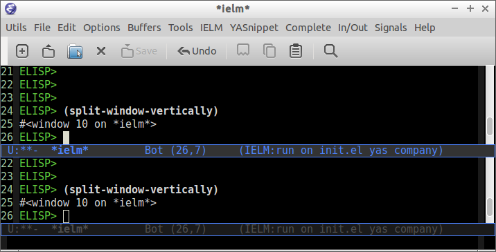
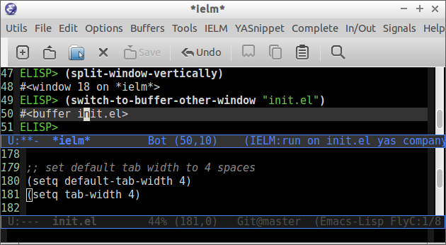
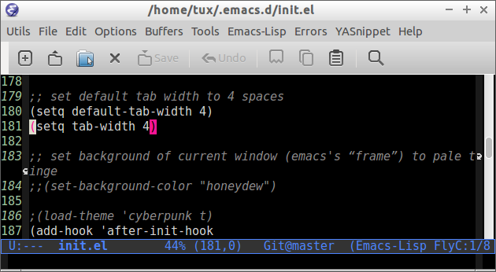
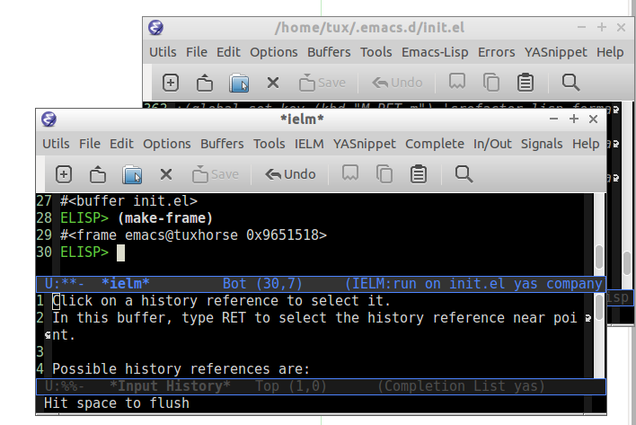
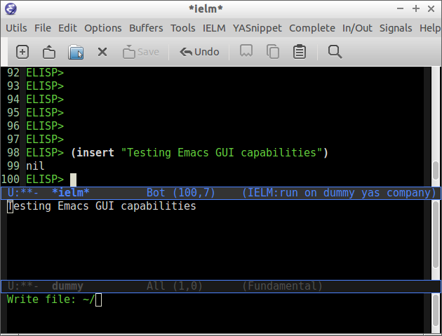
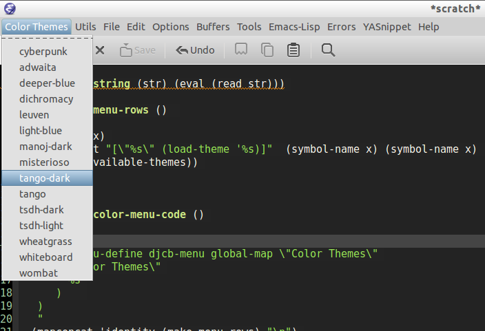

<!-- START doctoc generated TOC please keep comment here to allow auto update -->
<!-- DON'T EDIT THIS SECTION, INSTEAD RE-RUN doctoc TO UPDATE -->
**Table of Contents**  *generated with [DocToc](https://github.com/thlorenz/doctoc)*

- [Emacs - Elisp Programming and Customization](#emacs---elisp-programming-and-customization)
  - [Default Keybindings](#default-keybindings)
  - [Command Line Options](#command-line-options)
  - [Elisp](#elisp)
    - [Ielm - Elisp shell](#ielm---elisp-shell)
    - [Emacs Terminology](#emacs-terminology)
    - [Basic Syntax](#basic-syntax)
      - [Basic Operations](#basic-operations)
      - [Defining Variables](#defining-variables)
      - [Defining Functions](#defining-functions)
      - [List Operations](#list-operations)
      - [Association Lists](#association-lists)
      - [Strings](#strings)
      - [Eval](#eval)
      - [Control Structures](#control-structures)
        - [Conditional Statement](#conditional-statement)
        - [Loops](#loops)
    - [Functional Programming](#functional-programming)
      - [Map and Filter](#map-and-filter)
      - [Anonymous functions/ Lambda functions](#anonymous-functions-lambda-functions)
      - [Function Composition](#function-composition)
      - [Interactive Functions](#interactive-functions)
    - [Macros and Metaprogramming](#macros-and-metaprogramming)
      - [Quasiquote](#quasiquote)
      - [Macros](#macros)
    - [Structures](#structures)
    - [Bufffers](#bufffers)
      - [Buffer Attributes](#buffer-attributes)
      - [Buffer Mode](#buffer-mode)
      - [Get Buffer Contents / Selection / Line](#get-buffer-contents--selection--line)
    - [Files and Directories and OS Interface](#files-and-directories-and-os-interface)
      - [Directory and Path](#directory-and-path)
      - [Date and Time](#date-and-time)
      - [Call External Commands or Apps](#call-external-commands-or-apps)
      - [Environment Variables](#environment-variables)
      - [Process Management](#process-management)
      - [File Name Components](#file-name-components)
      - [Read / Write file to a string](#read--write-file-to-a-string)
    - [Window Functions](#window-functions)
      - [Basic Window Functions](#basic-window-functions)
      - [Manipulate Buffer in Another Window](#manipulate-buffer-in-another-window)
    - [Special Variables](#special-variables)
  - [Discoverability / Get Documentation](#discoverability--get-documentation)
    - [Describe](#describe)
  - [Bytecodes](#bytecodes)
  - [Documentation](#documentation)
    - [References](#references)
      - [Manual](#manual)
      - [Tutorials](#tutorials)
      - [Wikis](#wikis)
      - [Issues](#issues)
    - [Developement Environments for Emacs](#developement-environments-for-emacs)
    - [Selected Dot Emacs](#selected-dot-emacs)
    - [Space Emacs Default Config](#space-emacs-default-config)
    - [Selected Codes](#selected-codes)
    - [Screencasts](#screencasts)
  - [Customization](#customization)
    - [Hide / Show Emacs Widgets](#hide--show-emacs-widgets)
    - [Themes](#themes)
    - [Misc](#misc)
    - [Quiet Startup](#quiet-startup)
  - [Solutions](#solutions)
    - [Quick edit and reload Emac Configuration File.](#quick-edit-and-reload-emac-configuration-file)
    - [Refresh/ Reload File](#refresh-reload-file)
    - [Creating Quick Access Menu](#creating-quick-access-menu)
    - [Extract Function Documentation](#extract-function-documentation)
    - [Edit File as Root](#edit-file-as-root)
    - [Open Current Buffer Directory](#open-current-buffer-directory)
    - [Open Current Buffer Directory in File Manager](#open-current-buffer-directory-in-file-manager)
    - [Open a terminal Emulator in the directory of Current Buffer](#open-a-terminal-emulator-in-the-directory-of-current-buffer)
    - [Eval String in Clipboard](#eval-string-in-clipboard)
    - [Save and Reload Current Session](#save-and-reload-current-session)
    - [Create a menu with all color themes available](#create-a-menu-with-all-color-themes-available)

<!-- END doctoc generated TOC please keep comment here to allow auto update -->

# Emacs - Elisp Programming and Customization

Emacs is an scriptable text editor that can be customized in Elisp, an Emacs own lisp dialect that is a subset of and old version of common lisp. An excellent book about common lisp that is also useful for Elisp and Scheme is [On Lisp - by Paul Graham](http://unintelligible.org/onlisp/onlisp.html)

)

See: [Hyperpolyglot / Lisp: Common Lisp, Racket, Clojure, Emacs Lisp](http://hyperpolyglot.org/lisp)

* http://homepage1.nifty.com/bmonkey/emacs/elisp/completing-help.el
* http://www.reallysoft.de/code/emacs/snippets.html#b4ac15 

**Configuration File**

``` 
~/.emacs.d/init.el
```

## Default Keybindings


**Key Notation**

| Key | Name        |  Modern Keyboard Equivalence   |
|-----|-------------|--------------------------------|
|  M  | Meta        | Alt                            |
|  C  | Control     | Ctrl                           |
|  S  | Shift       | Shift                          |
| SPC | Space       | Space                          |


**File**

|                         |                       |
|-------------------------|-----------------------|
| <kbd>C-x C-s </kbd>     | Save Current Buffer   |
| <kbd>C-x C-w </kbd>     | Save Buffer as different file |
| <kbd>C-x s </kbd>       | Save all buffers      |
| <kbd>C-x C-f </kbd>     | Open File             |

**Buffers**

|                       |                       |
|-----------------------|-----------------------|
| <kbd>C-x b </kbd>     | Select Another Buffer |
| <kbd>C-x C-b</kbd>    | List all buffers      |
| <kbd>C-x k </kbd>     | Kill a buffer         |     

**Edit**

Navigation

|
|-----------------------|------------------------|
| <kbd> C-a </kbd>     | Go to start of the line |
| <kbd> C-e </kbd>     | Go to end of the line.  | 
| <kbd> C-k </kbd>     | Cut/Delete from cursor current position to the end of the line. |
| <kbd> M-< </kbd>     | Move to top of buffer   |
| <kbd> M-> </kbd>     | Move to Bottom of buffer |

Search

|                      |                      |
|----------------------|----------------------|
| <kbd>C-s</kbd>       | Forward Search  |
| <kbd>C-r</kbd>       | Backward Search |
| <kbd>M-%</kbd>       | Replace |

Select, Copy, Cut and Paste

|                        |                      |
|------------------------|----------------------|
| <kbd>C - _     </kbd>  | Undo                 |
| <kbd>C - x u   </kbd>  | Redo                 |
| <kbd>C - Space </kbd>  | Begin Selection      |
| <kbd>C - G     </kbd>  | Cancel Selection     |
| <kbd>C-x h </kbd>      | Select the whole buffer |
| <kbd>M-w  </kbd>       | Copy |
| <kbd>C-y  </kbd>       | Paste |
| <kbd>C-w  </kbd>       | Cut |
| 

Word Case / Comment and Uncomment

|                         |                      |
|-------------------------|----------------------|
| <kbd> M-u </kbd>        | Make word uppercase |
| <kbd> M-l </kbd>        | Make word lowercase |
| <kbd> M-c </kbd>        | Make word title (Capitalize only first letter) |
|
| <kbd> M-; </kbd>  | Comment/ Uncomment Selected Code |


**Windows**

|                        |                      |
|------------------------|----------------------|
| <kbd>C-x k</kbd>       | Close                |
| <kbd>C-x b</kbd>       | Next Window          |
| <kbd>C-x C-b </kbd>    | Choose buffer Window |
| <kbd>C-x 1 </kbd>      | Unsplit              |
| <kbd>C-x 2 </kbd>      | Split Horizontally   |
| <kbd>C-x 3 </kbd>      | Split Vertically     |
| <kbd>C-x o </kbd>      | Switch Window        |
| <kbd>C-x 2 5 </kbd>    | Launch a new frame (separated window) |


**Commands**

|                    |                 | 
|--------------------|-----------------|
| <kbd> M - x </kbd> | Enter a command |
| <kbd> C - g </kbd> | Cancel command input |
| <kbd> M - x </kbd> eval-expression | Eval a lisp expression in current buffer |
| <kbd> M -x </kbd> ielm | Enter Emacs Interactive elisp shell |
| <kbd> M -x </kbd> eshell | Enter Emacs Shell Written in Elisp |
| <kbd> M -x </kbd> shell | Run a shell |
| <kbd> M -! </kbd> shell | Run a single shell command like: ls, pwd, make ... |
| <kbd> M-x eval-region </kbd> shell | Evaluate selected region as elisp code |
| <kbd> M-x eval-buffer </kbd> shell | Evaluate current buffer as elips code |
| <kbd> M-x goto-char </kbd> | Got a character position |


**Information**

|                    |                      |
|--------------------|----------------------|
| <kbd> C-h f </kbd> | Describe function    |
| <kbd> C-h v </kbd> | Describe variable    |
| <kbd> C-h m </kbd> | Describe mode        |
| <kbd> C-h s </kbd> | Describe syntax      |
| <kbd> C-h b </kbd> | Describe key bindings for current buffer |
| <kbd> C-h a </kbd> | Command Apropos |


## Command Line Options

Start emacs ignoring the ~/.emacs.d/init.el or ~/.emacs configuration file.

```

$ emacs --no-init-file

or

$ emacs -q
```

Start Emacs with a custom configuration file:

```
$ emacs -q -l customstart.el 
```

Debug Emacs configuration file: ~/.emacs.d/init.el or ~/.emacs

```
$ emacs  --debug-init
```

To keep multiple configurations files see: [Emacs Bootstrap](https://github.com/caiorss/Emacs-Bootstrap)

Show Emacs version

```
$ emacs --version
```

## Elisp

### Ielm - Elisp shell

This section will use the Emacs interactive elisp shell IELM that can be accessed by typing **M-x ielm**. You can also use the scratch buffer to test Emacs commands, however the it is easier to use IELM.


### Emacs Terminology

| Emacs Terminology | Description |
|-------------------|-------------|
| Point| Cursor position |
| Buffer | Place where the user edit something. Not all buffers are bound to a file. |
| Region | Selected area/ text |
| Frame  | The current window of emacs |
| Windows | Each frame can be split in sections that Emacs documentation calls windows |
| Fill | Word Wrap |
| Yank | Paste |
| Kill | Cut |
| Kill Ring | Clipboard |
| Mode Line | Status Bar |
| Font Lock | Syntax Coloring |

### Basic Syntax

#### Basic Operations

**Arithmetic**

```elisp
ELISP> (+ 20 30)
50 (#o62, #x32, ?2)
ELISP> (- 100 80)
20 (#o24, #x14, ?\C-t)
ELISP> (+ 1 2 3 4 5 6)
21 (#o25, #x15, ?\C-u)
ELISP> (* 1 2 3 4 5 6)
720 (#o1320, #x2d0, ?ː)
ELISP> (/ 1 100) 
0 (#o0, #x0, ?\C-@)

ELISP> (> 10 1) ;; ?? 10 > 1 
t
ELISP> (< 2 8) ;; ?? 2 < 8 
t
ELISP> (< 8 2) ;; ?? 8 < 2
nil

ELISP> (= 2 2)
t
ELISP> (= 2 4)
nil

ELISP> (/= 2 2)
nil
ELISP> (exp -1)
0.36787944117144233
ELISP> (log 10)
2.302585092994046
ELISP> (sin pi)
1.2246467991473532e-16
ELISP> (cos pi)
-1.0
ELISP> (tan (/ pi 2))
1.633123935319537e+16
ELISP> 
```

Comparison

```elisp

;;;; Compare Numbers
;;;;;;;;;;;;;;;;;;;;;;;;;;

ELISP> (= 2 (+ 1 1))
t

;;; Compare Symbols and Numbers
;;;;;;;;;;;;;;;;;;;;;;;;;;;;;

ELISP> (eq 1 1)
t
ELISP> (eq 1 2)
nil
ELISP> 

ELISP> (eq 'x 'x)
t
ELISP> 

;;; Compare Elements of a List
;;;;;;;;;;;;;;;;;;;;;;;;;;;;;;

ELISP> (equal (list 1 2 3 4) (list 1 2 3 4))
t

;;; Compare Strings
;;;;;;;;;;;;;;;;;;;;;;;;;;;;;

ELISP> (string= "hello" "hello")
t
```

Lists

```
ELISP> 
ELISP> '(10 20 30 40)
(10 20 30 40)

ELISP> '(10 203 40 "hello" () ("empty" 65))
(10 203 40 "hello" nil
    ("empty" 65))

ELISP> 
```


#### Defining Variables

```elisp

;;; Constants
;;;;;;;;;;;;;;;;;;;;;;;;;;;;;;;;;;;

ELISP> (defconst zsh-shell "/usr/bin/zsh")
zsh-shell

ELISP> zsh-shell
"/usr/bin/zsh"
ELISP> 

;;; Define a variable
;;;;;;;;;;;;;;;;;;;;;;;;;;;;;;;;;;;

;;;; Set is not used very much the 
;;
ELISP> (set 'avar "hello world")
"hello world"

ELISP> avar
"hello world"
ELISP> 

;;;;; The most used command for assignment is setq
;;
ELISP> (setq x 10)
10 (#o12, #xa, ?\C-j)

ELISP> (setq avar "hello world")
"hello world"

ELISP> x
10 (#o12, #xa, ?\C-j)

ELISP> avar
"hello world"
ELISP>

ELISP> (setq my-list '(10 20 30 40))
(10 20 30 40)

ELISP> my-list
(10 20 30 40)

;;; Multiple Assignment
;;
ELISP> (setq a 10 b 20 c "Emacs")
"Emacs"
ELISP> a
10 (#o12, #xa, ?\C-j)
ELISP> b
20 (#o24, #x14, ?\C-t)
ELISP> c
"Emacs"
ELISP>

;; Dynamic Scoping  (Local Variables)
;;;;;;;;;;;;;;;;;;;;;;;;;;;;;;;;;;;;; 
;;
ELISP> (let ((x 1) (y 10)) (+ (* 4 x) (* 5 y)) )
54 (#o66, #x36, ?6)
ELISP> x
10 (#o12, #xa, ?\C-j)
ELISP> y
*** Eval error ***  Symbol's value as variable is void: y
ELISP> 
```

#### Defining Functions


```elisp
ELISP> (defun afunction (a b c) (+ a b c))
afunction

ELISP> (afunction 10 20 30)
60 (#o74, #x3c, ?<)

ELISP> (defun myfun () (message "Hello Emacs"))
myfun
ELISP> (myfun)
"Hello Emacs"
ELISP> 


ELISP> 
ELISP> (defun signum (n)
     (cond ((> n 0) 1 )
           ((< n 0) -1)
           (0)))
signum
ELISP> (signum 10)
1 (#o1, #x1, ?\C-a)
ELISP> (signum 0)
0 (#o0, #x0, ?\C-@)
ELISP> (signum -23)
-1 (#o7777777777, #x3fffffff)
ELISP> 


ELISP> (defun factorial (n)
     (if (= n 0)
         1
         (* n (factorial (- n 1)))))
factorial

ELISP> (factorial 5)
120 (#o170, #x78, ?x)
ELISP
```
#### List Operations

See also: http://www.fincher.org/tips/Languages/Emacs.shtml


```elisp

;; Defining a List
;; 
;; A emacs list can contain elements of almost any type.
;;
ELISP> '( "a" 2323 "b" 21.2323 "hello" "emacs"   nil () (34 134) '(+ 2 3 5))
("a" 2323 "b" 21.2323 "hello" "emacs" nil nil
 (34 134)
 '(+ 2 3 5))

ELISP> (quote  (1 3 3 4 5))
(1 3 3 4 5)

;;;;; Empty List
;;
ELISP> nil
nil
ELISP> '()
nil
ELISP> 

;; Length of a list
ELISP> (length '(1 2 3 4 5 6))
6 (#o6, #x6, ?\C-f)
ELISP> 


;; nth element of a list
;;
ELISP> (nth 0 '(0 1 2 3 4 5))
0 (#o0, #x0, ?\C-@)
ELISP> (nth 2 '(0 1 2 3 4 5))
2 (#o2, #x2, ?\C-b)
ELISP> (nth 5 '(0 1 2 3 4 5))
5 (#o5, #x5, ?\C-e)
ELISP> (nth 10 '(0 1 2 3 4 5))
nil
ELISP>


;; Membership test
;; member returns null if the element is not member of the list
;;
ELISP> (member 2 '(0 1 2 3 4 5))
(2 3 4 5)

ELISP> (member 10 '(0 1 2 3 4 5))
nil
ELISP> 

;; Position of list element (prior to emacs 24.4)
;;
ELISP> (position 7 '(5 6 7 8))
2 (#o2, #x2, ?\C-b)

ELISP> (position 17 '(5 6 7 8))
nil
ELISP> 

;; Position of list element (emacs 24.4 or later)
;;
ELISP> (cl-position 7 '(5 6 7 8))
2 (#o2, #x2, ?\C-b)

ELISP> (cl-position 17 '(5 6 7 8))
nil
ELISP> 

;; cdr
;;
;; Removes first element of the list, returns the list tail.
;;
ELISP> (cdr '(1 2 3 4 5))
(2 3 4 5)

;; car 
;; 
;; Returns the first list element
;;
ELISP> (car '(1 2 3 4 5))
1 (#o1, #x1, ?\C-a)
ELISP> 


;; cons 
;;
;; List constructor
;;
ELISP> (cons 10 '(1 2 3 4))
(10 1 2 3 4)

ELISP> (cons 1 (cons 2 (cons 3 (cons 4 (cons 5 '())))))
(1 2 3 4 5)

;; Last element of a list
;;
;;
ELISP> (car (last '(1 2 3 4 5)))
5 (#o5, #x5, ?\C-e)
ELISP> 


;; Reverse a list
;;
ELISP> (reverse '(1 2 3 4 5))
(5 4 3 2 1)


;; Append lists
;; 
;; Note: nil also means an empty list
;;
ELISP> (append '(1 2) '( "a" "b" "c" "d"))
(1 2 "a" "b" "c" "d")

ELISP> (append '(1 2) nil '( "a" "b" "c" "d") nil)
(1 2 "a" "b" "c" "d")


;; Filter list elements given a predicate function
;;
;;
ELISP> (remove-if-not (lambda (x) (> x 2))     '(1 2 3 4 5 6 7 8 9 10))
(3 4 5 6 7 8 9 10)

;; Test if list is empty
;; 
ELISP> (null '(1 2 3 4 5))
nil
ELISP> (null '())
t
ELISP> (null nil)
t
ELISP> 

;; Drop the firsts n elements of a list
;;
;;
ELISP> (nthcdr 2 '(1 2 3 4))
(3 4)

ELISP> (nthcdr 3 '(1 2 3 4))
(4)

ELISP> (nthcdr 13 '(1 2 3 4))
nil
ELISP> 

;; Delete an element of a list
;;
;;
ELISP> (delq 1 '(1 2 3 4))
(2 3 4)


ELISP> (delq 10 '(1 2 3 4))
(1 2 3 4)

;; It doesn't work to delete sublists
;;
ELISP> (delq (5) '(1 2 (5) 3 4))
*** Eval error ***  Invalid function: 5
ELISP> (delq '(5) '(1 2 (5) 3 4))
(1 2
   (5)
   3 4)

ELISP> (delete '(5) '(1 2 (5) 3 4))
(1 2 3 4)

;;;;;;;;;;;;;;;;;;;;;;;;;;;;;;;;;;;;;

;; Convert Vector to List
;;
;;
ELISP> (coerce [1 2 3] 'list)
(1 2 3)

;; Convert List to Vector
;;
ELISP> (coerce '(1 2 3) 'vector)
[1 2 3]

ELISP> (number-sequence 0 10 2)
(0 2 4 6 8 10)

ELISP> (number-sequence 9 4 -1) 
(9 8 7 6 5 4)


;;Modify list variables.
;;
ELISP> alist
(a b c d e)

ELISP> (push 'f alist)
(f a b c d e)

ELISP> alist
(f a b c d e)

ELISP> alist
(a b c d e)

ELISP> (pop alist)
a
ELISP> alist
(b c d e)

ELISP> 
```

#### Association Lists

Reference: [Emacs Manual / Association Lists](http://www.delorie.com/gnu/docs/elisp-manual-21/elisp_89.html)

```emacs

ELISP> (setq dict   
'((pine . cones)
 (oak . acorns)
 (maple . seeds)))
((pine . cones)
 (oak . acorns)
 (maple . seeds))

ELISP> dict
((pine . cones)
 (oak . acorns)
 (maple . seeds))

;; Get a cell associated with a key
;;
;;;;;;;;;;;;;;;;;;;;;;;;;;;;;;;;;;;;;;;;
ELISP> 
ELISP> (assoc 'oak dict)
(oak . acorns)

ELISP> (assoc 'wrong dict)
nil

;; Get a Key
;;
;;;;;;;;;;;;;;;;;;;;;;;;;;;;;;;;;;;;;;;;;;

ELISP> (car (assoc 'oak dict))
oak
ELISP> (cdr (assoc 'oak dict))
acorns
ELISP> 


ELISP> (car (assoc 'oak dict))
oak
ELISP> 

;; Get all keys
;;
;;;;;;;;;;;;;;;;;;;;;;;;;;;;;;;;;;;;;;;;;;;;;

ELISP> (mapcar #'car dict)
(pine oak maple)

;; Get all values
;;
;;;;;;;;;;;;;;;;;;;;;;;;;;;;;;;;;;;;;;;;;;;;;

ELISP> (mapcar #'cdr dict)
(cones acorns seeds)

```

Example: Filter multiple keys

```elisp

ELISP> (defvar language-list
  '(
   ("io" . ((:command . "io")
             (:description . "Run IO Language script")))
    ("lua" . ((:command . "lua")
              (:description . "Run Lua script")))
    ("groovy" . ((:command . "groovy")
                 (:description . "Run Groovy")))
    ("scala" . ((:command . "scala")
                (:cmdopt . "-Dfile.encoding=UTF-8")
                (:description . "Run Scala file with scala command")))

    ("haml" . ((:command . "haml")
               (:exec    . "%c %o %s")
               (:description . "Convert HAML to HTML")))
    ("sass" . ((:command . "sass")
               (:exec    . "%c %o --no-cac")))
 ))
language-list


ELISP> (assoc  "scala"  language-list )
("scala"
 (:command . "scala")
 (:cmdopt . "-Dfile.encoding=UTF-8")
 (:description . "Run Scala file with scala command"))

ELISP> (assoc  "lua"  language-list )
("lua"
 (:command . "lua")
 (:description . "Run Lua script"))

ELISP> (assoc  "wrong"  language-list )
nil

ELISP> (assoc ':command (assoc  "scala"  language-list ))
(:command . "scala")

ELISP> (cdr (assoc ':command (assoc  "scala"  language-list )))
"scala"
ELISP> 

ELISP> (assoc ':description (assoc  "scala"  language-list ))
(:description . "Run Scala file with scala command")

ELISP> (cdr (assoc ':description (assoc  "scala"  language-list )))
"Run Scala file with scala command"
ELISP> 

ELISP> (mapcar 'car language-list)
("io" "lua" "groovy" "scala" "haml" "sass")

ELISP> (mapcar 'cdr language-list)
(((:command . "io")
  (:description . "Run IO Language script"))
 ((:command . "lua")
  (:description . "Run Lua script"))
 ((:command . "groovy")
  (:description . "Run Groovy"))
 ((:command . "scala")
  (:cmdopt . "-Dfile.encoding=UTF-8")
  (:description . "Run Scala file with scala command"))
 ((:command . "haml")
  (:exec . "%c %o %s")
  (:description . "Convert HAML to HTML"))
 ((:command . "sass")
  (:exec . "%c %o --no-cac")))

ELISP> 

ELISP> (mapcar (lambda (x) (
                             list
                             (car x)
                             (cdr x)
                             ))
                            language-list)
(("io"
  ((:command . "io")
   (:description . "Run IO Language script")))
 ("lua"
  ((:command . "lua")
   (:description . "Run Lua script")))
 ("groovy"
  ((:command . "groovy")
   (:description . "Run Groovy")))
 ("scala"
  ((:command . "scala")
   (:cmdopt . "-Dfile.encoding=UTF-8")
   (:description . "Run Scala file with scala command")))
 ("haml"
  ((:command . "haml")
   (:exec . "%c %o %s")
   (:description . "Convert HAML to HTML")))
 ("sass"
  ((:command . "sass")
   (:exec . "%c %o --no-cac"))))

ELISP> 

ELISP> (mapcar (lambda (x) (
     list
     (car x)
     (assoc ':command       (cdr x))
     (assoc ':cmdopt        (cdr x))
     (assoc ':description   (cdr x))                             
     ))
    language-list)
    
(("io"
  (:command . "io")
  nil
  (:description . "Run IO Language script"))
 ("lua"
  (:command . "lua")
  nil
  (:description . "Run Lua script"))
 ("groovy"
  (:command . "groovy")
  nil
  (:description . "Run Groovy"))
 ("scala"
  (:command . "scala")
  (:cmdopt . "-Dfile.encoding=UTF-8")
  (:description . "Run Scala file with scala command"))
 ("haml"
  (:command . "haml")
  nil
  (:description . "Convert HAML to HTML"))
 ("sass"
  (:command . "sass")
  nil nil))

ELISP> 


ELISP> (mapcar (lambda (x) (
         list
         (car x)
         (cdr (assoc ':command   (cdr x)))
         (cdr (assoc ':cmdopt       (cdr x)))
         (cdr (assoc ':description   (cdr x)))
         ))

        language-list)
(("io" "io" nil "Run IO Language script")
 ("lua" "lua" nil "Run Lua script")
 ("groovy" "groovy" nil "Run Groovy")
 ("scala" "scala" "-Dfile.encoding=UTF-8" "Run Scala file with scala command")
 ("haml" "haml" nil "Convert HAML to HTML")
 ("sass" "sass" nil nil))

ELISP> 

ELISP> (defun get-value (alist key) (cdr (assoc key alist)))
get-value
ELISP> (get-value language-list "scala")
((:command . "scala")
 (:cmdopt . "-Dfile.encoding=UTF-8")
 (:description . "Run Scala file with scala command"))

ELISP> (get-value language-list "lua")
((:command . "lua")
 (:description . "Run Lua script"))

ELISP> 
ELISP> (get-value language-list "0")
nil
ELISP> 


ELISP> (defun get-key-value (alist key field)
                (cdr (assoc  field  (cdr (assoc key alist))  )))
get-key-value
ELISP> 
ELISP> (get-key-value language-list "scala" ':description)
"Run Scala file with scala command"
ELISP> 

ELISP> (get-key-value language-list "scala" ':command)
"scala"
ELISP> 
```

#### Strings


```elisp

;; Split String

ELISP> (split-string "  two words ")
("two" "words")

ELISP> 

ELISP> (split-string "o\no\no" "\n" t)
("o" "o" "o")

ELISP> (split-string "Soup is good food" "o*" t)
("S" "u" "p" " " "i" "s" " " "g" "d" " " "f" "d")

ELISP> 

;; Format String

ELISP> (format-time-string "%Y/%m/%d %H:%M:%S" (current-time))
"2015/06/26 06:10:04"
ELISP> 
ELISP> 


;; Concatenate Strings

ELISP> (concat "The " "quick brown " "fox.")
"The quick brown fox."
ELISP> 

ELISP> (mapconcat 'identity '("aaa" "bbb" "ccc") ",")
"aaa,bbb,ccc"
ELISP> (split-string "aaa,bbb,ccc" ",") 
ELISP> (split-string "aaa,bbb,ccc" ",")
("aaa" "bbb" "ccc")

;; String Width

ELISP> (string-width "hello world")
11 (#o13, #xb, ?\C-k)
ELISP> 
ELISP> (substring "Freedom Land" 0 5)
"Freed"
ELISP> 
ELISP> (string-match "ce" "central park")
0 (#o0, #x0, ?\C-@)
ELISP> (string-match "gt" "central park")
nil
ELISP> 


;;;;; Misc

ELISP> (make-string 5 ?x)
"xxxxx"
ELISP> (make-string 5 ?a)
"aaaaa"
ELISP> (make-string 5 ?r)
"rrrrr"
ELISP> (make-string 15 ?r)
"rrrrrrrrrrrrrrr"
ELISP> 

```

**Elisp Symbol / String Conversion**

```elisp

; Convert a symbol to string 
;;
ELISP> (symbol-name 'wombat)
"wombat"


; Convert a String to Symbol

ELISP> (intern "wombat")
wombat
```


**Read S-expression from String**

```elisp
ELISP> (read-from-string
            "(
               (POINT1  (X  10.2323)  (Y   20.2323))
               (POINT2  (x  0.2)          (Y 923.23))
               (POINT3  (x -10.5)       (Y 78,23))
             )")
(((POINT1
   (X 10.2323)
   (Y 20.2323))
  (POINT2
   (x 0.2)
   (Y 923.23))
  (POINT3
   (x -10.5)
   (Y 78
      (\, 23))))
 . 174)

ELISP> 
```


#### Eval

**Eval Sexp or S-expressions**

```elisp
ELISP> (eval '(+ 1 2 3 4 5))
15 (#o17, #xf, ?\C-o)
ELISP> 


ELISP> '(defun func1(x)(* 10 x))
(defun func1
    (x)
  (* 10 x))

ELISP> 

ELISP> '((+ 1 3) (* 4 5) (- 8 9))
((+ 1 3)
 (* 4 5)
 (- 8 9))

ELISP> (eval '(defun func1(x)(* 10 x)))
func1
ELISP> (func1 5)
50 (#o62, #x32, ?2)
ELISP> 


ELISP> (mapcar 'eval '((+ 1 3) (* 4 5) (- 8 9)))
(4 20 -1)

```

**Eval Strings**

```elisp
ELISP> (defun eval-string (str) (eval (read str)))
eval-string

ELISP> (eval-string "(+ 1 2 3 4 5 6)")
21 (#o25, #x15, ?\C-u)
ELISP> 

ELISP> (eval-string "(defun func2(x)(* 10 x)))")
func2
ELISP> (func2 6)
60 (#o74, #x3c, ?<)
ELISP> 
```

**S-expression/ Sexp to String**

```elisp
ELISP> (setq sexp1 '(+ 1 (* 2 3)))
(+ 1
   (* 2 3))

ELISP> (eval sexp1)
7 (#o7, #x7, ?\C-g)

ELISP> (format "%S" sexp1)
"(+ 1 (* 2 3))"
ELISP> 
```

**Enter Emacs Lisp mode**

```
M-x emacs-lisp-mode
```

Or

```
emacs-lisp-mode
```

**Eval Commands in Elisp mode**

* Reference: [Evaluating Emacs Lisp Expressions](http://www.gnu.org/software/emacs/manual/html_node/emacs/Lisp-Eval.html)

Evaluate the defun containing or after point, and print the value in the echo area (eval-defun).

```
M-x eval-defun

or

(eval-defun)
```

Evaluate all the Emacs Lisp expressions in the region.
```
M-x eval-region

or

(eval-region)
```

Evaluate all the Emacs Lisp expressions in the current buffer/ window.
```
M-x eval-buffer

or

(eval-buffer)
```

Open a prompt, request user input in current buffer and evalutes.
```
M-x eval-expression
```

Eval/ Load a File
```
M-x load-file

or

(load-file "/path/my_lisp_commands.el")
```


#### Control Structures

##### Conditional Statement

**If Else Statement**

```elisp

;;
;; Any value different from nil or '() is true, otherwise false.
;;

;; True
;;
ELISP> (if t 5 6)
5 (#o5, #x5, ?\C-e)

ELISP> (if 10 5 6)
5 (#o5, #x5, ?\C-e)

ELISP> (if 0 5 6)
5 (#o5, #x5, ?\C-e)

;; False
ELISP> (if nil 5 6)
6 (#o6, #x6, ?\C-f)

ELISP> (if '() 5 6)
6 (#o6, #x6, ?\C-f)


;; Inverting Predicate
;;
ELISP> (if (not t) 5 6)
6 (#o6, #x6, ?\C-f)

ELISP> (if (not nil) 5 6)
5 (#o5, #x5, ?\C-e)


ELISP> (if (< 5 10)  (message "less than 10") (message "greater or equal to 10") )
"less than 10"

ELISP> (if (< 30 10)  (message "less than 10") (message "greater or equal to 10") )
"greater or equal to 10"
ELISP> 

;;; If else with multiple statements

ELISP> (setq x 10)
10 (#o12, #xa, ?\C-j)

ELISP> (if (> x 5)
       ;; Then Statement
       (progn 
         
         (message "Positive Number")
         (print "Greater than five")
         (split-window-vertically)
         78 ;;  Return Value
        ) 
     ;; Else Statement
     (progn
       (print "Less than five")
       (split-window-horizontally)
       12 ;;  Return Value
     ))

"Greater than five"

78 (#o116, #x4e, ?N)
ELISP> 


```

**When**

```elisp

ELISP> (when t 3)
3 (#o3, #x3, ?\C-c)

ELISP> (when nil 3)
nil


ELISP> (setq x 5)
5 (#o5, #x5, ?\C-e)

ELISP> (when (> x 3)
         (message "Less than 3"))
"Less than 3"
ELISP> 

ELISP> (setq x 1)
1 (#o1, #x1, ?\C-a)

ELISP> (when (> x 3)
         (message "Less than 3"))
nil
ELISP> 


;;;;; When with Multiple Statements

ELISP> (setq x 10)
10 (#o12, #xa, ?\C-j)

ELISP> (when (> x 7)
     (progn
       (message "Greater than 7 OK.")
       (message "Print message 2")
       (split-window-horizontally)
      ))
      
 #<window 8 on *ielm*>
ELISP> 
    

```

**Case Switch Statement**

```elisp
ELISP> (setq a 3)       ;; a = 3
3 (#o3, #x3, ?\C-c)
ELISP> 

ELISP> (cond
        ((evenp a) a)       ;; if   (a % 2 == 0)    ==> a
        ((> a 7) (/ a 2))   ;; elif (a > 7)         ==> a/2
        ((< a 5) (- a 1))   ;; elif (a < 5)         ==> a-1
        (t 7)               ;; else                 ==> 7
        )
2 (#o2, #x2, ?\C-b)
ELISP> 
```

##### Loops

It is better to use map and filter instead of loops. See the section: [Functional Programming](#functional-programming)

```elisp

ELISP> (setq a 4)
4 (#o4, #x4, ?\C-d)

ELISP> (loop
        (setq a (+ a 1))
        (when (> a 7) (return a)))
8 (#o10, #x8, ?\C-h)

ELISP> a
8 (#o10, #x8, ?\C-h)
ELISP> 

ELISP> (loop
   (setq a (- a 1))
   (when (< a 3) (return)))
nil
ELISP> a
2 (#o2, #x2, ?\C-b)
ELISP> 
```


### Functional Programming

See also: [Dash Library Github repository](https://github.com/magnars/dash.el)

Dash is functional programming library to Emacs with many useful higher order functions.

#### Map and Filter

**Mapcar / Equivalent to map**

```elisp
ELISP> (defun my-fun (x) (* x 10))
my-fun
ELISP> 

ELISP> (mapcar 'my-fun '(1 2 3 5 6))
(10 20 30 50 60)

ELISP> (mapcar 'capitalize '("hello" "world" "emacs"))
("Hello" "World" "Emacs")

;;  Anonymous Functions
;;
ELISP> (mapcar (lambda (x) (* x x))   '(1 2 3 4 5 6))
(1 4 9 16 25 36)


ELISP> (setq anon (lambda (x) (* x x)))
(lambda
  (x)
  (* x x))

ELISP> (mapcar anon '(1 2 3 4 5 6))
(1 4 9 16 25 36)
```

**Filter**

```elisp
ELISP> (null nil)
t
ELISP> (null 23)
nil
ELISP>

;; Equivalent to  Haskell idiom:  
;;
;; > filter predicate list 
;;
ELISP> (remove-if-not 'null '(1 2 3 nil 5 6 nil nil )) 
(nil nil nil)

;; Equivalent to Haskell idiom:
;;
;;   > filter (\x -> not (predicate x)) list
;;
;; a more apropriate name would be reject
;;
ELISP> (remove-if 'null '(1 2 3 nil 5 6 nil nil )) 
(1 2 3 5 6)


 
ELISP> (defun range (step start stop)
  (if (> start stop)
      nil
      (cons start (range step (+ step start) stop))
     
  );; End If
);; End range

ELISP> (range 1 0 10)
(0 1 2 3 4 5 6 7 8 9 10)

ELISP> (range 2 0 20)
(0 2 4 6 8 10 12 14 16 18 20)


ELISP> (remove-if (lambda (x) (= (% x 2) 0)) (range 1 0 20))
(1 3 5 7 9 11 13 15 17 19)

ELISP> (remove-if-not (lambda (x) (= (% x 2) 0)) (range 1 0 20))
(0 2 4 6 8 10 12 14 16 18 20)


ELISP> (remove-if (lambda (x) (= (% x 3) 0)) (range 1 0 20))
(1 2 4 5 7 8 10 11 13 14 16 17 19 20)

ELISP> (remove-if-not (lambda (x) (= (% x 3) 0)) (range 1 0 20))
(0 3 6 9 12 15 18)

ELISP> 
```

#### Anonymous functions/ Lambda functions

```elisp
ELISP> (lambda (x)(* x 10))
(lambda
  (x)
  (* x 10))

ELISP>

ELISP> (funcall (lambda (x)(* x 10)) 5)
50 (#o62, #x32, ?2)
ELISP>

ELISP> (setq my-lambda (lambda (x) (+ (* x 10) 5))) ;; 10 * x + 5
(lambda
  (x)
  (+
   (* x 10)
   5))

ELISP> (funcall my-lambda 10)
105 (#o151, #x69, ?i)
ELISP> (mapcar my-lambda '(1 2 3 4 5))
(15 25 35 45 55)


ELISP>  (setq double (function (lambda (x) (+ x x)) ))
(lambda
  (x)
  (+ x x))

ELISP> (funcall double 22)
44 (#o54, #x2c, ?,)
ELISP> 


;;
;; Apply a function to a list of arguments
;;
;;;;;;;;;;;

ELISP> (apply #'+ '(1 2 3 4 5))
15 (#o17, #xf, ?\C-o)
ELISP> 

ELISP> 
ELISP> (defun f (x y z) (+ (* 10 x) (* -4 y) (* 5 z)))
f
ELISP> (f 2 3 5)
33 (#o41, #x21, ?!)

ELISP> (apply 'f '(2 3 5))
33 (#o41, #x21, ?!)


ELISP> (mapcar (lambda (x) (apply 'f x)) '( (2 3 5) (4 5 6) (8 9 5)))
(33 50 69)


;; Create Higher Order Functions
;;
;;;;;;;;;;;;;;;;;;;;;;;;;;;;;;;;;;;;

```

#### Function Composition

Credits: [Elisp Function Composition](http://nullprogram.com/blog/2010/11/15/)


```elisp
ELISP> ;; ID: f0c736a9-afec-3e3f-455c-40997023e130
(defun compose (&rest funs)
  "Return function composed of FUNS."
  (lexical-let ((lex-funs funs))
    (lambda (&rest args)
      (reduce 'funcall (butlast lex-funs)
              :from-end t
              :initial-value (apply (car (last lex-funs)) args)))))
              compose
              
ELISP> (funcall (compose 'prin1-to-string 'random* 'exp) 10)
"4757.245739507558"
ELISP> 

```

#### Interactive Functions

Interactive functions can be called using: M-x <function>. The user can create custom emacs commands with interactive functions.

```elisp
(defun some-interactive-function ()
   "Documentation"
  (interactive)
  ...)
```

Execute the function

```
M-x some-interactive-function>
```

### Macros and Metaprogramming

Macros are useful to create new lisp special forms like if and when, create new control structures, domain specific languages and redefine syntax. As elisp is a subset of common lisp, it uses the same syntax. 


#### Quasiquote

Quasiquote is useful to create s-expression templates, data structure templates and lisp macros.

```elisp

> (setq a 10)
10 (#o12, #xa, ?\C-j)

> (setq b 20)
20 (#o24, #x14, ?\C-t)

> (setq c 'my-symbol)
my-symbol

> (setq d "a string")
"a string"


;;;; List of Symbols
> '(a b c d)
(a b c d)

> (list 'a 'b 'c 'd )
(a b c d)

;;;; List of numbers

> '(1 2.232 3523 23)
(1 2.232 3523 23)

> (list 1 2.232 3523 23)
(1 2.232 3523 23)


;;;; List of symbol and numbers

> '(1 2.232 3523 23 a b c d)
(1 2.232 3523 23 a b c d)

> (list 1 2.232 3523 23 'a 'b 'c 'd)
(1 2.232 3523 23 a b c d)

> (list 1 2.232 3523 23 a b c d)
(1 2.232 3523 23 10 20 my-symbol "a string")

;;;; List with the variables a b c d
> (list a b c d)
(10 20 my-symbol "a string")

;;;;  List with variables and symbols
> (list 'a a 'b b 'c c 'd d)
(a 10 b 20 c my-symbol d "a string")

;;;; Asssociaiton List
> (list (cons 'a  a) (cons 'b b) (cons 'c c) (cons 'd  d))
((a . 10)
 (b . 20)
 (c . my-symbol)
 (d . "a string"))
 
 
;;;; Quasiquote 

> `(the product of 3 and 4 is ,(* 3 4))
(the product of 3 and 4 is 12)

> `("the product of 3 and 4 is" ,(* 3 4))
("the product of 3 and 4 is" 12)

> `("the value of (exp 3) is " ,(exp 3) "the value of (sqrt 100) is" ,(sqrt 100))
("the value of (exp 3) is " 20.085536923187668 "the value of (sqrt 100) is" 10.0)
 
> `(a ,a b ,b c ,c d ,d)
(a 10 b 20 c my-symbol d "a string")

> `((a . ,a) (b . ,b) (c . ,c) (d . ,d))
((a . 10)
 (b . 20)
 (c . my-symbol)
 (d . "a string"))
 
> (setq xs '(sym1 sym2 sym3))
(sym1 sym2 sym3)

> xs
(sym1 sym2 sym3)

> `(xs ,xs)
(xs
 (sym1 sym2 sym3))
 
> `(xs ,@xs)
(xs sym1 sym2 sym3)

> `(if (< ,a ,b) ,(+ a 4) ,d)
(if
    (< 10 20)
    14 "a string")
    
> (eval `(if (< ,a ,b) ,(+ a 4) ,d))
14 (#o16, #xe, ?\C-n)
>     

> (eval `(if (> ,a ,b) ,(+ a 4) ,d))
"a string"

;;------------------

> (setq xlist '(1 2 3 4))
(1 2 3 4)

> (setq ylist '(a b c d e))
(a b c d e)

> `(xs ,xlist ys ,ylist)
(xs
 (1 2 3 4)
 ys
 (a b c d e))

> `(xs ,@xlist ys ,@ylist)
(xs 1 2 3 4 ys a b c d e)    
```

#### Macros

**Redefine lambda syntax to λ**

```elisp

(defmacro λ (args body)
 `(lambda ,args ,body))

ELISP> (λ (x) (+ x 3))
(lambda
  (x)
  (+ x 3))

ELISP> (mapcar (λ (x) (+ x 3)) '(1 2 3 4 5 6))
(4 5 6 7 8 9)
```

**Set variable to nil**

```elisp
(defmacro nil! (var)
  `(setq ,var nil))


ELISP> (setq x 10)
10 (#o12, #xa, ?\C-j)
ELISP> x
10 (#o12, #xa, ?\C-j)
ELISP> 

ELISP> (nil! x)
nil
ELISP> x
nil
ELISP> 

ELISP> (nil! z)
nil
ELISP> z
nil
ELISP> 
```

**Create Clojure def, defn and fn special forms**

* [Special form - fn](https://clojuredocs.org/clojure.core/fn)
* [Special form - def](https://clojuredocs.org/clojure.core/def)
* [Special form - defn](https://clojuredocs.org/clojure.core/defn)

```elisp
(defmacro fn (args body)
 `(lambda ,args ,body))

(defmacro def (name value)
   `(setq ,name ,value))

(defmacro defn (name args body)
   `(defun ,name ,args ,body))
 

ELISP> (fn (x) (* x x))
(lambda
  (x)
  (* x x))

ELISP> (mapcar (fn (x) (* x x)) '(1 2 3 4 5))
(1 4 9 16 25)

ELISP> 


ELISP> (def x 1000)
1000 (#o1750, #x3e8, ?Ϩ)
ELISP> x
1000 (#o1750, #x3e8, ?Ϩ)
ELISP> 

ELISP> (defn f (x y z) (+ (* 3 x) (* -4 y) (* 5 z)))
f
ELISP> (f 4 5 6)
22 (#o26, #x16, ?\C-v)
ELISP>

```

**Create Scheme Syntax define**

```elisp
(defmacro define (args body)
 (if (listp args)
     `(defun ,(car args) ,(cdr args) ,body)
     `(setq  ,args ,body)))
define
ELISP> 
ELISP> (define x 50)
50 (#o62, #x32, ?2)
ELISP> x
50 (#o62, #x32, ?2)
ELISP> 
ELISP> (define (f x y) (+ (* 3 x) (* -4 y)))
f
ELISP> (f 5 6)
-9 (#o7777777767, #x3ffffff7)
ELISP> 
```

**Rebind Elisp functions**

Bind new names to existing elisp functions in order to create user friendly identifiers, for example, bind the symbol map to the function mapcar.

```elisp

(defmacro rebindfun (new-name old-name)
   `(setf (symbol-function ,new-name) ,old-name))

ELISP> (rebindfun 'map #'mapcar)
mapcar
ELISP> 

ELISP> (map (lambda (x) (+ x 5)) '(1 2 3 4 5 6 7 8))
(6 7 8 9 10 11 12 13)

ELISP> (rebindfun 'filter #'remove-if-not)
remove-if-not
ELISP> 

ELISP> (filter (lambda (x) (< x  10)) '(1 20 30 4 6 89 3 2 9 100))
(1 4 6 3 2 9)

ELISP> (filter 'evenp  '(1 2 3 4 5 6 7 8))
(2 4 6 8)

ELISP> (filter 'oddp  '(1 2 3 4 5 6 7 8))
(1 3 5 7

;;; Commmon Lisp Way

ELISP> (filter #'evenp  '(1 2 3 4 5 6 7 8))
(2 4 6 8)

ELISP> (filter #'oddp  '(1 2 3 4 5 6 7 8))
(1 3 5 7)
```

**Convert Infix Operator to prefix operator**

```elisp
(defmacro $ (a op b)
  `(,op ,a ,b))  

ELISP> 
ELISP> ($ 1 < 10)
t
ELISP> ($ 1 > 10)
nil
ELISP> 

ELISP> (macroexpand '($ 1 > 10))
(> 1 10)

ELISP> (if ($ 4 < 10) "Less than 10" "Greater than 10")
"Less than 10"
ELISP> 
ELISP> (if ($ 1444 < 10) "Less than 10" "Greater than 10")
"Greater than 10"
ELISP> 
```


### Structures

```elisp
ELISP> (defstruct account id name balance)
account
ELISP> (make-account :id 3434 :name "John" :balance 1000.34)
[cl-struct-account 3434 "John" 1000.34]

ELISP> (setq user1 (make-account :id 3434 :name "John" :balance 1000.34))
[cl-struct-account 3434 "John" 1000.34]

ELISP> (account-name user1)
"John"

ELISP> (account-id user1)
3434 (#o6552, #xd6a, ?൪)
 
ELISP> (account-balance user1)
1000.34

;; Test if input is an account object
;;
;;;;;;;;;;;;;;;;;;;;;;;;;;;;;;;;;;;;
ELISP> (account-p user1)
t
ELISP> 

;; Change Field
;;;;;;;;;;;;;;;;;;;;;;;;;;;;;;;;

ELISP> (defun withdraw (accc amount)
         (setf (account-balance acc) (- (account-balance acc) amount)))
withdraw

ELISP> (withdraw user1 300)
700.34
ELISP> user1
[cl-struct-account 3434 "John" 700.34]

ELISP> (withdraw user1 500)
200.34000000000003
ELISP> user1
[cl-struct-account 3434 "John" 200.34000000000003]

ELISP> 

;; Build structure from a list of parameters
;;
;;;;;;;;;;;;;;;;;;;;;;;;;;;;;;;;;;;;;;;;;;;;

ELISP> (defun build-account (id name balance)
          (make-account :id id :name name  :balance balance))
build-account

ELISP> (build-account 3434 "O' Neil" 35434.23)
[cl-struct-account 3434 "O' Neil" 35434.23]

ELISP> (apply 'build-account '(3434 "O' Neil" 35434.23))
[cl-struct-account 3434 "O' Neil" 35434.23]

ELISP> 

ELISP> (mapcar (lambda (params) (apply 'build-account params))
               '(
                 (34423 "O' Neil" 23.2323)
                 (1023  "John Edwards" 1002323.23)
                 (92323 "Mr. Dummy"  2323241.2323)
                 (8723  "John Oliver" 9823)
               ))
([cl-struct-account 34423 "O' Neil" 23.2323]
 [cl-struct-account 1023 "John Edwards" 1002323.23]
 [cl-struct-account 92323 "Mr. Dummy" 2323241.2323]
 [cl-struct-account 8723 "John Oliver" 9823])

ELISP> 

ELISP> (defun build-accounts-from-list (list-of-params)
          (mapcar (lambda (params) (apply 'build-account params)) list-of-params))
build-accounts-from-list
ELISP> 

ELISP> (setq accounts (build-accounts-from-list
              '(
                 (34423 "O' Neil" 23.2323)
                 (1023  "John Edwards" 1002323.23)
                 (92323 "Mr. Dummy"  2323241.2323)
                 (8723  "John Oliver" 9823)
               )))
([cl-struct-account 34423 "O' Neil" 23.2323]
 [cl-struct-account 1023 "John Edwards" 1002323.23]
 [cl-struct-account 92323 "Mr. Dummy" 2323241.2323]
 [cl-struct-account 8723 "John Oliver" 9823])

ELISP> accounts
([cl-struct-account 34423 "O' Neil" 23.2323]
 [cl-struct-account 1023 "John Edwards" 1002323.23]
 [cl-struct-account 92323 "Mr. Dummy" 2323241.2323]
 [cl-struct-account 8723 "John Oliver" 9823])

ELISP> (mapcar #'account-id accounts)
(34423 1023 92323 8723)

ELISP> 

ELISP> 
ELISP> (mapcar #'account-name accounts)
("O' Neil" "John Edwards" "Mr. Dummy" "John Oliver")

ELISP> 


ELISP> (mapcar #'account-balance accounts)
(23.2323 1002323.23 2323241.2323 9823)

ELISP> 

```

### Bufffers


#### Buffer Attributes

**List all Buffers**

```emacs
;; List of Buffers

ELISP> (buffer-list)
(#<buffer *ielm*> #<buffer Emacs.md> #<buffer *Help*> #<buffer  *Minibuf-1*>
    #<buffer *shell*> #<buffer init.el> #<buffer *markdown-output*> #<buffer *Popup Shell*>
    #<buffer dummy.el> #<buffer  *Minibuf-0*> #<buffer  *code-conversion-work*> #<buffer
    *Echo Area 0*> #<buffer  *Echo Area 1*> #<buffer  *code-converting-work*> #<buffer pad>
    #<buffer *scratch*> #<buffer *Messages*>
    #<buffer *Flycheck error messages*> #<buffer *Completions*>)
```

**Show Current Buffer**

```elisp
;; Show Current Buffer
;; 
ELISP> (current-buffer)
    #<buffer *ielm*>
ELISP>
```

**Name of all buffers**

```elisp

;; Name of all buffers
;;
ELISP> (mapcar #'buffer-name (buffer-list))
("*ielm*" "Emacs.md" "*Help*" " *Minibuf-1*" "*shell*" "init.el" "*markdown-output*"
"*Popup Shell*" "dummy.el" " *Minibuf-0*" " *code-conversion-work*" "
*Echo Area 0*" " *Echo Area 1*" " *code-converting-work*" "pad" "*scratch*"
"*Messages*" "*Flycheck error messages*" "*Completions*")

```

**File names of all buffers**

```elisp
;;
;;
ELISP> (mapcar #'buffer-file-name (buffer-list))
(nil "/home/tux/.emacs.d/Emacs.md" nil nil nil
"/home/tux/.emacs.d/init.el" nil nil
"/home/tux/tmp/dummy.el"
nil nil nil nil nil nil nil nil nil nil)

```

**List all opened files**

```elisp
ELISP> (defun opened-files ()
  "List all opened files in the current session"
  (interactive)
  (remove-if 'null (mapcar 'buffer-file-name  (buffer-list))))
 
opened-files

ELISP> (opened-files)
("/home/tux/.emacs.d/elutils.el" 
"/home/tux/.emacs.d/init.el" 
"/home/tux/PycharmProjects/ocaml/prelude/mtree.ml" 
"/home/tux/.emacs.d/ntmux.el" 
...)

```

**Kill Buffer**

```elisp

ELISP> (kill-buffer "pad")
t
ELISP> 

ELISP> (get-buffer "*scratch*")
    #<buffer *scratch*>
```

**Open a File Programmatically**

```elisp

ELISP> (find-file "/etc/fstab")
 #<buffer fstab>
ELISP> 

;; Open a list of files programmatically
;;
ELISP> (mapcar 'find-file '("/etc/hosts" "/etc/host.conf" "/etc/hosts.allow" "/etc/hosts.deny"))
(#<buffer hosts> #<buffer host.conf> #<buffer hosts.allow> #<buffer hosts.deny>)

```

**Find Buffer Associated With a File**

```elisp

ELISP> (defun find-buffer-file (filename) 
            (car (remove-if-not
              (lambda (b) (equal (buffer-file-name b) filename)) (buffer-list))))
find-buffer-file
ELISP> 

ELISP> (find-buffer-file "/etc/hosts.allow")
 #<buffer hosts.allow>
ELISP> 

ELISP> (find-buffer-file "/etc/file_not_opened")
nil

ELISP> (mapcar 'find-buffer-file '("/etc/hosts" "/etc/host.conf" "/etc/hosts.allow" "/etc/hosts.deny"))
(#<buffer hosts> #<buffer host.conf> #<buffer hosts.allow> #<buffer hosts.deny>)

```

**Close a list of files**

```elisp
(mapcar 
  (lambda (f) (kill-buffer (find-buffer-file f))) 
 '("/etc/hosts" "/etc/host.conf" "/etc/hosts.allow" "/etc/hosts.deny"))
 
ELISP> (defun close-files (filelist)
         (mapcar (lambda (f) (kill-buffer (find-buffer-file f))) filelist)) 
close-files
ELISP>

;;;; Close All Files ;;;;

ELISP> (close-files (opened-files))
(t t t t t t)
```

**Create a New Buffer**

```elisp
;;
;;
;; This function returns a buffer named  buffer-or-name.
;; The buffer returned does not become the current
;; buffer—this function does not change which buffer is current.
;;

ELISP> (get-buffer-create "foobar")
    #<buffer foobar>
ELISP> 

;;
;;  Divide the screen in two windows, and switch to the new buffer
;;  window
;;
ELISP> (switch-to-buffer-other-window "foobar")
    #<buffer foobar>
ELISP> 

;; Clean Current Buffer
;;
ELISP> (erase-buffer)
nil
ELISP> 

;;  Edit another buffer and go back to the old buffer
;;
;;;;;;;;;;;;;;;;;;;;;;;;;;;;;;;;;;;;;;;;;;;;;;;;;;;;;;;;;

ELISP> (defun within-buffer (name function) 
         (let (curbuff (current-buffer))
         (switch-to-buffer name)
         (funcall function)
         (switch-to-buffer current-buffer)
       ))

ELISP> (within-buffer "foobar" (lambda () (insert "dummy")))
    #<buffer *ielm*>
    ELISP> 
    ELISP> (lambda (x)(* x 10))
    (lambda
      (x)
      (* x 10))

;;;; Translated from: http://d.hatena.ne.jp/rubikitch/20100201/elispsyntax
;;
ELISP> ;; test-buffer Create a buffer named, to write a variety of content
(with-current-buffer (get-buffer-create "test-buffer")
  ;; Empty the contents of the buffer
  (erase-buffer)
  ;; /tmp/foo.txt Make the contents inserted
  (insert-file-contents "/etc/fstab")
  ;; Insert a string
  (insert "End\n")
  ;; Write the contents of a buffer to a file
  (write-region (point-min) (point-max) "/tmp/bar.txt"))
nil
ELISP> 

```

#### Buffer Mode

**Show Buffers Mode**

```elisp

ELISP> (defun buffer-mode (buffer-or-string)
  "Returns the major mode associated with a buffer."
  (with-current-buffer buffer-or-string
     major-mode))
buffer-mode

ELISP> (mapcar (lambda (b)(
                           let
                            (  
                            (name (buffer-name b))
                            (type   (buffer-mode (buffer-name b)))
                            )
                            (list name type)
                          ))
                         (buffer-list))
(("*ielm*" inferior-emacs-lisp-mode)
 ("*SPEEDBAR*" speedbar-mode)
 (" *Minibuf-1*" minibuffer-inactive-mode)
 ("*scratch*" emacs-lisp-mode)
 ("test3.ml" tuareg-mode)
 ("*Help*" help-mode)
 ("*Messages*" messages-buffer-mode)
 ("sbet.ml" tuareg-mode)
 (" *Minibuf-0*" minibuffer-inactive-mode)
 ("test.el" emacs-lisp-mode)
 ...
 ...
 
  ("ocsv.ml" tuareg-mode)
 ("parser.ml" tuareg-mode)
 ("prelude.back.ml" tuareg-mode)
 ("prelude.ml" tuareg-mode)
 ("sbet.m" objc-mode)
 ("*etags tmp*" fundamental-mode)
 ("*compilation*" compilation-mode)
 ("mli" fundamental-mode)
 ("test3.mli" tuareg-mode)
 ("*Completions*" completion-list-mode))

```

#### Get Buffer Contents / Selection / Line

**Get Buffer Content as String**

```elisp
ELISP> (defun buffer-content (name) 
    (with-current-buffer name 
    (buffer-substring-no-properties (point-min) (point-max)  )))
buffer-content
ELISP> 

ELISP> (buffer-content "test3.ml")
"\n\nlet rec prodlist = function \n    | [] ... "

```

**Get Selected text in current buffer as string**

You can test the function: select a text in any buffer, enter M-x get-selection, it
will print in another window the selected text

```elisp
(defun get-selection ()
 "Get the text selected in current buffer as string"
 (interactive)
 (buffer-substring-no-properties (region-beginning) (region-end))
)
```

**Get current line in current buffer**

To test it: M-x eval-expression and enter (get-current-line)

```elisp
(defun get-current-line ()
   (interactive)
   "Get current line, where the cursor lies in the current buffer"
   (replace-regexp-in-string "[\n|\s\t]+$" "" (thing-at-point 'line t))
)
```

### Files and Directories and OS Interface

[Files](http://www.gnu.org/software/emacs/manual/html_node/elisp/Files.html)

#### Directory and Path

```elisp
;; Get and Set current directory

ELISP> (pwd)
"Directory /home/tux/tmp/"

ELISP> (cd "/etc/")
"/etc/"

ELISP> (pwd)
"Directory /etc/"
ELISP> 


ELISP> (file-name-directory "/etc/hosts")
"/etc/"

;; Expand File Name
;;
ELISP> (expand-file-name "~/")
"/home/tux/"
ELISP> (expand-file-name ".")
"/home/tux/tmp"
ELISP> (expand-file-name "..")
"/home/tux"
ELISP> 


;;;;; Create a Directory
;;;
ELISP> (mkdir "dummy")
nil
ELISP> (mkdir "dummy")
*** Eval error ***  File exists: /home/tux/dummy
ELISP>

;;; List Directory
;;;;
;;;
ELISP> (directory-files "/home/tux/PycharmProjects/Haskell/")
("." ".." ".git" ".gitignore" ".idea" "LICENSE" "Make" "Makefile"
"README.back.md" "README.html" "README.md" "Test.html" "build.sh" "clean.sh"
"codes" "dict.sh" "haskell" "ocaml" "papers" "tags" "tmp")
```

#### Date and Time

```elisp
;;;
;;; Print Current Time    
;;;
;;;;;;;;;;;;;;;;;;;;;;;;;;;;;;;;;;;;;;;;;;;;;;;
;; (current-time-string)
;;;;;;;;;;
"Sun Jun 21 06:10:28 2015"

;; Year-Month-Day:
(insert (format-time-string "%Y-%m-%d"))

;; Hour:Minutes:Seconds
(insert (format-time-string "%H-%M-%S"))


;; Format Current Time
;;
;;;;;;;
ELISP> (format-time-string "%d/%m/%Y %H:%M:%S" (current-time))
"27/06/2015 22:05:10"
ELISP> 
```

#### Call External Commands or Apps

```elisp

;;; Call External Command
;;;;;;
;; It will launch Lxterminal
;;;;;;;;;;;;;;;;;;;;;;;;;;;;;;;;;...
ELISP> (call-process "lxterminal")
0 (#o0, #x0, ?\C-@)
ELISP>
 

;; Shell Command to String
;;;;;;;
ELISP> (shell-command-to-string "pwd")
"/home/tux/PycharmProjects/ocaml/prelude\n"
ELISP
ELISP> (shell-command-to-string "uname" )
"Linux\n"
ELISP> (shell-command-to-string "uname -a" )
"Linux tuxhorse 3.19.0-18-generic #18-Ubuntu SMP Tue May 19 18:30:59 UTC 2015 i686 i686 i686 GNU/Linux\n"
ELISP> 
```

#### Environment Variables

```elisp
;; Environment Variables
;;
ELISP> (getenv "PATH")
"/home/tux/.opam/4.02.1/bin:/home/tux/bin:/home/tux/.opam/4.02.1/bin
:/usr/local/sbin:/usr/local/bin:/usr/sbin:/usr/bin:/sbin:/bin:/usr/games
:/usr/local/games:/opt/java:/opt/java/bin:/home/tux/bin:/home/tux/usr/bin
:/home/tux/.apps:/opt/jython:/opt/jython/bin:/opt/jython/Lib"

ELISP> (getenv "HOME")
"/home/tux"


;; Set Environment Variables
;;

ELISP> (setenv "JAVA_HOME" "/usr/local/java")
"/usr/local/java"

ELISP> (setenv "LANG" "en_US.UTF8")
"en_US.UTF8"

ELISP> (getenv "LANG")
"en_US.UTF8"
ELISP> 

;; Detect Operating System 
;;
;;
ELISP> system-type
gnu/linux
ELISP> 

;; Test if the operating system is Linux
ELISP> (eq system-type 'gnu/linux)
t
ELISP> 
```

#### Process Management

```elisp

;;;; List all process

ELISP> (process-list)
(#<process ocaml-toplevel> #<process ielm> #<process merlin> #<process melpa.org> #<process melpa.milkbox.net>)

;;;; Get a process, given its name.

ELISP> (get-process "merlin")
 #<process merlin>
ELISP> 

;;;; Names

ELISP> (mapcar 'process-name (process-list))
("ocaml-toplevel" "ielm" "merlin" "melpa.org" "melpa.milkbox.net")

ELISP> 

;;;; Commmand of a process

ELISP> (process-command (get-process "ocaml-toplevel"))
("/home/tux/bin/opam" "config" "exec" "--" "ocaml")

ELISP> (process-command (get-process "ielm"))
("hexl")

;;;; Process ID

ELISP> 
ELISP> (process-id (get-process "ocaml-toplevel"))
2488 (#o4670, #x9b8, ?স)
ELISP> 
ELISP> (process-id (get-process "ielm"))
25579 (#o61753, #x63eb, ?揫)
ELISP> 

;;;; Buffer Process

ELISP> (process-buffer (get-process "ocaml-toplevel"))
 #<buffer *ocaml-toplevel*>
ELISP> 

ELISP> (buffer-name (process-buffer (get-process "ocaml-toplevel")))
"*ocaml-toplevel*"
ELISP> 

ELISP> (mapcar (lambda (p) (buffer-name (process-buffer p))) (process-list))
("pybff" "*ocaml-toplevel*" "*ielm*" " *merlin (default)*" "*ielm*" "*ielm*")

;;;; Display Buffer Process Window

ELISP> (display-buffer (process-buffer (get-process "py")))
 #<window 21 on pybff>
ELISP> 

;;;; Start Asyncronous Process

;;  Start the process named py, with the buffer named pybff 
;;  using the command python, /usr/bin/python (on linux)
;;
ELISP> (start-process "py"   "pybff" "python")
 #<process py>

ELISP> (process-list)
(#<process py> #<process ocaml-toplevel> #<process ielm> 
 #<process merlin> #<process melpa.org> #<process melpa.milkbox.net>)


;;;; End Asynchronous Process

;; End the process named py
ELISP> (process-send-eof "py")
"py"

ELISP> (process-send-eof "py")
*** Eval error ***  Process py does not exist
ELISP> 

;;;; Send String to Process

ELISP> (process-send-string "py" "print 'Hello world'\n")
nil
ELISP> 

;;;; Get Multiple Fields

ELISP> (mapcar
        (lambda (p)(list
                     p
                    (process-name p)                    
                    (process-command p)
                    (list (process-buffer p) (buffer-name (process-buffer p)))
                    (process-id p)
                    (process-status p)                    
        ))
        (process-list))
((#<process py> "py"
            ("python")
            (#<buffer pybff> "pybff")
            3374 run)
 (#<process ocaml-toplevel> "ocaml-toplevel"
            ("/home/tux/bin/opam" "config" "exec" "--" "ocaml")
            (#<buffer *ocaml-toplevel*> "*ocaml-toplevel*")
            2488 run)
 (#<process ielm> "ielm"
            ("hexl")
            (#<buffer *ielm*> "*ielm*")
            25579 run)
 (#<process merlin> "merlin"
            ("ocamlmerlin" "-protocol" "sexp")
            (#<buffer  *merlin
                       (default)
                       *> " *merlin (default)*")
            24926 run)
 (#<process melpa.org> "melpa.org" nil
            (nil "*ielm*")
            nil open)
 (#<process melpa.milkbox.net> "melpa.milkbox.net" nil
            (nil "*ielm*")
            nil open))

ELISP>
```


#### File Name Components

[File Name Components](http://www.gnu.org/software/emacs/manual/html_node/elisp/File-Name-Components.html)

```elisp
ELISP> (file-name-directory "/usr/bin/env")
"/usr/bin/"
ELISP> 

ELISP> (file-name-nondirectory "/usr/bin/env")
"env"
ELISP> 


ELISP> (file-name-base "/home/foo/zoo1.c")
"zoo1"
ELISP> (file-name-base "/home/foo/zoo1.c.back")
"zoo1.c"
ELISP
```

#### Read / Write file to a string


**Read File**

```elisp

ELISP> (defun file-contents (filename)
  (interactive "fFind file: ")
  (with-temp-buffer
    (insert-file-contents filename)
    (buffer-substring-no-properties (point-min) (point-max))))

ELISP> (file-contents "/proc/filesystems")
"nodev  sysfs\nnodev    rootfs\nnodev   ramfs\nnodev    
bdev\nnodev proc\nnodev cgroup\nnode ...   
```

**Write to File**

```elisp
ELISP> (append-to-file "hello world" nil "/tmp/hello.txt")
nil

ELISP> (file-contents "/tmp/hello.txt")
"hello world"
ELISP>
```

* [Current Buffer](http://www.gnu.org/software/emacs/manual/html_node/elisp/Current-Buffer.html)
* [Creating New Buffer](http://www.gnu.org/software/emacs/manual/html_node/elisp/Creating-Buffers.html)


### Window Functions

#### Basic Window Functions

* Original Window before be changed.


* Split Window Horizontally

```elisp
ELISP> (split-window-horizontally)
#<window 6 on *ielm*>
```


* Delete Other Windows

```elisp
ELISP> (delete-other-windows)
nil
ELISP> 
```


* Split Window Vertically

```elisp
ELISP> (split-window-vertically)
#<window 10 on *ielm*>
ELISP> 
```


* Switch to Buffer on other window.

```elisp
ELISP> (switch-to-buffer-other-window "init.el")
#<buffer init.el>
ELISP> 
```


* Delete Current Window

```elisp
ELISP> (split-window-vertically)
#<window 18 on *ielm*>

ELISP> (switch-to-buffer-other-window "init.el")
#<buffer init.el>
```



```elisp
ELISP> (delete-window)
nil
ELISP> 
```




* Launch a new frame

```elisp
ELISP> (make-frame)
#<frame emacs@tuxhorse 0x9651518>
ELISP> 
```



```elisp
;;; List Frames:

ELISP> (frame-list)
(#<frame /home/tux/.emacs.d/init.el 0x95fe518> #<frame *ielm* 0x9651518>)

ELISP> 

;; Close the new frame
;;
ELISP> (delete-frame)
nil
ELISP> 
```

#### Manipulate Buffer in Another Window

Description: Split window vertically, create a new buffer not associated to a file named dummy, and switch
to this buffer on the second window and set the current buffer to dummy.

```elisp
ELISP> (split-window-vertically)
#<window 22 on *ielm*>

ELISP> (setq dummy-buffer (get-buffer-create "dummy"))
#<buffer dummy>

ELISP> (switch-to-buffer-other-window dummy-buffer)
#<buffer dummy>

ELISP> (set-buffer dummy-buffer)
#<buffer dummy>
ELISP>  
```


Description: Insert some text on the buffer dummy.

```elisp
ELISP> (insert "Testing Emacs GUI capabilities")
nil
ELISP> 
```



Description: Redirect a shell command to the dummy buffer.

```elisp
ELISP> (print (shell-command-to-string "lsusb") dummy-buffer)
;; 
;; Or it could be:
;;
;;  (insert (shell-command-to-string "lsusb"))

```


Description: Erase Dummy buffer:

```elisp
ELISP> (erase-buffer)
nil
ELISP> 
```


* Change Buffer Safely:

```elisp
ELISP> (with-current-buffer dummy-buffer
         (insert (shell-command-to-string "uname -a")))
nil
ELISP> 
```


* Other Window Operations

```elisp

;; List all Opened windows
;;
ELISP> (window-list)
(#<window 18 on *ielm*> #<window 22 on dummy> #<window 12 on  *Minibuf-1*>)

;; List the buffer of each window
;;
ELISP> (mapcar 'window-buffer (window-list))
(#<buffer *ielm*> #<buffer dummy> #<buffer  *Minibuf-1*>)

;; List the buffer name of each window
;;
ELISP> (mapcar (lambda (w)(buffer-name (window-buffer w))) (window-list))
("*ielm*" "dummy")

ELISP
```


* Not Compiled Yet.

```
balance-windows
delete-other-windows
delete-window
delete-windows-on
display-buffer
shrink-window-if-larger-than-buffer
split-window
split-window-horizontally
split-window-vertically
switch-to-buffer
switch-to-buffer-other-window
other-window
other-window-for-scrolling

;; Open a new Emacs Window
(make-frame)

;; Screen Resolution

ELISP> (x-display-pixel-width)
1366 (#o2526, #x556, ?Ֆ)

ELISP> (x-display-pixel-height)
768 (#o1400, #x300, ?̀)
ELISP> 
ELISP> 

;; Resize and Set Emacs Windows position
;; 
;; From: http://uce.uniovi.es/tips/Emacs/mydotemacs.html#sec-41
;;
;;;;;;;;;;;;;;;;;;;;;;;;;;;;;;;;;;;;;;;;;;;;;

ELISP> (defun resize-frame ()
  "Set size"
  (interactive)
  (set-frame-width (selected-frame) 100)
  (set-frame-height (selected-frame) 28)
  (set-frame-position (selected-frame) 0 1))
resize-frame
ELISP> 

ELISP> (resize-frame)
t
ELISP> 

```

* http://ecb.sourceforge.net/docs/The-edit_002darea.html 
* http://www.delorie.com/gnu/docs/elisp-manual-21/elisp_432.html 
* http://www.delorie.com/gnu/docs/elisp-manual-21/elisp_441.html 
* http://www.chemie.fu-berlin.de/chemnet/use/info/elisp/elisp_26.html 

### Special Variables

```elisp
ELISP> emacs-major-version
24 (#o30, #x18, ?\C-x)    

ELISP> load-path
    ("/home/tux/.emacs.d/elpa/color-theme-cobalt-0.0.2/" 
    "/home/tux/.emacs.d/elpa/color-theme-20080305.34/" 
    "/home/tux/.emacs.d/elpa/company-ghc-20150613.123/" 
    "/home/tux/.emacs.d/elpa/company-0.8.12/
    ...)
    
    
ELISP> window-system
x
ELISP> 

ELISP> system-type
gnu/linux
ELISP> 

ELISP> system-configuration
"i686-pc-linux-gnu"
ELISP> 

;;;;;;;; User Settings ;;;;;;;;;

ELISP> shell-file-name
"/bin/bash"
ELISP> 

ELISP> user-full-name
"tux"
ELISP> user-mail-address
"tux@tuxhorse"

ELISP> user-init-file
"/home/tux/.emacs.d/init.el"
ELISP> 


ELISP> user-emacs-directory
"~/.emacs.d/"

ELISP> 
ELISP> exec-directory
"/usr/lib/emacs/24.4/i686-linux-gnu/"
ELISP> 
```

## Discoverability / Get Documentation


**Apropos**

```
M-x <apropos command>
```

Apropos Commands

```
apropos
apropos-command
apropos-documentation
info-apropos
apropos-library
apropos-variable
apropos-value
```


### Describe

See also: 

* [.emacs file by Alex](https://alexschroeder.ch/geocities/kensanata/dot-emacs.html)
* [qDot's Emacs Configuration](http://qdot.github.io/conf_emacs/)

**Describe Function**

This calls the command describe-function. Type a function name and get documentation of it.

```
ELISP> (describe-function <function-name>)

or

M-x describe-function

or type the keys

C-h f
```

**Describe Variable**

This calls the command describe-variable. Type the name of a variable at the prompt and press return. This displays the variable's documentation and value.


```
ELISP> (describe-variable <variable-name>)
ELISP> (describe-variable 'load-path)


M-x describe-variable

or

C-h v
```

## Bytecodes

* http://www.chemie.fu-berlin.de/chemnet/use/info/elisp/elisp_15.html

* [Emacs Bytecodes internals](http://nullprogram.com/blog/2014/01/04/)

Forth Compiler to Emacs Bytecodes

* https://github.com/larsbrinkhoff/lbForth/blob/master/targets/emacs/forth.el
* https://github.com/larsbrinkhoff/lbForth/blob/master/targets/emacs/asm.fth


## Documentation

### References

#### Manual

* [GNU Emacs Lisp Reference Manual](http://www.delorie.com/gnu/docs/elisp-manual-21/elisp_toc.html#SEC_Contents)

* http://blog.gnumonk.com/2012/07/effective-emacs-part1.html

#### Tutorials

* [Rosetta Code/ Category:Emacs Lisp](http://rosettacode.org/wiki/Category:Emacs_Lisp)

* [Read Lisp, Tweak Emacs: How to read Emacs Lisp so that you can customize Emacs](http://emacslife.com/how-to-read-emacs-lisp.html)

* [Read Lisp, Tweak Emacs [Beginner 1/4]: How to try Emacs Lisp](http://sachachua.com/blog/series/read-lisp-tweak-emacs/)

* [Elisp Cookbook](http://emacswiki.org/emacs/ElispCookbook)
* [ErgoEmacs](http://ergoemacs.org/)
* [Essential Elisp Libraries - Functional Programmin in Elisp](http://www.wilfred.me.uk/blog/2013/03/31/essential-elisp-libraries/)


#### Wikis

* [Emacs / Arch Wiki](https://wiki.archlinux.org/index.php/Emacs)

* [Emacs Lisp for Perl Programmers](http://obsidianrook.com/devnotes/elisp-for-perl-programmers.html)

* [Hyperglot / Lisp: Common Lisp, Racket, Clojure, Emacs Lisp](http://hyperpolyglot.org/lisp)

**Github**

* [Learn Elisp the Hard Way](https://github.com/hypernumbers/learn_elisp_the_hard_way)

**Lexical Scope**

* [On elisp and programming in general](http://prog-elisp.blogspot.com.br/2012/05/lexical-scope.html)


#### Issues

* [Emacs on Windows / Cygwin](http://www.khngai.com/emacs/cygwin.php)

### Developement Environments for Emacs

**Python**

* [Python Settings](http://wikemacs.org/wiki/Python)

* [Setting up Emacs to Support both Python 2 and Python 3](http://www.reddit.com/r/emacs/comments/3anrqf/setting_up_emacs_to_support_both_python_2_and/)

* [Pyenv Mode](https://github.com/proofit404/pyenv-mode)

**Javascript**

* [Java Script](http://wikemacs.org/wiki/JavaScript)

**C / C++**

* [C/C++ Development Environment for Emacs](http://tuhdo.github.io/c-ide.html)
* [C make IDE](https://github.com/atilaneves/cmake-ide)

**Ocaml**

* [Ocaml](http://wikemacs.org/wiki/OCaml)

**Haskell**

* [Haskell Mode](http://wikemacs.org/wiki/Haskell-mode)


**Non Categorized**

* [Loacal Variables](http://emacswiki.org/emacs/LocalVariables)

* [Project Interaction Library for Emacs](https://github.com/joelmccracken/projectile)

* [The Emacs Widget Library](http://www.gnu.org/software/emacs/manual/html_node/widget/index.html)

* [InteractivelyDoThings](http://www.emacswiki.org/emacs/InteractivelyDoThings)

### Selected Dot Emacs

* [Sacha Chua's Emacs configuration](http://pages.sachachua.com/.emacs.d/Sacha.html)

* [Howard Abrams dot emacs](https://github.com/howardabrams/dot-files/blob/master/emacs.org)

* http://uce.uniovi.es/tips/Emacs/mydotemacs.html

* http://www.dgp.toronto.edu/~ghali/emacs.html

* http://whattheemacsd.com/

* https://snarfed.org/dotfiles/.emacs

* http://web.mit.edu/Nelhage/Public/dot-elisp/site/g-client/json.el


### Space Emacs Default Config

From the documentation:

Spacemacs is first intended to be used by Vim users who want to go to the next level by using Emacs. It is also a good fit for people wanting to lower the risk of RSI induced by the default Emacs key bindings (this is an assumption, there is no official studies to prove this).


* https://github.com/syl20bnr/spacemacs

### Selected Codes

* http://forge.scilab.org/index.php/p/scilab-emacs/source/tree/master/scilab.el

* http://repo.or.cz/w/emacs.git/blob_plain/emacs-24:/lisp/progmodes/python.el

* http://emacswiki.org/emacs/file-template.el

* http://aperiodic.net/phil/configs/elisp/ledger.el

Large Collection of Codes to Emacs

* http://www.damtp.cam.ac.uk/user/eglen/emacs/ell.html

### Screencasts

* [What You Can Learn From ido.el](https://vimeo.com/1013263)

## Customization

See also: http://www.aaronbedra.com/emacs.d/

### Hide / Show Emacs Widgets

**Hide / Show Menu bar**

Hide Menu Bar

```
(menu-bar-mode 0)
```

Show Menu Bar

```
(menu-bar-mode 1)
```

**Hide / Show Toolbar**

Show Tool Bar

```
(tool-bar-mode 1)
```

Hide Tool Bar

```
(tool-bar-mode 0)
```


**Hide / Show Scroll Bar**

Show

```
(scroll-bar-mode 1)
```

Hide

```
(scroll-bar-mode -1)
```

### Themes

Load a color theme

```
(load-theme 'wombat t)
```

List all available themes

```
ELISP> (custom-available-themes)
(cyberpunk adwaita deeper-blue dichromacy leuven light-blue manoj-dark 
misterioso tango-dark tango tsdh-dark tsdh-light wheatgrass 
whiteboard wombat)

or

M-x custom-available-themes
```

Print Color Theme Info (elisp code)

```
ELISP> (color-theme-print)
"Pretty printing current color theme function... done"

or

M-x color-theme-print
```

### Misc

**Disable/Enable Blink Cursor**

Enable Blink Cursor

```elisp
(blink-cursor-mode 1)
```

Stop Blink Cursor

```elisp
(blink-cursor-mode 0)
```

**Space / Tabs - Identation**

Set identation with spaces instead of tabs with 4 spaces

```
(setq tab-width 4 indent-tabs-mode nil)


;; set default tab char's display width to 4 spaces
(setq-default tab-width 4)
(setq-default indent-tabs-mode nil)

;; make tab key always call a indent command.
(setq-default tab-always-indent t)

;; make tab key call indent command or insert tab character, depending on cursor position
(setq-default tab-always-indent nil)

;; make tab key do indent first then completion.
(setq-default tab-always-indent 'complete)

```      

**Font Size and Type**

```
(set-default-font "Inconsolata 14")
```

**Character Encoding Default**

```
;; Character encodings default to utf-8.
(prefer-coding-system 'utf-8)

(set-language-environment 'utf-8)

(set-default-coding-systems 'utf-8)

(set-terminal-coding-system 'utf-8)

(set-selection-coding-system 'utf-8)
```


**Disable / Enable Backup Files**

Enable

```
(setq make-backup-files t)
```

Disable

```
(setq make-backup-files nil)
```

**Type y/n instead of yes and no**

```
(defalias 'yes-or-no-p 'y-or-n-p)
```

**Show Match Parenthesis**

```
ELISP> (show-paren-mode 1)
t
```

**Delete trailing whitespace before saving**

```
(add-hook 'before-save-hook 'delete-trailing-whitespace)
```


### Quiet Startup

From: [Ask HN Emacs Users: What's in your .emacs file?](https://news.ycombinator.com/item?id=1654164)


```elisp
;; Don't display the 'Welcome to GNU Emacs' buffer on startup
(setq inhibit-startup-message t)

;; Display this instead of "For information about GNU Emacs and the
;; GNU system, type C-h C-a.". This has been made intentionally hard
;; to customize in GNU Emacs so I have to resort to hackery.
(defun display-startup-echo-area-message ()
  "If it wasn't for this you'd be GNU/Spammed by now"
  (message ""))

;; Don't insert instructions in the *scratch* buffer
(setq initial-scratch-message nil)
```

## Solutions

### Quick edit and reload Emac Configuration File.

It is usefult to quick edit and reload ~/emacs.d/init.el without restart emacs. Those functions can be put in the init.el file.

```elisp
;; Usage: M-x reload-init-file
;;
(defun reload-init-file ()
  "Reload init.el file"
  (interactive)
  (load user-init-file)
  (message "Reloaded init.el OK.")
)

;; Usage: M-x open-init-file
;;
(defun open-init-file ()
    (interactive)
    (find-file user-init-file)
)  
```


### Refresh/ Reload File

Source: http://www.emacswiki.org/emacs-en/download/misc-cmds.el


```elisp
(defun refresh ()
    "Revert buffer without confirmation."
    (interactive)
    (revert-buffer t t))
```

Usage:

```
M-x refresh
```

### Creating Quick Access Menu


```elisp

(require 'easymenu)
                  
(easy-menu-define djcb-menu global-map "Utils"
  '("Utils"

     ("Shells" ;; submenu
       ["Ielm   - Emacs Lisp Shell"       (ielm)]
       ["Eshell - Emacs Buitin Shell"    (eshell)]
       ["Native Shell "                  (shell)]
      ["---------------------" nil]       
      ["Edit .bashrc" (find-file  "~/.bashrc")]
      ["Edit .profile" (find-file "~/.profile")]
      ["Edit .Xresources" (find-file "~/.Xresources")]
      ["Edit .xsessin"    (find-file "~/.xsession")]
      ["See all GNU MAN pages" ( info)]
      ["See a specific Man Page" (woman)]       
       
      );; End of shells menu   

     ("Emacs /Elisp"  ;; submenu

      ["Ielm   - Emacs Lisp Shell"  (ielm)]
      ["Eval buffer"   ( eval-buffer ) ]      
      ["---------------------" nil]
      
      ["Edit  init.el" (find-file  user-init-file)]
      ["Reload init.el" (load-file user-init-file)]      
      ["Open .emac.d dir" (find-file "~/.emacs.d")]
      ["List packages"     (list-packages)]
      ["Install package"   (package-install)]
      
     ) ;; End of Emacs / Elisp submenu
   
 )) ;; End of Custom Menu


```


### Extract Function Documentation

Source:

* [Generate emacs-lisp documentation](http://kitchingroup.cheme.cmu.edu/blog/2014/10/17/Generate-emacs-lisp-documentation/)

Primitives:

```elisp
ELISP> 
ELISP> (defun sample-function (a b c)
           "Function Docstring"
         (+ a (* 5 b) (* 3 c)))
 

;; Extract Documentation
;;
ELISP> (documentation 'sample-function)
"Function Docstring"

;; Extract Code
;;
ELISP> (symbol-function 'sample-function)
(lambda
  (a b c)
  "Function Docstring"
  (+ a
     (* 5 b)
     (* 3 c)))

;; Extract Arguments
ELISP> (help-function-arglist 'sample-function)
(a b c)
```
Final Code

```elisp
(fun2org 'sample-function)
    "** sample-function (a b c)\nFunction Docstring\n\n#+BEGIN_SRC emacs-lisp\n(lambda (a b c) \"Function Docstring\" (+ a (* 5 b) (* 3 c)))\n#+END_SRC\n"
    ELISP> 
    ELISP> (defun fun2org (function-symbol)
      (let ((args (help-function-arglist function-symbol))
            (doc  (documentation function-symbol))
            (code (symbol-function function-symbol)))
        (print (format "** %s %s
    %s

    #+BEGIN_SRC emacs-lisp
    %S
    #+END_SRC
    " function-symbol args doc code)))) ;; End of fun2org
```    
       
    
```elisp    
ELISP> (fun2org 'sample-function)

"** sample-function (a b c)
Function Docstring
 
 #+BEGIN_SRC emacs-lisp
 (lambda (a b c) \"Function Docstring\" (+ a (* 5 b) (* 3 c)))
 #+END_SRC
"
```

### Edit File as Root

```elisp
(defun open-as-root (filename)
  (interactive)
  (find-file (concat "/sudo:root@localhost:"  filename)))


;; Example: 
;; ELISP> (open-as-root "/etc/host.conf")
;;


;;
;; Open an already opened buffer as root
;;
;; M-x open-buffer-as-root
;;
(defun open-buffer-as-root ()
 (interactive)
 (let 
     (
      ;; Get the current buffer file name
      (filename (buffer-file-name (current-buffer))) 
      ;; Get the current file name
      (bufname  (buffer-name (current-buffer)))
     )
   (progn
  (kill-buffer bufname)         ;; Kill current buffer
  (open-as-root filename))))    ;; Open File as root


```

### Open Current Buffer Directory

M-x open-dir

```elisp
(defun open-dir ()
  "Open directory of current buffer"
  (interactive)
  (find-file (file-name-directory (buffer-file-name))))
```  

### Open Current Buffer Directory in File Manager

M-x open-file-manager

```elisp
(defun open-file-manager ()
  "Open buffer directory in file manager (Linux Only)"
  (interactive)
  (call-process "pcmanfm"))
;; or on Mac
(defun open-file-manager ()
  "Open buffer directory in file manager (Mac Only)"
  (interactive)
  (call-process "open" nil nil nil "."))
```  

### Open a terminal Emulator in the directory of Current Buffer

Despite Emacs can run a shell like python, bash, zsh, it cannot run ncurses based applications. In these cases is necessary to launch an external terminal. This command can be added to the menu in the section: [Creating Quick Access Menu](#creating-quick-access-menu)

Usage:

```
M-x open-terminal
```

Code:

```elisp
(defun open-terminal ()
  "Open terminal in file directory"
  (interactive)
  (call-process "lxterminal"
                nil
                (format "--working-directory='%s'"
                        (file-name-directory (buffer-file-name)))))
;; or on Mac
(defun open-terminal ()
  "Open terminal in file directory"
  (interactive)
  (let ((cmd (format "cd %s" default-directory)))
    (do-applescript
     (format
      "
  tell application \"iTerm\"
       activate
       set _session to current session of current terminal
       tell _session
            set command to get the clipboard
            write text \"%s\"
       end tell
  end tell
  " cmd))))
```

### Eval String in Clipboard

It only works on Linux and requires Xclip to be installed, but with a few changes can be tweaked to work in another Os.

```elisp

ELISP> (defun eval-string (str) (eval (read str)))
eval-string

ELISP> (defun eval-xclip () (eval-string (shell-command-to-string "xclip -o")))
eval-xclip

;;
;;  Copy the following line in this comment block
;;  
;;      (message "Loading my copypaste file...")

ELISP> (eval-xclip)
"Loading my copypaste file..."
ELISP> 

```
                                                
### Save and Reload Current Session

Interactive Developement

```elisp
ELISP> (defun file-contents (filename)
  (interactive "fFind file: ")
  (with-temp-buffer
    (insert-file-contents filename)
    (buffer-substring-no-properties (point-min) (point-max))))
file-contents
ELISP> 

ELISP> (defun write-file (filename content)
         (append-to-file content nil filename))
write-file
ELISP> 

ELISP> (remove-if 'null (mapcar 'buffer-file-name  (buffer-list)))
("/home/tux/.emacs.d/init.el" "/sudo:root@localhost:/etc/host.conf")

ELISP> (setq session-file  "~/.emacs.d/lastsession.el")
"~/.emacs.d/lastsession.el"
ELISP> 

ELISP> 
ELISP> (format "(setq last-session-files '%S)" (remove-if 'null (mapcar 'buffer-file-name  (buffer-list))))
"(setq last-session-files '(\"/home/tux/.emacs.d/init.el\" \"/sudo:root@localhost:/etc/host.conf\"))"


ELISP> (setq code  (format "(setq last-session-files '%S)" (remove-if 'null (mapcar 'buffer-file-name  (buffer-list)))))
"(setq last-session-files '(\"/home/tux/.emacs.d/init.el\" \"/sudo:root@localhost:/etc/host.conf\"))"
ELISP> 

ELISP> (setq session-file "~/.emacs.d/lastsession.el")

ELISP> (delete-file session-file)
nil

ELISP> (write-file session-file code)
nil
ELISP> 

ELISP> (file-contents session-file)
"(setq last-session-files '(\"/home/tux/.emacs.d/init.el\" \"/sudo:root@localhost:/etc/host.conf\"))"
ELISP> 

ELISP> (load-file session-file)
t
ELISP> last-session-files
("/home/tux/.emacs.d/init.el" "/sudo:root@localhost:/etc/host.conf")

;;; Open All files defined in Last Session
ELISP> 
ELISP> (mapcar 'find-file last-session-files)
(#<buffer init.el> #<buffer host.conf>)

ELISP> 
```

Joining Everything


File: sessions.el

```elisp
(setq session-file "~/.emacs.d/lastsession.el")

(defun write-file (filename content)
  (append-to-file content nil filename))


(defun make-session-code ()
     (interactive)
     (format "(setq last-session-files '%S)" (remove-if 'null (mapcar 'buffer-file-name  (buffer-list)))))
   

(defun save-session () 
    "Save Current Session"
    (interactive)
    (when (file-exists-p session-file) (delete-file session-file))
    (write-file session-file (make-session-code)))


(defun load-session ()
  (interactive)
  (load-file session-file)
  (mapcar 'find-file last-session-files)
)

(message "Reloaded")

```


To save all bufffers with files:

```
M-x load-file ;; Enter session.el
M-x save-session 
```


Close Emacs and

```
M-x load-file    ;; Enter session.el
M-x load-session ;; All previous files in the session 
                 ;; saved will be opened
```

### Create a menu with all color themes available



**Using Eval**

Copy and paste the code below to the scratch buffer and enter <kbd>M-x eval-buffer</kbd>. This code can also be put in ~/emacs.d/init.el, in the config file.

```elisp
(defun eval-string (str) (eval (read str)))

(defun make-menu-rows () 
 (mapcar
   (lambda (x)
      (format "[\"%s\" (load-theme '%s)]"  (symbol-name x) (symbol-name x) ))
   (custom-available-themes))
 )


(defun make-color-menu-code ()
  (format
   "
   (easy-menu-define djcb-menu global-map \"Color Themes\"
     '(\"Color Themes\"
        %s
      )   
   )
   "
  (mapconcat 'identity (make-menu-rows) "\n")
   
  ) ;; End of format
) ;; End of make-color-menu


;;
;; "Eval is evil". It must be avoided, because, it is hard to refactor,  
;; hard to debug and vulnerable to code injection on Web Apps, so a better
;; way to write it is to use Elisp macros.
;;
;; @TODO: Change eval-string to an Elisp macro.
;;
(eval-string (make-color-menu-code))

```

**Using Macros**

Developement:

```elisp
ELISP> (custom-available-themes)
(cyberpunk adwaita deeper-blue dichromacy leuven light-blue manoj-dark misterioso tango-dark tango tsdh-dark tsdh-light wheatgrass whiteboard wombat)

ELISP> (mapcar
        (lambda (sym) `[,(symbol-name sym) (load-theme (quote ,sym))])
        (custom-available-themes)
    )
(["adwaita"
  (load-theme 'adwaita)]
 ["deeper-blue"
  (load-theme 'deeper-blue)]
 ["dichromacy"
  (load-theme 'dichromacy)]
 ["leuven"
  (load-theme 'leuven)]
 ["light-blue"
  (load-theme 'light-blue)]
 ["manoj-dark"
  (load-theme 'manoj-dark)]
 ["misterioso"
  (load-theme 'misterioso)]
 ["tango-dark"
  (load-theme 'tango-dark)]
  ...

ELISP>  (defun make-menu-rows ()
          (mapcar
        (lambda (sym) `[,(symbol-name sym) (load-theme (quote ,sym))])
        (custom-available-themes)))
make-menu-rows
ELISP> 
ELISP> (make-menu-rows)
(["adwaita"
  (load-theme 'adwaita)]
 ["deeper-blue"
  (load-theme 'deeper-blue)]
 ["dichromacy"
  (load-theme 'dichromacy)]
 ["leuven"
  (load-theme 'leuven)]
  ...


ELISP> `(easy-menu-define djcb-menu global-map "Color Themes"
          '("Color Themes"
           ,@(make-menu-rows)))
(easy-menu-define djcb-menu global-map "Color Themes"
  '("Color Themes"
    ["adwaita"
     (load-theme 'adwaita)]
    ["deeper-blue"
     (load-theme 'deeper-blue)]
    ["dichromacy"
     (load-theme 'dichromacy)]
    ["leuven"
     (load-theme 'leuven)]
    ["light-blue"
     (load-theme 'light-blue)]
     ...
     
;;; Now execute the generated code, the menu will pop up.
;;;      
   
ELISP> (eval `(easy-menu-define djcb-menu global-map "Color Themes"
          '("Color Themes"
           ,@(make-menu-rows))))
nil        
    
```

Final code

```elisp
(defun make-menu-rows ()
          (mapcar
        (lambda (sym) `[,(symbol-name sym) (load-theme (quote ,sym))])
        (custom-available-themes)))

     
(defmacro make-color-menu ()
  `(easy-menu-define djcb-menu global-map "Color Themes"
     '("Color Themes"
       ,@(make-menu-rows))))

(make-color-menu)

;;;;; Or copy and paste the following  block on IELM shell

(progn
    (defun make-menu-rows ()
              (mapcar
            (lambda (sym) `[,(symbol-name sym) (load-theme (quote ,sym))])
            (custom-available-themes)))

         
    (defmacro make-color-menu ()
      `(easy-menu-define djcb-menu global-map "Color Themes"
         '("Color Themes"
           ,@(make-menu-rows))))

    (make-color-menu)
)   
       

;;;; Testing the macro expansion

ELISP> (macroexpand '(make-color-menu))
(progn
  (defvar djcb-menu nil "Color Themes")
  (easy-menu-do-define 'djcb-menu global-map "Color Themes"
               '("Color Themes"
             ["adwaita"
              (load-theme 'adwaita)]
             ["deeper-blue"
              (load-theme 'deeper-blue)]
             ["dichromacy"
              (load-theme 'dichromacy)]
             ["leuven"
              (load-theme 'leuven)]
             ["light-blue"
              (load-theme 'light-blue)]
            ...
       
```
